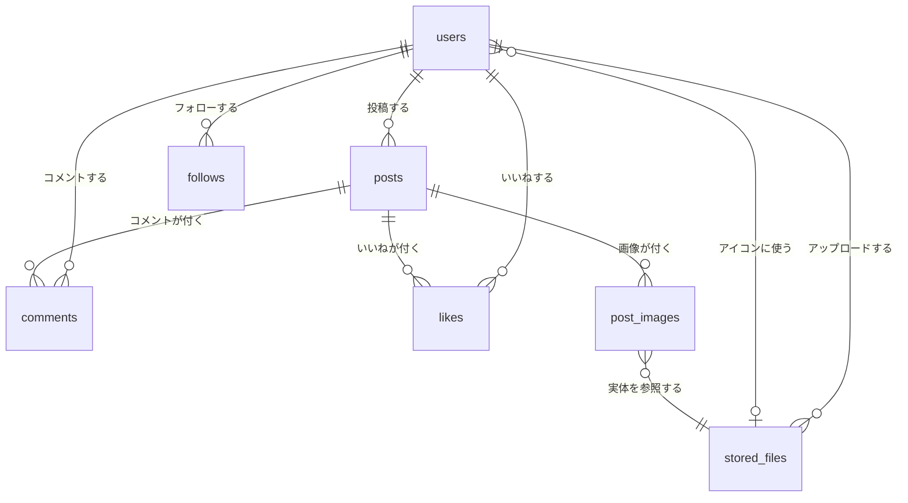
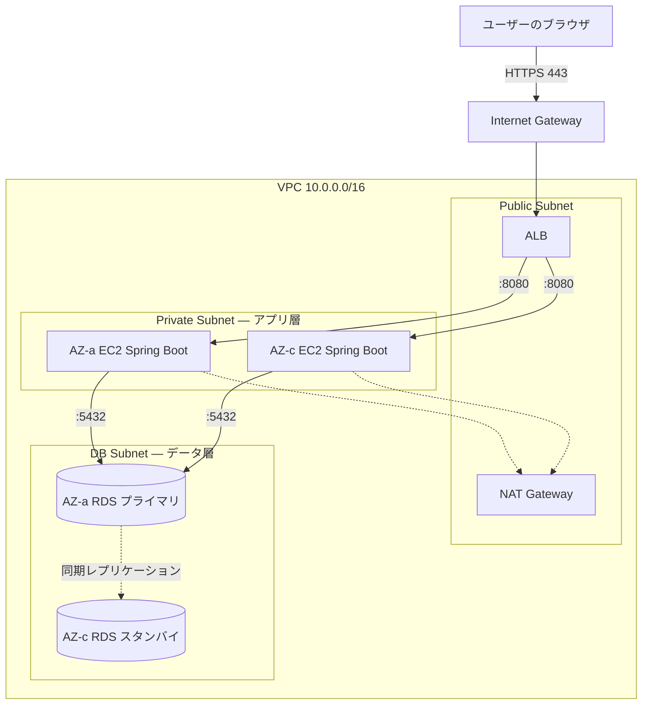

# SnsTimeLineApp（タイムライン型SNSアプリ）

X（旧Twitter）のタイムライン形式を参考にした、**学習目的**のSNS風Webアプリケーション。
短いテキストと画像を投稿し、**いいね**・**コメント**・**フォロー**で相互にやり取りできます。

**Webアプリ開発の定番課題（N+1問題・トランザクション整合性・カーソルページネーション・JWT認証・ストレージ抽象化）に正面から向き合うこと**を目的に、要件定義から設計まで一貫したドキュメントを整備しています。

> **現在は要件定義フェーズです。** ドキュメント一式（11本）と[画面モックアップ](mockup/)が完成しており、実装はこれから着手します。
> 進捗は[現在の状態](#現在の状態)を参照してください。

---

## システム概要

### 概要

ユーザーが短いテキスト（最大280文字）と画像を投稿すると、タイムラインに新着順で流れます。他のユーザーはその投稿に**いいね**を付けたり、**コメント**を書いたりできます。気に入ったユーザーを**フォロー**すると、フォロー中のユーザーの投稿だけを集めたタイムラインを見られます。

### X / Twitter との違い（差別化ポイント）

本アプリはX/Twitterの類似アプリですが、以下の2点で明確に差別化しています。

| 項目 | X / Twitter | 本アプリ |
|---|---|---|
| **インプレッション数** | 投稿ごとに表示回数を表示する | **表示しない** |
| **リツイート / リポスト** | 他人の投稿を再共有できる | **機能を用意しない** |

**【差別化の意図】**

- **インプレッション数を表示しない** — 閲覧数という数字が可視化されると、ユーザーは反応の少なさを気にして投稿しづらくなります。本アプリは「気軽に書ける」ことを重視し、投稿者に届く数字を**いいね数とコメント数（＝能動的な反応）だけ**に絞りました。
- **リツイート / リポストを用意しない** — 拡散機能があると、フォロー中タイムラインに「自分がフォローしていない人の投稿」が大量に流れ込み、タイムラインの性質が変わってしまいます。本アプリは**タイムラインに流れるのは、その人自身が書いた投稿だけ**という一貫性を保ちます。

この2点は単なる機能削減ではなく、**「静かで見通しの良いタイムライン」という体験上の選択**です。
DBにも閲覧ログを持たない設計としており、[要件定義書](docs/01_requirements.md) 3.2 で対象外スコープとして明記しています。

### 想定ユーザー

- **一般ユーザー**：アカウントを登録し、投稿・閲覧・反応（いいね／コメント／フォロー）を行う

**管理者（Admin）ロールは設けません。** 全ユーザーが同一権限を持ち、「**自分のリソースのみ編集・削除できる**」という原則で認可します（[設計判断 D-14](docs/09_decision_log.md)）。

想定データ量はユーザー100人・投稿10,000件程度で、商用リリースや不特定多数への公開は想定していません。

### 設計ドキュメント

要件から設計・インフラまで、各工程のドキュメントを整備しています。
**まず [ドキュメント索引](docs/00_index.md) を読むことを推奨します**（読む順序・執筆ルールを記載）。

| # | ドキュメント | 内容 |
|---|---|---|
| 00 | [索引](docs/00_index.md) | 読む順序・執筆ルール・Mermaid運用ルール |
| 01 | [要件定義書](docs/01_requirements.md) | スコープ・対象外・ペルソナ・ユーザーストーリー（US-01〜23） |
| 02 | [機能一覧](docs/02_feature_list.md) | 機能ID（35件）と優先度 |
| 03 | [画面設計](docs/03_screen_design.md) | 画面一覧（12画面 + 3モーダル）・遷移図 |
| 04 | [データモデル](docs/04_data_model.md) | ER図・テーブル定義（7テーブル）・インデックス・ユーザー検索設計 |
| 05 | [API設計](docs/05_api_design.md) | エンドポイント一覧（26件）・共通仕様・シーケンス図 |
| 06 | [非機能要件](docs/06_non_functional.md) | 性能・セキュリティ・保守性・テスト方針 |
| 07 | [アーキテクチャ](docs/07_architecture.md) | レイヤー構成・ストレージ抽象化・実装順序 |
| 08 | [用語集](docs/08_glossary.md) | 日本語 / 英語 / DB名の対応表 |
| 09 | [設計判断ログ](docs/09_decision_log.md) | **なぜこの設計にしたのか**（D-01〜D-20） |
| 10 | [インフラ構成](docs/10_infrastructure.md) | AWS想定構成（EC2 / RDS / ALB / S3）。**構築可否は未決** |
| — | [**画面モックアップ**](mockup/) | 全12画面 + 3モーダルの静的プロトタイプ（HTML / CSS / JS） |

---

## 主な使用技術・選定理由

| 区分 | 技術 | 用途 |
|---|---|---|
| フロントエンド | React (SPA) + Vite + TypeScript | 画面の描画とユーザー操作。APIを呼ぶだけでDBには触れない |
| ルーティング | React Router | 画面遷移（[画面設計](docs/03_screen_design.md)のパスに対応） |
| バックエンド | **Spring Boot 4.1.0 / JDK 25** (REST API) | REST APIの提供。**HTMLは返さない** |
| O/Rマッパー | **MyBatis** | SQLを直接書く。発行クエリ数を目視で確認できる（[D-25](docs/09_decision_log.md)） |
| データベース | PostgreSQL 16 | データの永続化 |
| マイグレーション | Flyway | DBスキーマの変更履歴をコード管理 |
| 認証 | JWT（HS256, jjwt）+ リフレッシュトークン + BCrypt(cost 10) | アクセストークン15分・リフレッシュトークン14日のローテーション方式 |
| 画像保存 | ローカルディレクトリ → **Amazon S3** | S3利用は決定済み（[10](docs/10_infrastructure.md)） |
| 開発環境 | Docker Compose（DBのみ） | PostgreSQL の起動。アプリはIDEから直接起動 |
| インフラ | AWS（EC2 / RDS / ALB / S3）想定 | 構成図を作成済み。**構築するかは未決** |

**フロントとバックは別オリジン**（:5173 と :8080）で動作するため、**CORS設定が必須**です。

**【選定理由】**

- **React + Spring Boot（別オリジン構成）**：あえてSPAとREST APIを分離しました。サーバサイドレンダリングなら不要な**CORS・JWTによるステートレス認証・APIクライアントの共通化**といった課題に向き合うことが学習ゴールに直結するためです。
- **PostgreSQL**：**部分インデックス**（`WHERE deleted_at IS NULL`）や**行値比較**（`(created_at, id) < (?, ?)`）、**pg_trgm** といった機能が、本アプリの設計課題（論理削除の除外・カーソルページネーション・あいまい検索）とそのまま噛み合うため採用しました。いずれもMySQLにはない、またはPostgreSQL側が扱いやすい機能です。
- **Flyway**：DBスキーマの変更履歴をコードとして残し、長期運用での再現性を確保します。「**適用済みマイグレーションは編集しない**」という規約自体も学習項目としています。
- **JWT（ステートレス）＋ リフレッシュトークン**：セッションをサーバーに持たないため、**EC2を複数台に増やしてもセッション共有の仕組みが不要**になります。インフラ構成を検討した際、この設計がそのまま活きることを確認しました（[10](docs/10_infrastructure.md) 3章）。一方で**JWTは発行後に失効させられない**という弱点があるため、アクセストークンを15分と短命にし、失効可能なリフレッシュトークン（DB管理・使い捨て・盗用検知つき）で長いセッションを支える構成にしました（[D-29](docs/09_decision_log.md)）。
- **Docker はDBのみ**：アプリ本体をコンテナに入れると、IDEからの起動とデバッグが煩雑になります。開発効率を優先し、**DBだけをコンテナ化**する構成としました。
- **MyBatis（JPAではなく）**：発行されるSQLがコードと1対1で対応するため、「**タイムライン取得のSQL発行回数は3回以内**」「N+1を作らない」という自ら課した性能要件を、**目で確認しながら実装できます**。代償として論理削除の自動除外（Hibernateの`@SQLRestriction`相当）が無く、各SQLに`deleted_at IS NULL`を手書きする必要があるため、条件をXMLで共通化する等の歯止めを設けています（[D-25](docs/09_decision_log.md)）。
- **jjwt**：非機能要件で「`alg: none` を受け入れない」ことを要求していますが、jjwtでは**これが設定ではなく既定の動作**です。安全側がデフォルトになっているライブラリを選びました（[D-26](docs/09_decision_log.md)）。実際に`alg:none`で細工したトークンが401で拒否されることを確認済みです。

---

## DB設計

投稿・反応・フォロー関係を扱う**7テーブル構成**です。詳細は[データモデル](docs/04_data_model.md)を参照してください。

### テーブル概要

| テーブル | 役割 | 主な設計上の要点 |
|---|---|---|
| `users` | ユーザー | `email` / `username` は一意。パスワードはBCryptハッシュ |
| `posts` | 投稿 | **`like_count` / `comment_count` を非正規化カウンタで保持** |
| `comments` | コメント | 投稿に対する1階層のみ（ネストしない） |
| `likes` | いいね | **`UNIQUE (post_id, user_id)`** で二重いいねを防ぐ。物理削除 |
| `follows` | フォロー関係 | **自己参照**。`CHECK (follower_id <> followee_id)` で自己フォロー防止 |
| `post_images` | 投稿の添付画像 | DBは4枚まで対応。MVPのAPIは1枚に制限 |
| `stored_files` | 保存ファイルのメタ情報 | **`storage_type` + `storage_key` を保持し、URLは保存しない** |

### ER図



> `follows` は `follower_id` と `followee_id` の両方が `users` を参照する自己参照テーブルですが、
> Mermaidで2本引くとラベルが重なるため図では1本にまとめています。

---

## 機能一覧

機能ID（`F-<カテゴリ>-<連番>`）を採番し、**画面・APIと相互参照できる**ようにしています（全35件）。
詳細は[機能一覧](docs/02_feature_list.md)を参照してください。

| カテゴリ | MVP | Phase2 | 主な機能 |
|---|---|---|---|
| 認証 (`F-AU-`) | 4 | 1 | 新規登録・ログイン・ログアウト・ログイン状態の維持 |
| ユーザー (`F-US-`) | 3 | 2 | プロフィール表示・編集、**ユーザー検索** |
| 投稿 (`F-PO-`) | 4 | 1 | 投稿作成（テキスト／画像）・詳細表示・削除 |
| コメント (`F-CM-`) | 3 | 1 | コメント投稿・一覧表示・削除 |
| いいね (`F-LK-`) | 3 | 1 | いいね・解除（**冪等**）・いいね数の表示 |
| フォロー (`F-FL-`) | 2 | 2 | フォロー・解除（**冪等**）・フォロー中／フォロワー一覧 |
| タイムライン (`F-TL-`) | 3 | 0 | 全体TL・フォロー中TL・無限スクロール |
| 画像 (`F-IM-`) | 3 | 0 | アップロード・配信・バリデーション |
| 共通 (`F-CO-`) | 2 | 0 | エラーの統一表示・401時の自動遷移 |

**MVPは27件。** これだけで「登録 → ログイン → 投稿 → TL閲覧 → いいね → コメント → フォロー → フォロー中TL」という一周が成立します。

### 優先度の切り分け方針：「削除はMVP、編集はPhase2」

削除は**誤投稿のリカバリ手段**として必須ですが、編集は無くても運用できます（消して投稿し直せる）。
ただし**DBスキーマとAPI設計には最初から編集を織り込み**（`edited_at` カラム・`PATCH` エンドポイント）、Phase2では実装を足すだけで済むようにしています。

---

## 画面設計

**MVPは8画面 + 2モーダル**（Phase2含めて12画面 + 3モーダル）。詳細は[画面設計](docs/03_screen_design.md)を参照してください。

| 画面ID | 画面名 | パス | 優先度 |
|---|---|---|---|
| SC-01 | ログイン | `/login` | MVP |
| SC-02 | 新規登録 | `/signup` | MVP |
| SC-03 | タイムライン | `/` | MVP |
| SC-04 | 投稿詳細 | `/posts/:postId` | MVP |
| SC-05 | プロフィール | `/users/:userId` | MVP |
| SC-06 | プロフィール編集 | `/settings/profile` | MVP |
| SC-12 | NotFound / エラー | `*` | MVP |
| MD-01 | 投稿作成モーダル | — | MVP |
| MD-03 | 削除確認モーダル | — | MVP |
| SC-07〜SC-11 / MD-02 | ユーザー検索・フォロー一覧・いいね一覧・アカウント設定・投稿編集 | — | Phase2 |

すべての画面で**ローディング / 空 / エラー / 正常の4状態**を実装することを要件としています。

### 画面モックアップ

実装に入る前に、設計した画面が成立するかを確かめるため、**HTML / CSS / JavaScript だけの静的プロトタイプ**を [mockup/](mockup/) に用意しています。ビルド不要で、HTMLファイルをブラウザで開くだけで動きます。

```bash
start mockup/timeline.html    # Windows
open  mockup/timeline.html    # macOS
```

DBもサーバーも使いませんが、**設計の要点になっている挙動は実際に動きます**。

| 動き | 確認できること |
|---|---|
| いいねの楽観的更新 | 押した瞬間に数字と塗りつぶしが変わる。**連打しても2にならない**（冪等性） |
| タブ切替 | 「すべて」↔「フォロー中」が**URLの `?tab=` に反映**される |
| 無限スクロール | 下端手前で次を読み込み、末尾に「これ以上投稿はありません」 |
| 文字数カウンタ | 残り20文字で警告色、**超過で赤＋投稿ボタンが無効化** |
| フォローのトグル | ホバーすると「フォロー解除」（赤）に変わる |
| 検索のデバウンス | 入力後300ms待って検索。**未入力では検索しない** |

> **モックを先に作る価値**: 空状態の文言・ボタンの配置・カウンタの挙動といった「仕様書では気づきにくい穴」を、実装前に洗い出せます。
> また、**インプレッション数を表示しない**・**リツイートボタンを置かない**という差別化ポイントを、画面として証明できます。

各ファイルと画面IDの対応は [mockup/README.md](mockup/README.md) を参照してください。

---

## API設計

REST API・**26エンドポイント**。詳細は[API設計](docs/05_api_design.md)を参照してください。

| # | メソッド | パス | 概要 |
|---|---|---|---|
| 1–4 | `POST` / `GET` / `PUT` | `/auth/*` | 登録・ログイン・現在のユーザー取得・パスワード変更 |
| 5 | `GET` | `/timeline` | タイムライン取得（`tab=all` / `tab=following`） |
| 6–9 | `POST` / `GET` / `PATCH` / `DELETE` | `/posts` `/posts/{id}` | 投稿の作成・詳細・編集・削除 |
| 10–13 | `GET` / `POST` / `PATCH` / `DELETE` | `/posts/{id}/comments` 等 | コメントの一覧・投稿・編集・削除 |
| 14–16 | `PUT` / `DELETE` / `GET` | `/posts/{id}/like(s)` | いいね・解除（**冪等**）・いいね一覧 |
| 17–20 | `GET` / `PATCH` | `/users/*` | プロフィール取得・投稿一覧・編集・**ユーザー検索** |
| 21–24 | `PUT` / `DELETE` / `GET` | `/users/{id}/follow(ers/ing)` | フォロー・解除（**冪等**）・一覧 |
| 25–26 | `POST` / `GET` | `/files` `/files/{id}` | 画像アップロード・配信 |

### 設計上の要点

- **いいね・フォローは `PUT` / `DELETE` を使い、冪等にする** — `POST /like` + `POST /unlike` ではなく、同じ操作を何度実行しても結果が変わらない設計にしています。ダブルクリックや複数タブでの同時操作に耐えます。
- **ページネーションは機能ごとに方式を選ぶ** — タイムラインやコメントは新着挿入で順序が動くため**カーソル方式**、ユーザー検索は結果が安定しページ番号UIが自然なため**オフセット方式**を採用しました。アプリ全体で統一する必要はないという判断自体が学習ポイントです（[D-06](docs/09_decision_log.md)）。
- **画像アップロードを投稿作成から分離する** — 投稿APIをJSONのまま保て、アップロード進捗を先に表示でき、失敗時のリトライが独立します。

---

## インフラ構成（AWS想定）

**画像ストレージにS3を使うことは決定済み**ですが、**AWSでサーバー（EC2 / RDS / ALB）を構築するかは未決**です。
ただし構築する場合の構成は先に確定させ、構成図を作成しています。詳細は[インフラ構成](docs/10_infrastructure.md)を参照してください。



> **なぜ構築を決める前に構成図を描いたのか**
>
> 構成が決まっていないと、**アプリ側の設計が正しいかを検証できない**ためです。「セッションを持たない」「ファイルをローカルに置かない」「接続先を環境変数にする」といった設計は、複数台構成にして初めて意味を持ちます。
>
> 実際に構成図を描いて既存設計を検証したところ、**5項目が対応済み**である一方、**ヘルスチェックエンドポイントの未定義**と **`X-Forwarded-For` の未対応**という2つの漏れが見つかりました。構成図は「アプリ側の設計に対する制約の洗い出し」として、**実際に構築するかを決める前に描く価値がある**と判断しました。

**本番想定のMulti-AZ構成**と、**学習用の最小構成**（月額 $45〜50 程度）の両方を記載しています。コスト面で最も効くのは **NAT Gateway と RDS Multi-AZ** の2つで、これを外すかどうかで月額が倍近く変わります。

---

## 設計上の主要な論点

本プロジェクトで特に掘り下げた設計判断です。すべて[設計判断ログ](docs/09_decision_log.md)に「なぜそうしたか」を記録しています（D-01〜D-20）。

### ◆ いいね数を非正規化カウンタで持つ（D-01）

タイムライン20件それぞれで `COUNT(*)` を2回走らせると、件数増加で確実に劣化します。そこで `posts.like_count` / `comment_count` に**非正規化カウンタ**を持たせ、単一クエリで完結させました。

代わりに**トランザクション整合性の責任**が発生します。これを次の3点で担保します。

1. いいね/コメントの登録・削除と**カウンタ更新を同一トランザクション**で実行する
2. カウンタは**SQL側で相対更新**する（`SET like_count = like_count + 1`）。Java側で「読み取り→加算→書き込み」をするとロストアップデートが発生する
3. ズレた場合の**再集計SQL**を用意しておく

> **「非正規化を導入すると、代わりに整合性の責任が発生する」** というRDB設計の核心を実地で学ぶことが狙いです。
> 推奨する学習ステップとして、**最初は都度COUNTで実装し、`EXPLAIN ANALYZE` で遅さを確認してからリファクタリングする**手順をドキュメントに記載しています。

### ◆ カーソルページネーションのタイブレーカー（D-06）

`created_at` だけでソートすると、**同一時刻の投稿があった場合に取りこぼしや重複が発生**します。

```
投稿A: created_at = 12:00:00, id = 100
投稿B: created_at = 12:00:00, id = 101   ← 同じ時刻
```

`created_at < '12:00:00'` で次ページを取ると **A と B の両方が漏れます**。
主キーを第2キーに含めた**行値比較** `(created_at, id) < (?, ?)` で順序を一意に確定させ、インデックスも `(created_at DESC, id DESC)` と複合にしています。

### ◆ 画像ストレージの抽象化（D-05）

DBには**絶対URLも物理パスも保存せず**、`storage_type` + `storage_key` だけを持ちます。

| 保存する内容 | ローカル→S3移行時に起きること |
|---|---|
| ✕ 絶対URL | 全レコードのURL書き換えが必要。ドメイン変更でも壊れる |
| ✕ 物理パス | OS依存。サーバー移設で全滅 |
| ○ **`storage_type` + `storage_key`** | **`S3FileStorageService` を追加し、設定値を変えるだけ** |

URLの組み立ては `FileStorageService#generateUrl()` の責務とし、**レスポンスを組み立てるたびに生成**します。この設計により、S3移行後の配信経路（アプリ経由／リダイレクト／CloudFront直）を**どれに決めてもDB変更が不要**になりました。

### ◆ ユーザー検索を段階式にする（D-19）

「前方一致 → pg_trgm によるあいまい一致」の順に拡張します。あえて一発で高機能にしないのは、**「B-treeインデックスは前方一致までしか効かない」**という原則を `EXPLAIN ANALYZE` で体感するためです。

```
lower(username) LIKE 'tar%'   → Index Scan   ✅ 左端が確定しているので範囲検索にできる
lower(username) LIKE '%aro%'  → Seq Scan     ❌ 左端が不定なので木を辿れない
```

セキュリティ面では、**`email` を検索対象にもレスポンスにも含めない**（アカウント列挙の防止）、**`%` `_` をエスケープする**（`q=%` で全件が返るのを防ぐ）ことを要件としています。後者はパラメータバインディングだけでは防げません。

### ◆ 認可は「存在チェック → 所有者チェック」の順序（D-14）

```
① 存在チェック → 404（存在しないリソース）
② 所有者チェック → 403（存在するが他人のもの）
```

**この順序が重要です。** 先に所有者チェックをすると、存在しないIDに対して403を返してしまい、**リソースの存在有無が漏れます**。

---

## ドキュメント作成で重視したこと

### ◆ 「なぜそうしたか」を必ず残す

設計判断ログ（[09](docs/09_decision_log.md)）に、**論点・選択肢・決定・理由・受け入れたトレードオフ**をD-01〜D-20として記録しています。判断を変更する場合も**既存エントリは書き換えず**、新しいIDで追記して古い方を「撤回」にします。**判断の履歴自体が学習の記録**になるためです。

### ◆ 情報の重複を避け、「正」を1つに決める

同じ情報を複数のドキュメントに書くと、必ず片方が古くなります。「テーブル定義は04が正」「APIレスポンスは05が正」のように**どちらが正かを決め、もう一方はリンクで参照**するルールを[索引](docs/00_index.md) 4章で定めています。

### ◆ 機能IDで全ドキュメントを貫く

機能ID（`F-XX-nn`）を一次キーとし、機能一覧をハブとして画面ID・API番号と相互参照できるようにしました。これにより「**この機能を消したら何が影響するか**」を逆引きできます。

### ◆ 図と表の役割を分ける

**図は「関係の理解」、表は「実装の正」**と役割を分けています。ER図に全カラムを書かず主要カラムに絞るのも、図の可読性を保つためです。Mermaid図は[mermaid-cli](https://github.com/mermaid-js/mermaid-cli)でレンダリングを確認しています。

---

## 現在の状態

- [x] **要件定義フェーズ** — ドキュメント一式（11本）が完成
- [x] **画面モックアップ** — 全12画面 + 3モーダルの静的プロトタイプ（[mockup/](mockup/)）
- [ ] **実装フェーズ** — 進行中
  - [x] DB構築（`V1__create_users.sql` / `V2__create_refresh_tokens.sql`）
  - [x] **認証・認可のバックエンド** — 新規登録 / ログイン / `GET /auth/me` / **トークン再発行 / ログアウト**（アクセストークン＋リフレッシュトークン方式）
  - [ ] 投稿作成・全体タイムライン
  - [ ] フロントエンド（React + Vite + TypeScript）
  - [ ] 自動テスト

### 実装の推奨順序

[アーキテクチャ](docs/07_architecture.md) 8章で、詰まりにくい順序を定義しています。

```
1. DB構築（Flywayマイグレーション）
2. 認証（JWT取得 → /auth/me が通る）
3. 投稿作成・全体TL
4. フロント: ログイン + タイムライン表示
5. いいね ← カウンタの整合性をここで作り込む
6. コメント（カウンタの非対称ルール）
7. 画像アップロード（ストレージ抽象化を最初から入れる）
8. フォロー + フォロー中TL ← MVPの一周が完成
9. プロフィール
10. 削除と論理削除の徹底
11. 無限スクロール
```

> **ステップ5で手を抜かないこと。** カウンタの整合性は後から直すのが難しいため、トランザクション境界とSQL側の相対更新を最初から正しく実装します。

---

## ローカル環境で動かす

> **`backend/` と `docker-compose.yml` は実装済みで、手順3〜4はそのまま動きます。**
> **`frontend/` は未着手**のため、手順5はまだ実行できません。

### 前提

- Docker Desktop
- **JDK 25**
- Node.js 20 以上（フロントエンド着手後に必要）

### 手順（初回）

```bash
# 1. リポジトリを取得
git clone https://github.com/tomo-taka108/SnsTimeLineApp.git
cd SnsTimeLineApp

# 2. 環境変数ファイルを作成
#    Windows(PowerShell) の場合: Copy-Item .env.example .env
cp .env.example .env
#    JWT_SECRET には32バイト以上のランダム文字列を設定する

# 3. PostgreSQL を起動
docker compose up -d

# 4. バックエンド（起動時にFlywayがマイグレーションを自動実行）
cd backend && ./mvnw spring-boot:run

# 5. フロントエンド（別ターミナル）※ 未実装のため現時点では実行できません
cd frontend && npm install && npm run dev
```

> **`JWT_SECRET` は必ず設定してください。** 既定値を持たせていないため、未設定だと起動に失敗します
> （弱い鍵で署名し続けるより明確に落とす設計）。なお **Spring Boot は `.env` を自動では読み込まない**ため、
> `.env` の値は IDE の実行構成かシェルの環境変数に設定します。

### 認証APIを試す（フロント未実装のうちはこちら）

```bash
BASE=http://localhost:8080/api/v1

# 新規登録（201。登録と同時にトークンが返る）
curl -i -X POST "$BASE/auth/signup" -H 'Content-Type: application/json' \
  -d '{"email":"taro@example.com","username":"taro_123","displayName":"たろう","password":"Password1"}'

# ログイン（200）。アクセストークン（15分）とリフレッシュトークン（14日）が返る
RES=$(curl -s -X POST "$BASE/auth/login" -H 'Content-Type: application/json' \
  -d '{"email":"taro@example.com","password":"Password1"}')
ACCESS=$(echo "$RES" | jq -r .accessToken)
REFRESH=$(echo "$RES" | jq -r .refreshToken)

# 現在のユーザー（200）
curl -i "$BASE/auth/me" -H "Authorization: Bearer $ACCESS"

# トークン再発行（200）。リフレッシュトークンも新しい値に差し替わる
RES2=$(curl -s -X POST "$BASE/auth/refresh" -H 'Content-Type: application/json' \
  -d "{\"refreshToken\":\"$REFRESH\"}")
ACCESS=$(echo "$RES2" | jq -r .accessToken)
REFRESH=$(echo "$RES2" | jq -r .refreshToken)   # ← 必ず保存し直す

# ログアウト（204）。リフレッシュトークンが失効する
curl -i -X POST "$BASE/auth/logout" -H "Authorization: Bearer $ACCESS"
```

> **リフレッシュトークンは1回で使い捨て（ローテーション）。** 上で `REFRESH` を上書きしているのはそのため。古い値をもう一度使うと**盗用とみなされ、そのログインのトークンがすべて失効します**（＝再ログインが必要になる）。

フロントエンド実装後は、ブラウザで http://localhost:5173 を開きます。

| 対象 | ポート |
|---|---|
| フロントエンド（Vite） | 5173 |
| バックエンド（Spring Boot） | 8080 |
| PostgreSQL | 5432 |

### よく使うコマンド

```bash
# DBを完全にリセット（ボリュームごと削除して作り直す）
docker compose down -v && docker compose up -d

# DBへ直接接続
docker compose exec db psql -U snsapp -d snstimeline
```

環境構築のトラブル対処は `.claude/skills/dev-environment/SKILL.md` に整理しています。

---

## 開発ルール

開発時のルールは [CLAUDE.md](CLAUDE.md) に定義しています（Claude Code 用ですが、人間の開発者にも同じルールを適用します）。

| 項目 | ルール |
|---|---|
| ブランチ | `feature/` `fix/` `docs/` `chore/` + Issue番号（例: `feature/12-add-follow-timeline`） |
| Issue | **ブランチ作成前に必ず作成する** |
| コミット | **Conventional Commits**（`feat:` `fix:` `docs:` `chore:` 等） |
| PR | **main への直接プッシュは禁止**。必ずPRを通す |
| 品質チェック | コミット前に整形・静的解析・テストを実行し、すべて緑にする |

---

## 学習ゴール

| 領域 | 習得内容 |
|---|---|
| フロントエンド | SPAのルーティング、無限スクロール、楽観的UI更新 |
| バックエンド | REST API設計、レイヤー分割、例外ハンドリング |
| 認証 | JWTによるステートレス認証、パスワードハッシュ化、認可 |
| データベース | 正規化、インデックス設計、**非正規化の判断**、トランザクション |
| ファイル処理 | 画像アップロード、バリデーション、**ストレージの抽象化** |
| インフラ | AWS構成の理解、**アプリ設計とインフラ制約の対応関係** |
| 全体 | 別オリジン構成でのCORS、要件定義から実装までの一貫した流れ |

---

## 今後の展望

| フェーズ | 内容 |
|---|---|
| **MVP** | 27機能。「登録 → 投稿 → いいね → コメント → フォロー → フォロー中TL」の一周 |
| **Phase2** | 投稿・コメントの編集、ユーザー検索、フォロー中／フォロワー一覧、プロフィール画像 |
| **Phase3（対象外）** | 通知、コメントへの返信、投稿の全文検索、退会機能、パスワードリセット |

Phase3は**実装しない**方針ですが、DBスキーマ側では拡張余地を残しています（`users.deleted_at` は用意済み、`comments.parent_comment_id` は追加すれば1階層の返信に対応可能、投稿画像はDBが既に4枚まで対応）。**「今は使わないが、後で必要になったときにマイグレーションが要らない」形にしておく**のが設計の要点です。
