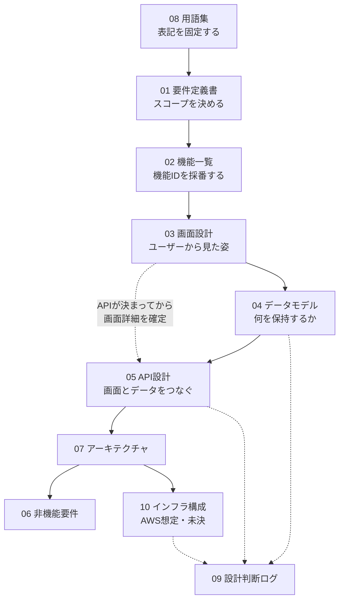

# ドキュメント索引

X/Twitter風SNSアプリ（学習目的）の要件定義ドキュメント一式。

---

## 1. ドキュメント一覧

| # | ファイル | 目的 | 想定読者 | 状態 |
|---|---|---|---|---|
| 00 | **00_index.md**（本書） | 索引・読む順序・執筆ルール | すべて | Fixed |
| 01 | [01_requirements.md](01_requirements.md) | 要件定義書。スコープ・対象外・ユーザーストーリー | すべて | Fixed |
| 02 | [02_feature_list.md](02_feature_list.md) | 機能一覧。機能IDと優先度 | すべて | Fixed |
| 03 | [03_screen_design.md](03_screen_design.md) | 画面一覧・遷移図・各画面仕様 | フロント実装者 | Fixed |
| 04 | [04_data_model.md](04_data_model.md) | ER図・テーブル定義・設計判断・インデックス | バックエンド実装者 | Fixed |
| 05 | [05_api_design.md](05_api_design.md) | APIエンドポイント・共通仕様・シーケンス図 | すべての実装者 | Fixed |
| 06 | [06_non_functional.md](06_non_functional.md) | 性能・セキュリティ・保守性 | すべての実装者 | Fixed |
| 07 | [07_architecture.md](07_architecture.md) | システム構成・レイヤー・ストレージ抽象化 | バックエンド実装者 | Fixed |
| 08 | [08_glossary.md](08_glossary.md) | 用語集（日本語 / 英語 / DB名） | すべて | Fixed |
| 09 | [09_decision_log.md](09_decision_log.md) | 設計判断ログ（なぜこうしたか） | すべて | Fixed |
| 10 | [10_infrastructure.md](10_infrastructure.md) | インフラ構成（AWS想定）。**構築するかは未決** | インフラ担当 | **Draft** |

---

## 2. 読む順序

### 初めて読む場合

```
08 用語集（ざっと目を通す）
  ↓
01 要件定義書（何を作るのか・何を作らないのか）
  ↓
02 機能一覧（機能IDを把握する）
  ↓
03 画面設計（ユーザーから見た姿）
  ↓
04 データモデル（データ構造）
  ↓
05 API設計（両者をつなぐもの）
```

### 目的別

| 知りたいこと | 読むべきドキュメント |
|---|---|
| このアプリは何ができるのか | [01_requirements.md](01_requirements.md) 2章、[02_feature_list.md](02_feature_list.md) |
| X/Twitterと何が違うのか | [01_requirements.md](01_requirements.md) 2.2 |
| MVPの範囲はどこまでか | [02_feature_list.md](02_feature_list.md) 3章・6章 |
| どんな画面があるのか | [03_screen_design.md](03_screen_design.md) 2章・3章 |
| テーブル構造はどうなっているか | [04_data_model.md](04_data_model.md) 1章・2章 |
| **なぜこの設計にしたのか** | [09_decision_log.md](09_decision_log.md) |
| APIの仕様 | [05_api_design.md](05_api_design.md) 3章・5章 |
| 実装をどの順で進めるか | [07_architecture.md](07_architecture.md) 8章 |
| セキュリティで気をつけること | [06_non_functional.md](06_non_functional.md) 3章 |
| **ユーザー検索をどう実装するか** | [04_data_model.md](04_data_model.md) 6章、[05_api_design.md](05_api_design.md) #20 |
| **AWSに載せるとどうなるか** | [10_infrastructure.md](10_infrastructure.md) |

---

## 3. ドキュメント間の関係



**「画面を先に、データを後に」** が設計の要点。データモデルから始めると、画面に必要な情報が足りない/余るという事態になりやすい。

---

## 4. 情報の重複を避けるルール

同じ情報を複数のドキュメントに書かない。**どちらが「正」かを決め、もう一方はリンクで参照する。**

| 情報 | 正となるドキュメント | 参照側 |
|---|---|---|
| テーブル定義・カラムの型と制約 | [04_data_model.md](04_data_model.md) | 05, 07 |
| APIレスポンスのJSON構造 | [05_api_design.md](05_api_design.md) | 03, 04 |
| 機能の一覧と優先度 | [02_feature_list.md](02_feature_list.md) | 01, 03, 05 |
| 画面のパスと表示項目 | [03_screen_design.md](03_screen_design.md) | 02, 05 |
| 用語の日本語・英語・DB名 | [08_glossary.md](08_glossary.md) | すべて |
| 設計判断の理由 | [09_decision_log.md](09_decision_log.md) | 04, 05, 06, 07, 10 |
| ユーザー検索の方式・SQL・インデックス | [04_data_model.md](04_data_model.md) 6章 | 03, 05 |
| AWS構成・インフラ | [10_infrastructure.md](10_infrastructure.md) | 07 |

> **DBのカラムとAPIのフィールドは1対1ではない。** 例えば `isLikedByMe` はAPIにあるがDBにはなく、`password_hash` はDBにあるがAPIには出ない。両者を混同しないこと。

---

## 5. 相互参照のしくみ

**機能ID（`F-XX-nn`）がすべてのドキュメントを貫く一次キー。**

```
02 機能一覧（ハブ）
  ├─ 機能ID → 関連画面ID → 03 画面設計
  └─ 機能ID → 関連API #  → 05 API設計
                              ↓
                         04 データモデル（テーブルと機能IDの対応表）
```

これにより「**この機能を消したら何が影響するか**」を逆引きできる。

| ドキュメント | 逆引き用の表 |
|---|---|
| [02_feature_list.md](02_feature_list.md) | 各機能に「関連画面」「API #」の列 |
| [03_screen_design.md](03_screen_design.md) | 9章「画面と機能の対応マトリクス」 |
| [04_data_model.md](04_data_model.md) | 8章「テーブルと機能の対応」 |
| [05_api_design.md](05_api_design.md) | 9章「APIと機能・画面の対応」 |

---

## 6. Mermaid図の運用ルール

### 6.1 記法の使い分け

| 記法 | 用途 | 使用箇所 | 枚数 |
|---|---|---|---|
| `erDiagram` | テーブル間のリレーション・カーディナリティ | 04 | 1 |
| `flowchart` | 画面遷移・システム構成・ユースケース概観 | 01, 03（2枚）, 07（2枚）, 10（3枚）, 00 | 9 |
| `sequenceDiagram` | 時系列の相互作用 | 05 | 4 |

**判断基準**

| 迷ったとき | 選ぶもの |
|---|---|
| 「どこからどこへ移動するか」が主題 | `flowchart` |
| 「誰が誰に、どの順番で」が主題 | `sequenceDiagram` |
| 「データがどう繋がっているか」が主題 | `erDiagram` |
| 判断がつかない | **`flowchart`**（表現力が広く、レンダリングも安定している） |

**`sequenceDiagram` は登場人物が3つ以上のときだけ使う。** React → API の2者だけならAPI仕様表で十分で、図にする価値が薄い。

**使わない記法**

| 記法 | 使わない理由 |
|---|---|
| `stateDiagram` | 投稿の状態遷移（下書き→公開など）という概念がないため |
| `classDiagram` | ドメインモデルとテーブルがほぼ1対1で、`erDiagram` で足りるため |

### 6.2 記述上の注意

| # | 注意点 |
|---|---|
| 1 | **ノードラベルに半角の `()` `[]` を含めない。** 構文エラーになる。全角の（）を使うか、`"` で囲む |
| 2 | `erDiagram` のカラムコメントは**第3カラムに文字列**で書く（`bigint user_id FK "NOT NULL"`） |
| 3 | `erDiagram` で同じテーブル間に2本の線を引くとラベルが重なる。1本にまとめて表で補足する |
| 4 | **`erDiagram` に全カラムを書かない。** 主要カラムに絞り、完全な定義はMarkdownの表で書く |
| 5 | GitHub / VS Code / Mermaid Live Editor でレンダリング結果が異なる。**Mermaid Live Editor で必ず確認する** |
| 6 | **`subgraph` のIDとラベルを分ける**（`subgraph VPC["VPC 10.0.0.0/16"]`）。ラベルに `/` や `.` を含めるとID解釈でエラーになるため。10のインフラ構成図で使用 |
| 7 | インフラ構成図のように**入れ子の `subgraph` が深くなる場合は `flowchart TB`**（上から下）にする。`LR` だと横に伸びすぎて読めなくなる |

> **図と表の役割分担**: 図は「関係の理解」、表は「実装の正」。二重管理になるが、役割が違うので許容する。

---

## 7. ドキュメントの保守ルール

| 状況 | やること |
|---|---|
| 実装がドキュメントと乖離した | **ドキュメントを更新する。** 乖離を放置しない |
| 設計を変更した | [09_decision_log.md](09_decision_log.md) に新しいIDで追記し、古い判断を「撤回」にする |
| 機能を追加した | [02_feature_list.md](02_feature_list.md) にIDを採番して追加。関連画面・APIの列も埋める |
| 新しい機能アイデアが出た | [01_requirements.md](01_requirements.md) 3.2 の対象外スコープ、または Phase3 に追記する。**MVPには入れない** |
| 用語を新しく使い始めた | [08_glossary.md](08_glossary.md) に追加する |

**IDは一度振ったら変更しない。** 機能ID・画面ID・判断IDのすべてに適用する。削除する場合も番号を再利用せず「廃止」として残す。

---

## 8. 要件定義フェーズ完了チェックリスト

- [x] `docs/` 配下に10ファイルが存在し、本書からすべてリンクされている
- [x] 全機能（35件）に機能IDと優先度が付いている
- [x] MVP機能（27件）だけで「登録→ログイン→投稿→TL閲覧→いいね→コメント→フォロー→フォロー中TL」が成立する
- [x] 全画面（12画面 + 3モーダル）に画面IDとパスが振られ、遷移図に登場している
- [x] ER図の全テーブル（7件）に、それを使う機能IDが紐づいている（孤立テーブルなし）
- [x] 主要な設計判断が [09_decision_log.md](09_decision_log.md) に理由付きで記録されている（D-01〜D-15）
- [x] 全APIエンドポイント（26件）に認証要否・機能ID・リクエスト/レスポンスが記載されている
- [x] ページネーション方式の選択理由が書かれている（D-06）
- [x] 画像ストレージ抽象化が 04（DB側）と 07（インターフェース側）で整合している
- [x] 用語集の全用語が「日本語 / 英語 / DB名」の3列で埋まっている
- [x] 対象外スコープに「インプレッション数」「リツイート/リポスト」が明記されている
- [x] **Mermaid図のレンダリング確認** — 10（3枚）と00は `@mermaid-js/mermaid-cli` で描画確認済み（2026-08-18）。**04のER図と05のログインシーケンス図**はリフレッシュトークン導入に伴う改訂時に描画確認済み（2026-08-23）。**01・03・07の既存図（8枚）は未確認**

### Mermaid図の一覧（レンダリング確認用）

| ドキュメント | 図 | 記法 |
|---|---|---|
| 00_index | ドキュメント間の関係 | `flowchart` |
| 01_requirements | 5.3 ユースケース概観 | `flowchart` |
| 03_screen_design | 3.1 認証フロー | `flowchart` |
| 03_screen_design | 3.2 ログイン後のメイン遷移 | `flowchart` |
| 04_data_model | 1章 ER図 | `erDiagram` |
| 05_api_design | 図A ログインとJWT付与 | `sequenceDiagram` |
| 05_api_design | 図B 画像付き投稿とストレージ抽象化 | `sequenceDiagram` |
| 05_api_design | 図C いいねとカウンタ更新 | `sequenceDiagram` |
| 05_api_design | 図D カーソルページネーション | `sequenceDiagram` |
| 07_architecture | 1章 システム構成 | `flowchart` |
| 07_architecture | 4.1 JWT認証フロー | `flowchart` |
| 10_infrastructure | 1章 図1 ネットワーク構成（Multi-AZ） | `flowchart` |
| 10_infrastructure | 1章 図2 マネージドサービス連携 | `flowchart` |
| 10_infrastructure | 2章 学習用の最小構成 | `flowchart` |

---

## 9. 次のステップ

要件定義フェーズは完了し、**実装フェーズに着手済み**。推奨順序は [07_architecture.md](07_architecture.md) 8章を参照。

**現在の進捗**: ステップ1（`V1__create_users.sql` のみ）と**ステップ2（認証）が完了**。次はステップ3。
実装で新たに決めた事項は [09_decision_log.md](09_decision_log.md) D-25〜D-28 に記録している
（MyBatis採用 / jjwt採用 / パスワードのトリム除外 / JDK 25 + Spring Boot 4.1.0）。

```
1. DB構築（Flywayマイグレーション）        ← V1 完了
2. 認証（#1〜#3）                          ← 完了
3. 投稿作成・全体TL（#5, #6, #7）          ← 次はここ
4. フロント: ログイン + タイムライン表示
5. いいね（#14, #15）← カウンタの整合性を作り込む
6. コメント（#10, #11, #13）
7. 画像アップロード（#25, #26）
8. フォロー + フォロー中TL（#21, #22）← MVPの一周が完成
9. プロフィール（#17〜#19）
10. 削除と論理削除の徹底
11. 無限スクロール
```
