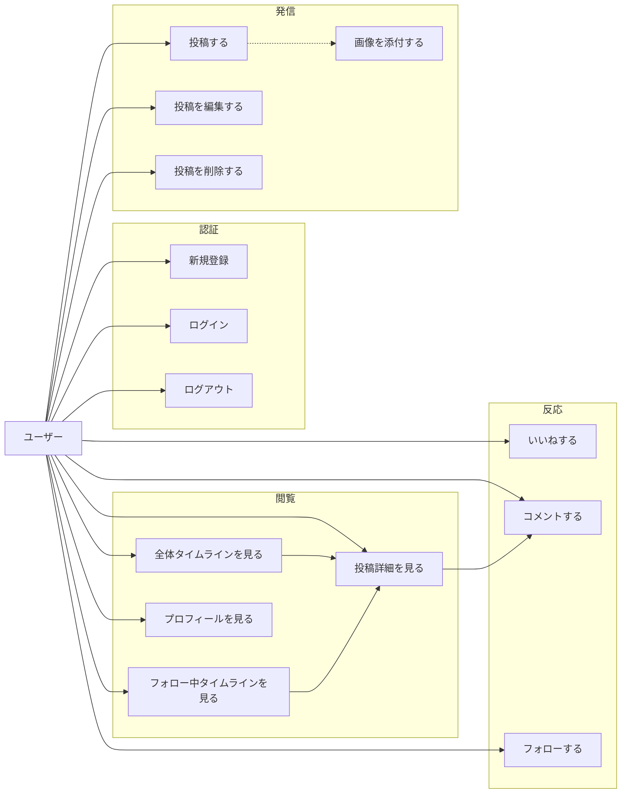

# 要件定義書

## 1. はじめに

### 1.1 本書の目的

本書は、X（旧Twitter）のタイムライン形式を参考にしたSNS風Webアプリケーションの要件を定義するものである。
機能の詳細は [02_feature_list.md](02_feature_list.md)、画面は [03_screen_design.md](03_screen_design.md)、データ構造は [04_data_model.md](04_data_model.md)、APIは [05_api_design.md](05_api_design.md) に分割して記載する。本書はそれらの上流にあたる。

### 1.2 本プロジェクトの位置づけ

本プロジェクトは**学習目的**で開発される。商用リリースや不特定多数への公開は想定しない。
したがって、以下の判断基準を全体に適用する。

- **学習価値が高い選択肢を優先する**。単に楽な実装より、Webアプリ開発の定番課題（N+1問題、トランザクション整合性、ページネーション、認証）に正面から向き合う設計を選ぶ。
- **過剰な最適化・冗長化はしない**。スケーラビリティやSLAは要求しない。
- ただし**マルチユーザーであることは前提**とする。利用者は個人だが、複数ユーザーが相互にいいね・コメント・フォローする状況を想定して設計する。

### 1.3 学習ゴール

本アプリを完成させることで、以下を一通り習得することを目標とする。

| 領域 | 習得内容 |
|---|---|
| フロントエンド | React (SPA) でのルーティング、状態管理、無限スクロール、楽観的UI更新 |
| バックエンド | Spring Boot によるREST API設計、レイヤー分割、例外ハンドリング |
| 認証 | JWTによるステートレス認証、パスワードハッシュ化、認可（他人のリソースを操作させない） |
| データベース | RDBの正規化、リレーション設計、インデックス設計、非正規化の判断、トランザクション |
| ファイル処理 | 画像アップロード、バリデーション、ストレージの抽象化 |
| 全体 | 別オリジン構成でのCORS、要件定義から実装までの一貫した流れ |

---

## 2. プロジェクト概要

### 2.1 アプリケーション概要

ユーザーが短いテキストと画像を投稿し、それがタイムラインに新着順で流れる。
他のユーザーはその投稿に**いいね**を付けたり、**コメント**を書いたりできる。
気に入ったユーザーを**フォロー**すると、フォロー中のユーザーの投稿だけを集めたタイムラインを見られる。

### 2.2 X（Twitter）との違い

本アプリはX/Twitterの類似アプリだが、以下の2点で明確に差別化する。

| 項目 | X/Twitter | 本アプリ |
|---|---|---|
| **インプレッション数** | 投稿ごとに表示回数を表示する | **表示しない** |
| **リツイート / リポスト** | 他人の投稿を再共有できる | **機能を用意しない** |

**差別化の意図:**

- **インプレッション数を表示しない** — 閲覧数という数字が可視化されると、ユーザーは反応の少なさを気にして投稿しづらくなる。本アプリは「気軽に書ける」ことを重視し、投稿者に届く数字を**いいね数とコメント数（＝能動的な反応）だけ**に絞る。
- **リツイート / リポストを用意しない** — 拡散機能があると、フォロー中タイムラインに「自分がフォローしていない人の投稿」が大量に流れ込み、タイムラインの性質が変わる。本アプリは**タイムラインに流れるのは、その人自身が書いた投稿だけ**という一貫性を保つ。

この2点は単なる機能削減ではなく、**「静かで見通しの良いタイムライン」という体験上の選択**である。

---

## 3. スコープ定義

### 3.1 対象スコープ（本プロジェクトで作るもの）

| # | 機能領域 | 概要 |
|---|---|---|
| 1 | ログイン機能 | メールアドレスとパスワードによる新規登録・ログイン・ログアウト |
| 2 | タイムライン機能 | 「全体」「フォロー中」の2タブ。新着順・無限スクロール |
| 3 | コメント機能 | 投稿へのコメント投稿・一覧表示・編集・削除。コメント数の表示 |
| 4 | いいね機能 | 投稿へのいいね・解除。いいね数の表示 |
| 5 | 画像投稿機能 | 投稿への画像添付、アップロード、表示 |
| 6 | 投稿管理 | 投稿の作成・詳細表示・編集・削除 |
| 7 | フォロー機能 | ユーザーのフォロー・解除、フォロー中／フォロワー一覧 |
| 8 | プロフィール機能 | プロフィールの表示・編集 |

各機能の詳細と優先度は [02_feature_list.md](02_feature_list.md) を参照。

### 3.2 対象外スコープ（作らないもの）

| 機能 | 対象外とした理由 |
|---|---|
| **インプレッション数の表示** | 差別化ポイント（2.2参照）。DBにも閲覧ログを持たない |
| **リツイート / リポスト / 引用投稿** | 差別化ポイント（2.2参照） |
| コメントへの返信（ネスト構造） | 再帰構造の複雑さが学習ゴールに見合わない。コメントは投稿に対する1階層のみ。詳細は [04_data_model.md](04_data_model.md) の設計判断③ |
| ハッシュタグ | 学習ゴールの範囲外 |
| 投稿の全文検索 | 全文検索エンジンの導入は範囲外。ユーザー名の部分一致検索のみPhase2で対応 |
| ダイレクトメッセージ | 範囲外 |
| 通知機能 | Phase3候補。いいね・コメント・フォローされた際の通知 |
| ブロック / ミュート | Phase3候補 |
| 非公開アカウント（鍵アカウント） | 全投稿はログインユーザー全員が閲覧可能とする |
| 動画・GIFの投稿 | 静止画像（JPEG / PNG / WebP）のみ |
| 複数端末のセッション管理 | JWTは単純な発行のみ。トークンの失効管理は行わない |
| パスワードリセット（メール送信） | メール送信基盤が必要になるため範囲外。Phase3候補 |
| 退会機能 | Phase3候補。DBスキーマ上は `users.deleted_at` で対応可能にしておく |

### 3.3 スコープ管理の運用ルール

- 開発中に新しい機能アイデアが出た場合、**本節「対象外スコープ」または [02_feature_list.md](02_feature_list.md) の Phase3 に追記する**。MVPには入れない。
- スコープを変更する場合は [09_decision_log.md](09_decision_log.md) に理由を記録する。

---

## 4. ステークホルダーと想定ユーザー

| 役割 | 説明 |
|---|---|
| 開発者 | 本プロジェクトの唯一の開発者。学習が主目的 |
| 一般ユーザー | アプリに登録し、投稿・閲覧・反応を行う。運営者と一般ユーザーの権限差は設けない |

**管理者（Admin）ロールは設けない。** 全ユーザーが同一の権限を持ち、「自分のリソースのみ編集・削除できる」という原則で認可を行う。

---

## 5. ペルソナとユーザーストーリー

### 5.1 ペルソナ

**Aさん（投稿する人）** — 日々の出来事や写真を気軽に記録したい。反応が欲しいが、数字に一喜一憂したくない。
**Bさん（見る人・反応する人）** — 知人の投稿を眺め、気に入ったものにいいねやコメントで反応したい。

### 5.2 ユーザーストーリー

`US-nn` 形式で採番する。各ストーリーは [02_feature_list.md](02_feature_list.md) の機能IDに対応する。

#### アカウント

| ID | ストーリー | 対応機能ID |
|---|---|---|
| US-01 | ユーザーとして、メールアドレスとパスワードでアカウントを作りたい。アプリを使い始めるため | F-AU-01 |
| US-02 | ユーザーとして、登録したメールアドレスでログインしたい。自分のアカウントを使うため | F-AU-02 |
| US-03 | ユーザーとして、ブラウザを閉じて開き直してもログイン状態でいたい。毎回入力する手間を省くため | F-AU-04 |
| US-04 | ユーザーとして、ログアウトしたい。共用端末で他人に見られないため | F-AU-03 |

#### 投稿

| ID | ストーリー | 対応機能ID |
|---|---|---|
| US-05 | ユーザーとして、短いテキストを投稿したい。今の考えを記録するため | F-PO-01 |
| US-06 | ユーザーとして、写真を添えて投稿したい。文字だけでは伝わらないことを伝えるため | F-PO-02, F-IM-01 |
| US-07 | ユーザーとして、投稿の誤字を直したい。書き間違いを放置したくないため | F-PO-04 |
| US-08 | ユーザーとして、投稿を削除したい。誤って投稿した内容を取り消すため | F-PO-05 |

#### タイムライン

| ID | ストーリー | 対応機能ID |
|---|---|---|
| US-09 | ユーザーとして、みんなの投稿を新着順で見たい。新しい人を見つけるため | F-TL-01 |
| US-10 | ユーザーとして、フォローしている人の投稿だけを見たい。興味のある投稿に集中するため | F-TL-02 |
| US-11 | ユーザーとして、下にスクロールすると過去の投稿が続けて読み込まれてほしい。ページ送りの操作をしたくないため | F-TL-03 |

#### 反応

| ID | ストーリー | 対応機能ID |
|---|---|---|
| US-12 | ユーザーとして、良いと思った投稿にいいねを付けたい。手軽に反応を伝えるため | F-LK-01 |
| US-13 | ユーザーとして、間違って押したいいねを取り消したい | F-LK-02 |
| US-14 | 投稿者として、自分の投稿にいくつ**いいねが付いたか**を知りたい。反応があったことを確認するため | F-LK-03 |
| US-15 | ユーザーとして、投稿にコメントを書きたい。いいねでは伝えきれないことを伝えるため | F-CM-01 |
| US-16 | 投稿者として、自分の投稿にいくつ**コメントが付いたか**を一覧で知りたい。詳細を開かなくても反応量が分かるため | F-LK-03, F-CM-02 |
| US-17 | ユーザーとして、投稿に付いたコメントをすべて読みたい | F-CM-02 |
| US-18 | ユーザーとして、自分が書いたコメントを削除したい | F-CM-04 |

> **US-14 / US-16 の重要性**: 利用者は個人だが**第三者がいいね・コメントをする**前提のため、いいね数とコメント数は必ず表示する。タイムラインの各投稿カード上で、詳細画面を開かずに数が分かること。

#### フォロー・プロフィール

| ID | ストーリー | 対応機能ID |
|---|---|---|
| US-19 | ユーザーとして、気になる人をフォローしたい。その人の投稿を継続して見るため | F-FL-01 |
| US-20 | ユーザーとして、フォローをやめたい | F-FL-02 |
| US-21 | ユーザーとして、あるユーザーのプロフィールと過去の投稿をまとめて見たい。どんな人か知るため | F-US-02 |
| US-22 | ユーザーとして、自分の表示名や自己紹介を変更したい。自分を適切に紹介するため | F-US-03 |
| US-23 | ユーザーとして、誰が自分をフォローしているか知りたい | F-FL-04 |

### 5.3 ユースケース概観



---

## 6. 機能要件サマリ

機能の全体像は以下のとおり。**詳細な機能一覧・優先度は [02_feature_list.md](02_feature_list.md) を正とする。**

| カテゴリ | 機能ID接頭辞 | 機能数 | MVP数 |
|---|---|---|---|
| 認証 | `F-AU-` | 5 | 4 |
| ユーザー・プロフィール | `F-US-` | 5 | 3 |
| 投稿 | `F-PO-` | 5 | 4 |
| コメント | `F-CM-` | 4 | 3 |
| いいね | `F-LK-` | 4 | 3 |
| フォロー | `F-FL-` | 4 | 2 |
| タイムライン | `F-TL-` | 3 | 3 |
| 画像 | `F-IM-` | 3 | 3 |
| 共通 | `F-CO-` | 2 | 2 |
| **合計** | | **35** | **27** |

### MVPの完成条件

以下の一連の流れが、**2人以上のユーザーで**成立すること。

```
Aさんが登録 → ログイン → 画像付きで投稿
  ↓
Bさんが登録 → ログイン → 全体タイムラインでAさんの投稿を見る
  ↓
Bさんがいいね → Aさんの投稿のいいね数が 1 になる
  ↓
Bさんがコメント → Aさんの投稿のコメント数が 1 になる
  ↓
BさんがAさんをフォロー → Bさんのフォロー中タイムラインにAさんの投稿が現れる
  ↓
Aさんが投稿を削除 → 両者のタイムラインから消える
```

---

## 7. 非機能要件サマリ

詳細は [06_non_functional.md](06_non_functional.md) を参照。ここでは要点のみ示す。

| 項目 | 要求水準 |
|---|---|
| 性能 | タイムライン20件の取得が1秒以内。想定データ量はユーザー100人・投稿10,000件規模 |
| 可用性 | SLAは定めない。ローカル環境での起動を前提とする |
| セキュリティ | パスワードはBCryptでハッシュ化。他人のリソースの編集・削除は403で拒否。アップロードファイルは形式とサイズを検証 |
| 対応ブラウザ | 最新版のChrome / Edge / Firefox / Safari |
| レスポンシブ | スマートフォン（375px〜）とPC（1280px〜）の両方で利用可能 |

---

## 8. 前提・制約条件

### 8.1 技術スタック（確定）

| 層 | 技術 | 備考 |
|---|---|---|
| フロントエンド | React（SPA） | バックエンドとは**別オリジン**で動作させる |
| バックエンド | Spring Boot | REST APIのみを提供。画面のレンダリングは行わない |
| データベース | PostgreSQL | |
| 認証方式 | メールアドレス＋パスワード、**JWT** | `Authorization: Bearer <token>` ヘッダーで送信 |
| 画像保存先 | **サーバーのローカルディレクトリ** | 将来S3に差し替えられる抽象化を設計に含める。詳細は [07_architecture.md](07_architecture.md) |

### 8.2 制約

- フロントとバックが別オリジンのため、**CORSの設定が必須**。詳細は [05_api_design.md](05_api_design.md)。
- ステートレス認証（JWT）のため、サーバー側でセッションを保持しない。ログアウトはクライアント側のトークン破棄で実現する。
- 画像はローカルディレクトリに保存するため、**サーバーを別マシンに移すと画像が失われる**。これは学習用途として許容する。ただしDBには物理パスを保存せず、移行可能な設計にする（[04_data_model.md](04_data_model.md) 設計判断⑤）。

---

## 9. 用語

本ドキュメント群で使用する用語は [08_glossary.md](08_glossary.md) に統一表としてまとめる。
特に「投稿」「いいね」「コメント」「フォロー」「タイムライン」の表記ゆれを禁止しているため、執筆時は必ず参照すること。

---

## 10. リスクと未決事項

| # | 項目 | 内容 | 対応方針 | 状態 |
|---|---|---|---|---|
| R-01 | JWTの保存場所 | localStorage はXSSに弱く、Cookie はCSRF対策が必要 | [06_non_functional.md](06_non_functional.md) で比較し、[09_decision_log.md](09_decision_log.md) に決定を記録 | 決定済み |
| R-02 | いいね数の整合性 | 非正規化カウンタを採用するため、同時操作でズレる可能性がある | 同一トランザクション＋SQL側の相対更新で対応。再集計SQLを用意 | 決定済み |
| R-03 | 孤児ファイル | 画像をアップロードしたが投稿しなかった場合、ファイルが残る | Phase3で定期クリーンアップバッチを検討。MVPでは許容 | 保留 |
| R-04 | 画像の実体削除 | 投稿を論理削除しても画像ファイルは残る | 復元可能性のため意図的に残す。Phase3でバッチ削除 | 決定済み |
| R-05 | 本番相当の画像配信 | ローカル保存のため、複数サーバー構成に対応できない | 学習用途として許容。`FileStorageService` の抽象化で移行余地を残す | 決定済み |

---

## 関連ドキュメント

- [00_index.md](00_index.md) — ドキュメント全体の索引
- [02_feature_list.md](02_feature_list.md) — 機能一覧
- [03_screen_design.md](03_screen_design.md) — 画面設計
- [04_data_model.md](04_data_model.md) — データモデル・ER図
- [05_api_design.md](05_api_design.md) — API設計
- [06_non_functional.md](06_non_functional.md) — 非機能要件
- [07_architecture.md](07_architecture.md) — アーキテクチャ
- [08_glossary.md](08_glossary.md) — 用語集
- [09_decision_log.md](09_decision_log.md) — 設計判断ログ
