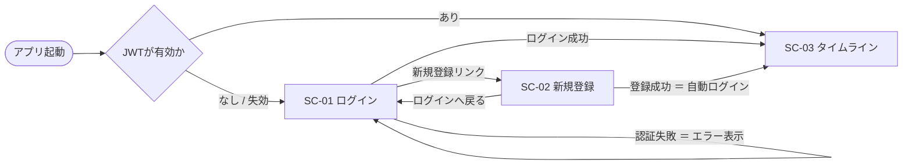
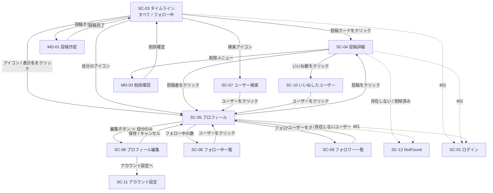

# 画面設計

本書は、[02_feature_list.md](02_feature_list.md) の機能を実現するために必要な画面と、その遷移・仕様を定義する。

> **📐 画面モックアップがあります**: 本書で定義した画面を HTML / CSS / JavaScript で再現した静的プロトタイプを [mockup/](../mockup/) に用意している。
> いいねの楽観的更新・タブ切替・無限スクロール・文字数カウンタなどは**実際に動く**ので、仕様を読む前に触ってみると理解が早い。
> ファイルと画面IDの対応は [mockup/README.md](../mockup/README.md) を参照。

---

## 1. 画面IDの採番規則

| 形式 | 対象 | 例 |
|---|---|---|
| `SC-<連番2桁>` | 画面（独立したURLを持つ） | `SC-03` タイムライン |
| `MD-<連番2桁>` | モーダル（URLを持たず、画面上に重ねて表示） | `MD-01` 投稿作成モーダル |

機能IDと同様、**一度振った画面IDは変更しない**。

---

## 2. 画面一覧

| 画面ID | 画面名 | パス | 認証 | 優先度 | 関連機能ID |
|---|---|---|---|---|---|
| SC-01 | ログイン | `/login` | 不要 | MVP | F-AU-02 |
| SC-02 | 新規登録 | `/signup` | 不要 | MVP | F-AU-01 |
| SC-03 | タイムライン | `/` | 必要 | MVP | F-TL-01, F-TL-02, F-TL-03, F-LK-01〜03, F-PO-05 |
| SC-04 | 投稿詳細 | `/posts/:postId` | 必要 | MVP | F-PO-03, F-CM-01〜04, F-LK-01〜03 |
| SC-05 | プロフィール | `/users/:userId` | 必要 | MVP | F-US-01, F-US-02, F-FL-01, F-FL-02, F-TL-03 |
| SC-06 | プロフィール編集 | `/settings/profile` | 必要 | MVP | F-US-03, F-US-04 |
| SC-07 | ユーザー検索 | `/search` | 必要 | Phase2 | F-US-05 |
| SC-08 | フォロー中一覧 | `/users/:userId/following` | 必要 | Phase2 | F-FL-03 |
| SC-09 | フォロワー一覧 | `/users/:userId/followers` | 必要 | Phase2 | F-FL-04 |
| SC-10 | いいねしたユーザー一覧 | `/posts/:postId/likes` | 必要 | Phase2 | F-LK-04 |
| SC-11 | アカウント設定 | `/settings/account` | 必要 | Phase2 | F-AU-05 |
| SC-12 | NotFound / エラー | `*` | 不要 | MVP | F-CO-01 |
| MD-01 | 投稿作成モーダル | — | 必要 | MVP | F-PO-01, F-PO-02, F-IM-01, F-IM-03 |
| MD-02 | 投稿編集モーダル | — | 必要 | Phase2 | F-PO-04 |
| MD-03 | 削除確認モーダル | — | 必要 | MVP | F-PO-05, F-CM-04 |

**MVP画面数: 8画面 + 2モーダル**

---

## 3. 画面遷移図

### 3.1 認証フロー（未ログイン時）



> **登録成功後は自動ログイン**する（F-AU-01）。登録APIがJWTを返すため、ログイン画面に戻す必要がない。

### 3.2 ログイン後のメイン遷移



**凡例**: 実線 = ユーザー操作による遷移 / 点線 = エラーによる自動遷移

---

## 4. 共通レイアウト

### 4.1 全体構造

```
┌──────────────────────────────────────────────┐
│  ヘッダー（固定）                              │
│  [ロゴ]        [検索🔍]  [アイコン▼]          │
├──────────────────────────────────────────────┤
│                                              │
│   メインコンテンツ（画面ごとに切替）             │
│   最大幅 600px / 中央寄せ                      │
│                                              │
│                                              │
├──────────────────────────────────────────────┤
│                            [ ✏ 投稿 ]  ←FAB  │
└──────────────────────────────────────────────┘
```

| 要素 | 内容 | 表示条件 |
|---|---|---|
| ロゴ | クリックで SC-03 タイムラインへ | 常時 |
| 検索アイコン | SC-07 へ遷移 | Phase2 |
| アイコンメニュー | ドロップダウン：「プロフィール」(SC-05) / 「設定」(SC-06) / 「ログアウト」(F-AU-03) | ログイン時のみ |
| FAB（投稿ボタン） | MD-01 を開く | ログイン時のみ。SC-03 / SC-05 で表示 |

未ログイン画面（SC-01 / SC-02）はヘッダーを表示せず、中央にフォームのみを配置する。

### 4.2 レスポンシブ方針

| ブレークポイント | レイアウト |
|---|---|
| 〜767px（スマートフォン） | 1カラム。ヘッダーは高さ56px。FABは右下固定 |
| 768px〜（PC / タブレット） | メインコンテンツを最大幅600pxで中央寄せ。左右に余白 |

サイドナビゲーションは設けない（X/Twitterのような3カラムレイアウトにはしない）。学習用途として構造を単純に保つ。

---

## 5. 共通UIコンポーネント

| コンポーネント | 用途 | 使用画面 |
|---|---|---|
| **投稿カード** | タイムライン・プロフィールでの投稿1件の表示 | SC-03, SC-04, SC-05 |
| **ユーザー行** | 一覧でのユーザー1件の表示（アイコン・表示名・@ユーザー名・自己紹介1行・フォローボタン） | SC-07, SC-08, SC-09, SC-10 |
| **いいねボタン** | ハートアイコン＋数字。押下で状態がトグルする | 投稿カード内 |
| **コメントボタン** | 吹き出しアイコン＋数字。押下で SC-04 へ | 投稿カード内 |
| **無限スクロールリスト** | 下端到達を検知して次ページを読み込む | SC-03, SC-04, SC-05 |
| **トースト** | 操作結果・エラーの一時表示（画面下部、3秒で自動消滅） | 全画面 |
| **モーダル** | MD-01 / MD-02 / MD-03 の土台。背景クリックとESCで閉じる | 全画面 |
| **アバター** | 円形のプロフィール画像。未設定時はイニシャルを表示 | 全画面 |

### 5.1 投稿カードの構造（最重要コンポーネント）

```
┌──────────────────────────────────────────┐
│ (◯)  表示名  @username · 3時間前     [⋯] │
│                                          │
│      投稿の本文がここに入ります。          │
│      最大280文字。                        │
│                                          │
│      ┌────────────────────┐              │
│      │                    │              │
│      │   添付画像（あれば）  │              │
│      │                    │              │
│      └────────────────────┘              │
│                                          │
│      💬 3        ♥ 12                    │
└──────────────────────────────────────────┘
```

| 要素 | 内容 | 備考 |
|---|---|---|
| アバター | クリックで SC-05 へ | |
| 表示名 / @ユーザー名 | クリックで SC-05 へ | |
| 投稿日時 | 24時間以内は相対表示（「3時間前」）、それ以降は絶対表示（「8月15日」） | |
| 「編集済み」 | `editedAt` が存在する場合のみ日時の後に表示 | F-PO-04 |
| `[⋯]` メニュー | **自分の投稿のみ表示**。「編集」(MD-02) /「削除」(MD-03) | F-PO-04, F-PO-05 |
| 本文 | 最大280文字。改行を保持。タイムラインでは5行を超えたら「続きを読む」で省略 | |
| 添付画像 | 角丸。クリックで拡大表示 | F-IM-02 |
| コメントボタン | 💬 + `commentCount`。クリックで SC-04 へ | F-LK-03 |
| いいねボタン | ♥ + `likeCount`。`isLikedByMe` が true なら塗りつぶし。クリックでトグル | F-LK-01〜03 |

> **重要（差別化ポイント）**: 投稿カードに**インプレッション数（閲覧数）は一切表示しない**。また、**リツイート / リポストのボタンも配置しない**。アクション行に並ぶのは「コメント」と「いいね」の2つだけである。

**カード全体のクリック** で SC-04 へ遷移する。ただしアバター・表示名・いいねボタン・`[⋯]` メニューのクリックはイベント伝播を止め、それぞれの動作を優先する。

---

## 6. 各画面の詳細仕様

### SC-01 ログイン

| 項目 | 内容 |
|---|---|
| パス | `/login` |
| 認証 | 不要。**ログイン済みの場合は SC-03 へリダイレクト** |
| 関連機能 | F-AU-02 |
| 使用API | #2 `POST /auth/login` |

**表示項目**

```
┌────────────────────────────┐
│         [ロゴ]              │
│                            │
│  メールアドレス              │
│  [________________]        │
│                            │
│  パスワード                  │
│  [________________]        │
│                            │
│  [      ログイン      ]     │
│                            │
│  アカウントをお持ちでない方は  │
│  → 新規登録                 │
└────────────────────────────┘
```

**バリデーション**

| 項目 | ルール | エラーメッセージ |
|---|---|---|
| メールアドレス | 必須、メール形式 | 「メールアドレスを入力してください」／「メールアドレスの形式が正しくありません」 |
| パスワード | 必須 | 「パスワードを入力してください」 |

**状態と挙動**

| 状態 | 挙動 |
|---|---|
| 送信中 | ボタンを無効化し「ログイン中...」を表示 |
| 認証失敗（401） | フォーム上部に「メールアドレスまたはパスワードが正しくありません」を表示。**どちらが間違っているかは示さない**（アカウント存在の推測を防ぐ） |
| 成功 | JWTを保存し SC-03 へ遷移 |
| サーバーエラー（500） | トーストで「通信に失敗しました。時間をおいて再度お試しください」 |

---

### SC-02 新規登録

| 項目 | 内容 |
|---|---|
| パス | `/signup` |
| 認証 | 不要。ログイン済みの場合は SC-03 へリダイレクト |
| 関連機能 | F-AU-01 |
| 使用API | #1 `POST /auth/signup` |

**入力項目とバリデーション**

| 項目 | ルール | エラーメッセージ |
|---|---|---|
| メールアドレス | 必須、メール形式、**一意** | 「このメールアドレスは既に登録されています」（409） |
| ユーザー名 | 必須、3〜30文字、半角英数字とアンダースコアのみ、**一意** | 「ユーザー名は半角英数字とアンダースコアのみ使用できます」／「このユーザー名は既に使われています」（409） |
| 表示名 | 必須、1〜50文字 | 「表示名を入力してください」 |
| パスワード | 必須、8文字以上、英字と数字を各1文字以上含む | 「パスワードは8文字以上で、英字と数字を含めてください」 |
| パスワード（確認） | 必須、上と一致 | 「パスワードが一致しません」 |

**挙動**

- ユーザー名は入力中に `@` プレフィックス付きでプレビュー表示する（例: `@taro_123`）。
- 登録成功時はJWTを保存して **SC-03 へ直接遷移**（自動ログイン）。
- 一意制約違反（409）はフィールド単位でエラーを表示する。

---

### SC-03 タイムライン

| 項目 | 内容 |
|---|---|
| パス | `/`（タブは `?tab=all` / `?tab=following`。省略時は `all`） |
| 認証 | 必要 |
| 関連機能 | F-TL-01, F-TL-02, F-TL-03, F-LK-01〜03, F-PO-05 |
| 使用API | #5 `GET /timeline`, #14/#15 いいね, #9 削除 |

**レイアウト**

```
┌──────────────────────────────────────┐
│ [ロゴ]          [🔍]  [◯▼]           │  ← 共通ヘッダー
├──────────────────────────────────────┤
│   すべて        │      フォロー中      │  ← タブ（固定）
│  ━━━━━━━━━━━                          │
├──────────────────────────────────────┤
│  ┌────────────────────────────────┐  │
│  │ 投稿カード                      │  │
│  └────────────────────────────────┘  │
│  ┌────────────────────────────────┐  │
│  │ 投稿カード                      │  │
│  └────────────────────────────────┘  │
│              ⟳ 読み込み中...          │  ← 無限スクロール
│                            [ ✏ ]     │  ← FAB
└──────────────────────────────────────┘
```

**タブの仕様**

| タブ | ラベル | クエリ | 内容 |
|---|---|---|---|
| 全体 | すべて | `?tab=all` | 全ユーザーの投稿を新着順（F-TL-01） |
| フォロー中 | フォロー中 | `?tab=following` | 自分＋フォロー中ユーザーの投稿を新着順（F-TL-02） |

- **タブの状態はURLクエリで表現する。** リロード・ブラウザバック・URL共有で状態が保持されること。
- タブ切り替え時はリストをリセットして先頭から取得し直す（カーソルも破棄する）。
- **タブごとに取得済みデータをキャッシュしない**（MVPでは単純化。切り替えるたびに再取得）。

**無限スクロール（F-TL-03）**

| 項目 | 仕様 |
|---|---|
| 初回取得 | 20件 |
| 追加取得 | 下端から200px手前に到達したら次の20件 |
| 取得中 | リスト末尾にスピナーを表示。多重リクエストを防ぐため取得中フラグで抑止 |
| 全件到達 | `hasNext: false` で「これ以上投稿はありません」を表示 |
| 失敗 | 「読み込みに失敗しました [再試行]」を表示 |

**いいね操作の挙動（楽観的UI更新）**

1. ボタン押下と同時に、**UI上のいいね数と塗りつぶし状態を即座に更新**する。
2. 裏でAPI（#14 / #15）を呼ぶ。
3. 成功時はレスポンスの `likeCount` で確定値に補正する。
4. 失敗時は元の状態に戻し、トーストで「いいねに失敗しました」を表示する。

> 楽観的更新により、通信待ちのラグを感じさせない。ただしサーバー値で必ず補正することで、他ユーザーのいいねによるズレも吸収できる。

**状態パターン**

| 状態 | 表示 |
|---|---|
| ローディング（初回） | 投稿カードのスケルトンを3件表示 |
| 空（全体TL） | 「まだ投稿がありません。最初の投稿をしてみましょう」＋ 投稿ボタン |
| 空（フォロー中TL） | 「フォロー中のユーザーの投稿がここに表示されます。気になるユーザーをフォローしてみましょう」 |
| エラー | 「タイムラインの取得に失敗しました [再試行]」 |

---

### SC-04 投稿詳細

| 項目 | 内容 |
|---|---|
| パス | `/posts/:postId` |
| 認証 | 必要 |
| 関連機能 | F-PO-03, F-PO-04, F-PO-05, F-CM-01〜04, F-LK-01〜03 |
| 使用API | #7 投稿取得, #10 コメント一覧, #11 コメント投稿, #13 コメント削除, #14/#15 いいね |

**レイアウト**

```
┌──────────────────────────────────────┐
│ [←戻る]                               │
├──────────────────────────────────────┤
│  (◯) 表示名 @username          [⋯]   │
│                                      │
│  投稿本文（省略せず全文表示）            │
│                                      │
│  [   添付画像   ]                     │
│                                      │
│  2026年8月15日 14:32 · 編集済み        │
│  ─────────────────────────────────    │
│  12 いいね  ← クリックで SC-10        │
│  ─────────────────────────────────    │
│  💬 3            ♥ 12                │
├──────────────────────────────────────┤
│  [◯] コメントを入力...        [送信]   │
├──────────────────────────────────────┤
│  (◯) Bさん @b_san · 2時間前     [⋯]  │
│       コメント本文                     │
│  ─────────────────────────────────    │
│  (◯) Cさん @c_san · 1時間前     [⋯]  │
│       コメント本文                     │
└──────────────────────────────────────┘
```

**投稿部分との違い（タイムラインの投稿カードとの差分）**

| 項目 | タイムライン | 投稿詳細 |
|---|---|---|
| 本文 | 5行で省略 | 全文表示 |
| 日時 | 相対表示（3時間前） | 絶対表示（2026年8月15日 14:32） |
| いいね数 | ボタン内の数字のみ | ボタンに加え、**「12 いいね」の行を独立表示**（クリックで SC-10 へ、Phase2） |

**コメント一覧（F-CM-02）**

| 項目 | 仕様 |
|---|---|
| 並び順 | **古い順（昇順）** — 会話の流れを追いやすくするため。タイムラインの新着順とは逆 |
| 取得件数 | 初回20件、以降スクロールで追加20件 |
| 各コメント | アバター・表示名・@ユーザー名・相対日時・本文・`[⋯]`メニュー（自分のコメントのみ） |
| 空状態 | 「まだコメントはありません。最初のコメントを書いてみましょう」 |

**コメント投稿（F-CM-01）**

| 項目 | 仕様 |
|---|---|
| 入力欄 | 常時表示。フォーカスで高さが拡張される |
| バリデーション | 必須、1〜280文字。文字数カウンタを表示（残り20文字を切ったら警告色） |
| 送信後 | 入力欄をクリアし、**コメント一覧の末尾に即座に追加**。投稿のコメント数を +1 する |
| 失敗時 | 入力内容を保持したままトーストでエラー表示 |

**投稿が存在しない / 論理削除済みの場合**

APIが404を返す。SC-12 NotFound へ遷移し、「この投稿は存在しないか、削除されました」と表示する。

---

### SC-05 プロフィール

| 項目 | 内容 |
|---|---|
| パス | `/users/:userId` |
| 認証 | 必要 |
| 関連機能 | F-US-01, F-US-02, F-FL-01, F-FL-02, F-TL-03 |
| 使用API | #17 プロフィール取得, #18 投稿一覧, #21/#22 フォロー |

**レイアウト**

```
┌──────────────────────────────────────┐
│ [←戻る]                               │
├──────────────────────────────────────┤
│   ( ◯ )                              │
│    アバター                            │
│                    [ プロフィールを編集 ]│  ← 自分の場合
│   表示名                    [ フォロー ] │  ← 他人の場合
│   @username                           │
│                                       │
│   自己紹介テキストがここに入ります。       │
│                                       │
│   2026年8月からご利用                   │
│                                       │
│   12 フォロー中   ·   34 フォロワー     │  ← クリックで SC-08 / SC-09
├──────────────────────────────────────┤
│   投稿  56件                           │
├──────────────────────────────────────┤
│  ┌────────────────────────────────┐  │
│  │ 投稿カード                      │  │
│  └────────────────────────────────┘  │
│              ⟳ 無限スクロール          │
└──────────────────────────────────────┘
```

**自分か他人かによる表示分岐**

APIレスポンスの `isMe` で判定する。

| 要素 | 自分（`isMe: true`） | 他人（`isMe: false`） |
|---|---|---|
| ボタン | 「プロフィールを編集」→ SC-06 | 「フォロー」/「フォロー中」トグル |
| 投稿の `[⋯]` メニュー | 表示（編集・削除） | 非表示 |

**フォローボタンの挙動（F-FL-01 / F-FL-02）**

| `isFollowing` | ラベル | ホバー時 | 押下時 |
|---|---|---|---|
| `false` | 「フォロー」（塗りつぶし） | — | API #21 を呼ぶ。楽観的に「フォロー中」へ変更し、フォロワー数を +1 |
| `true` | 「フォロー中」（枠線のみ） | 「フォロー解除」（赤） | API #22 を呼ぶ。**確認モーダルは出さない**（誤操作しても再フォローで復帰できるため） |

いいねと同様に楽観的UI更新を行い、失敗時は元に戻してトースト表示する。

**存在しないユーザーの場合**: 404 → SC-12 へ遷移し「このユーザーは存在しません」を表示。

---

### SC-06 プロフィール編集

| 項目 | 内容 |
|---|---|
| パス | `/settings/profile` |
| 認証 | 必要 |
| 関連機能 | F-US-03, F-US-04 |
| 使用API | #19 `PATCH /users/me`, #25 画像アップロード（Phase2） |

**入力項目**

| 項目 | ルール | 優先度 |
|---|---|---|
| プロフィール画像 | JPEG / PNG / WebP、5MBまで。円形にトリミング表示 | Phase2 |
| 表示名 | 必須、1〜50文字 | MVP |
| 自己紹介 | 任意、160文字まで。改行可。文字数カウンタを表示 | MVP |

**挙動**

- 画面を開いた時点で現在の値をフォームに読み込む。
- **変更がない場合は保存ボタンを無効化**する。
- 保存成功時はトーストで「プロフィールを更新しました」を表示し、SC-05（自分のプロフィール）へ遷移する。
- **未保存の変更がある状態で離脱しようとしたら確認ダイアログ**を出す。
- 画面下部に「アカウント設定」へのリンクを置く（SC-11、Phase2）。

**メールアドレスとユーザー名は本画面では変更できない。** ユーザー名の変更は他ユーザーの混乱を招くためPhase3、メールアドレスの変更は本人確認が必要になるため対象外とする。

---

### SC-07 ユーザー検索（Phase2）

| 項目 | 内容 |
|---|---|
| パス | `/search`（クエリは `?q=`） |
| 使用API | #20 `GET /users?q=` |

- 検索欄に入力後、**300msのデバウンス**を挟んでAPIを呼ぶ。
- **ユーザー名（`@taro_123`）と表示名（たろう）**の2つを検索対象とする。自己紹介とメールアドレスは対象外。
- 一致方法は**前方一致から始め、Phase2内で段階的にあいまい一致へ拡張する**（方式の詳細は [04_data_model.md](04_data_model.md) 6章）。
- 結果は「ユーザー行」コンポーネントの一覧。各行にフォローボタンを配置する。
- **自分自身は検索結果に出さない。**
- **ページネーションはオフセット方式**（結果が安定しているため。[05_api_design.md](05_api_design.md) 参照）。

**画面の状態**

| 状態 | 表示 |
|---|---|
| 未入力（初期） | 検索を促すメッセージ。**APIは呼ばない** |
| 入力中（デバウンス待ち） | 前回の結果を維持する。ちらつきを防ぐ |
| ローディング | スケルトンまたはスピナー |
| 0件 | 「『◯◯』に一致するユーザーは見つかりませんでした」 |
| エラー | 共通のエラー表示（F-CO-01） |

> **未入力でAPIを呼ばないこと。** `q` が空のリクエストは400になる（[05_api_design.md](05_api_design.md) #20）。フロント側で送信を抑止する。

> **デバウンスに加えて、古いレスポンスの破棄も必要。** 「ta」→「taro」と続けて入力した場合、ネットワーク状況によっては「ta」の結果が後から届いて表示を上書きすることがある。`AbortController` でリクエストをキャンセルするか、最新のリクエストの結果だけを採用する。

---

### SC-08 フォロー中一覧 / SC-09 フォロワー一覧（Phase2）

| 項目 | SC-08 | SC-09 |
|---|---|---|
| パス | `/users/:userId/following` | `/users/:userId/followers` |
| 見出し | 「フォロー中」 | 「フォロワー」 |
| 使用API | #23 | #24 |

- どちらも「ユーザー行」の一覧＋無限スクロール。
- 各行にフォローボタンを表示する（自分自身の行にはボタンを出さない）。
- 空状態: 「まだ誰もフォローしていません」／「まだフォロワーがいません」

---

### SC-10 いいねしたユーザー一覧（Phase2）

| 項目 | 内容 |
|---|---|
| パス | `/posts/:postId/likes` |
| 使用API | #16 |

- SC-04 の「12 いいね」をクリックして遷移する。
- 「ユーザー行」の一覧＋無限スクロール。いいねした新しい順に並べる。

---

### SC-11 アカウント設定（Phase2）

| 項目 | 内容 |
|---|---|
| パス | `/settings/account` |
| 使用API | #4 `PUT /auth/password` |

- パスワード変更フォーム（現在のパスワード / 新しいパスワード / 新しいパスワード（確認））。
- 変更成功時はトースト表示のみ。**ログアウトはさせない**（JWTは失効管理をしないため、そのまま有効）。
- メールアドレスの表示（変更不可、グレーアウト）。

---

### SC-12 NotFound / エラー

| 項目 | 内容 |
|---|---|
| パス | `*`（どのルートにも一致しない場合）、および404を受けた画面からの遷移先 |

| 発生元 | メッセージ |
|---|---|
| 未定義のURL | 「お探しのページは見つかりませんでした」 |
| 投稿が404 | 「この投稿は存在しないか、削除されました」 |
| ユーザーが404 | 「このユーザーは存在しません」 |

いずれも「タイムラインへ戻る」ボタンを配置する。

---

## 7. モーダル仕様

### MD-01 投稿作成モーダル

| 項目 | 内容 |
|---|---|
| 関連機能 | F-PO-01, F-PO-02, F-IM-01, F-IM-03 |
| 使用API | #25 画像アップロード → #6 投稿作成 |
| 起動元 | SC-03 / SC-05 のFAB |

```
┌──────────────────────────────────────┐
│  [×]                        [ 投稿 ]  │
├──────────────────────────────────────┤
│  (◯)  いまどうしてる？                 │
│                                      │
│       ┌──────────────┐               │
│       │ 画像プレビュー  │ [×]           │
│       └──────────────┘               │
│                                      │
├──────────────────────────────────────┤
│  [🖼 画像]                    248/280 │
└──────────────────────────────────────┘
```

**バリデーション**

| 項目 | ルール |
|---|---|
| 本文 | **必須**、1〜280文字。空白のみは不可 |
| 画像 | 任意。**MVPは1枚まで**（F-IM-03）。JPEG / PNG / WebP、1枚あたり5MBまで |

> **本文を必須にする理由**: 画像のみの投稿を許すとDB制約が複雑になるため、MVPでは本文必須で単純化する（[04_data_model.md](04_data_model.md) の `posts.body` 定義を参照）。

**画像添付のフロー（F-IM-01）**

1. 「画像」ボタンでファイル選択ダイアログを開く。
2. 選択と同時に**クライアント側で形式・サイズを検証**する。違反時はその場でエラー表示し、アップロードしない。
3. 検証を通過したら**即座にアップロード**（API #25）し、プレビューを表示する。アップロード中は進捗インジケータを出す。
4. レスポンスの `fileId` を保持する。
5. 「投稿」押下時に、本文と `fileId` を投稿API（#6）に送る。

> **アップロードを投稿より先に行う**ことで、投稿ボタン押下時の待ち時間をなくす。ただし投稿せずに閉じた場合、アップロード済みファイルが孤児になる（[01_requirements.md](01_requirements.md) R-03。MVPでは許容）。

**状態と挙動**

| 状態 | 挙動 |
|---|---|
| 送信中 | 「投稿」ボタンを無効化 |
| 成功 | モーダルを閉じ、**タイムライン先頭に新しい投稿を即座に挿入**。トーストで「投稿しました」 |
| 失敗 | モーダルを閉じず、入力を保持したままエラー表示 |
| 入力ありで閉じようとした | 「投稿を破棄しますか？」の確認を出す |

**文字数カウンタ**: 残り0文字でグレー→残り20文字で警告色→超過で赤＋投稿ボタン無効化。

---

### MD-02 投稿編集モーダル（Phase2）

| 項目 | 内容 |
|---|---|
| 関連機能 | F-PO-04 |
| 使用API | #8 `PATCH /posts/{postId}` |

- MD-01 とほぼ同じUI。ただし**画像の変更は不可**（既存の画像はプレビュー表示のみ、削除・追加ボタンを出さない）。
- 現在の本文を初期値としてフォームに読み込む。
- 保存成功後、その投稿の表示に「編集済み」が付く。

---

### MD-03 削除確認モーダル

| 項目 | 内容 |
|---|---|
| 関連機能 | F-PO-05, F-CM-04 |
| 使用API | #9 投稿削除 / #13 コメント削除 |

```
┌──────────────────────────────┐
│  投稿を削除しますか？           │
│                              │
│  この操作は取り消せません。      │
│                              │
│     [ キャンセル ]  [ 削除 ]   │
└──────────────────────────────┘
```

- 削除ボタンは赤色（破壊的操作の明示）。
- 対象に応じて文言を「投稿を削除しますか？」／「コメントを削除しますか？」と切り替える。
- 削除成功後:
  - **投稿削除（SC-03から）**: リストから該当カードを除去
  - **投稿削除（SC-04から）**: SC-03 へ遷移
  - **コメント削除**: 一覧から除去し、投稿のコメント数を -1

---

## 8. エラー・空・ローディング状態の設計方針

すべての一覧・詳細画面は、以下の4状態を必ず設計する。

| 状態 | 方針 |
|---|---|
| **ローディング** | スピナーではなく**スケルトン**（コンテンツの形をした灰色のプレースホルダ）を使う。レイアウトシフトを防ぐため |
| **空** | 単に「データがありません」で終わらせず、**次に取るべき行動を提示**する（例: 「最初の投稿をしてみましょう」＋ボタン） |
| **エラー** | 原因と再試行手段を示す。「[再試行]」ボタンを必ず添える |
| **正常** | — |

### エラー表示方法の使い分け（F-CO-01）

| エラーの種類 | 表示方法 |
|---|---|
| フォームのバリデーションエラー（400） | **該当フィールドの直下**に赤字で表示 |
| 認証失敗（401、ログイン時） | フォーム上部にまとめて表示 |
| 認証切れ（401、それ以外） | JWTを破棄し SC-01 へ自動遷移（F-CO-02）。トーストで「セッションの有効期限が切れました」 |
| 権限エラー（403） | トーストで「この操作を行う権限がありません」 |
| 対象なし（404） | SC-12 へ遷移 |
| 通信エラー / サーバーエラー（500） | トーストで「通信に失敗しました。時間をおいて再度お試しください」 |
| 一覧取得の失敗 | リスト領域内に「[再試行]」付きで表示（トーストにしない） |

---

## 9. 画面と機能の対応マトリクス

「この画面を変更したら、どの機能に影響するか」の逆引き表。

| 画面ID | F-AU | F-US | F-PO | F-CM | F-LK | F-FL | F-TL | F-IM | F-CO |
|---|---|---|---|---|---|---|---|---|---|
| SC-01 | 02 | | | | | | | | 01 |
| SC-02 | 01 | | | | | | | | 01 |
| SC-03 | 03,04 | | 05 | | 01,02,03 | | 01,02,03 | 02 | 01,02 |
| SC-04 | 04 | | 03,04,05 | 01,02,03,04 | 01,02,03 | | 03 | 02 | 01,02 |
| SC-05 | 04 | 01,02 | 05 | | 01,02,03 | 01,02 | 03 | 02 | 01,02 |
| SC-06 | 04 | 03,04 | | | | | | 01 | 01 |
| SC-07 | 04 | 05 | | | | 01,02 | | | 01 |
| SC-08 | 04 | | | | | 03 | | | 01 |
| SC-09 | 04 | | | | | 04 | | | 01 |
| SC-10 | 04 | | | | 04 | | | | 01 |
| SC-11 | 05 | | | | | | | | 01 |
| MD-01 | | | 01,02 | | | | | 01,03 | 01 |
| MD-02 | | | 04 | | | | | | 01 |
| MD-03 | | | 05 | 04 | | | | | 01 |

---

## 関連ドキュメント

- [01_requirements.md](01_requirements.md) — 要件定義書
- [02_feature_list.md](02_feature_list.md) — 機能一覧
- [04_data_model.md](04_data_model.md) — データモデル
- [05_api_design.md](05_api_design.md) — API設計
- [08_glossary.md](08_glossary.md) — 用語集
