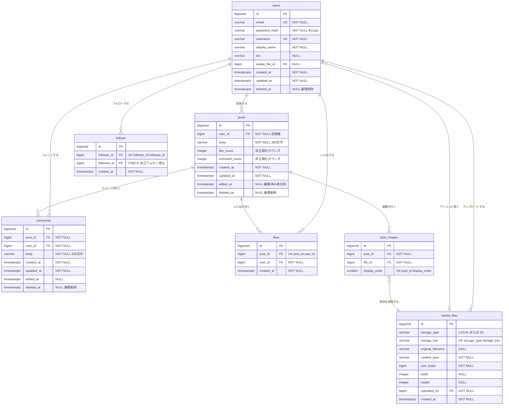

# データモデル / ER図

本書は、[03_screen_design.md](03_screen_design.md) の各画面が必要とするデータから逆算して設計したデータベース構造を定義する。
DBMSは **PostgreSQL** を前提とする。

---

## 1. ER図



> **図と表の役割分担**: 上のER図は「テーブルがどう繋がっているか」を理解するためのもの。
> **実装の正は次章のテーブル定義表**とする。制約やデフォルト値の詳細は必ず表を参照すること。

> **`users` と `follows` の関係について**: `follows` は `follower_id` と `followee_id` の両方が `users` を参照する自己参照テーブルだが、Mermaidで2本の線を引くとラベルが重なって読みづらくなるため図では1本にまとめている。実際には2つの外部キーがある。

---

## 2. テーブル定義

### 2.1 `users` — ユーザー

関連機能: F-AU-01, F-AU-02, F-US-01〜05

| カラム | 型 | NULL | デフォルト | 説明 |
|---|---|---|---|---|
| `id` | `BIGSERIAL` | NO | 自動採番 | 主キー |
| `email` | `VARCHAR(255)` | NO | — | ログインID。システム全体で一意 |
| `password_hash` | `VARCHAR(255)` | NO | — | BCryptでハッシュ化したパスワード。**平文は保存しない** |
| `username` | `VARCHAR(30)` | NO | — | `@taro_123` のハンドル。一意 |
| `display_name` | `VARCHAR(50)` | NO | — | 画面に表示する名前。重複可 |
| `bio` | `VARCHAR(160)` | YES | `NULL` | 自己紹介 |
| `avatar_file_id` | `BIGINT` | YES | `NULL` | プロフィール画像。`stored_files.id` を参照 |
| `created_at` | `TIMESTAMPTZ` | NO | `now()` | 登録日時。「2026年8月からご利用」の表示に使う |
| `updated_at` | `TIMESTAMPTZ` | NO | `now()` | 更新日時 |
| `deleted_at` | `TIMESTAMPTZ` | YES | `NULL` | 論理削除（退会）。MVPでは退会機能なしだが、カラムは用意する |

**制約**

| 種別 | 定義 |
|---|---|
| PK | `id` |
| UNIQUE | `email` |
| UNIQUE | `username` |
| FK | `avatar_file_id` → `stored_files(id)` `ON DELETE SET NULL` |
| CHECK | `char_length(username) >= 3` |
| CHECK | `username ~ '^[a-zA-Z0-9_]+$'` — 半角英数字とアンダースコアのみ |
| CHECK | `char_length(display_name) >= 1` |

> **`email` / `username` の一意制約に `deleted_at` を絡めない**: 退会したユーザーのメールアドレスは再利用させない方針とする。部分ユニークインデックスにすると退会後に同じメールで再登録できてしまい、過去の投稿との紐付けが曖昧になるため。

---

### 2.2 `posts` — 投稿

関連機能: F-PO-01〜05, F-TL-01〜03, F-LK-03

| カラム | 型 | NULL | デフォルト | 説明 |
|---|---|---|---|---|
| `id` | `BIGSERIAL` | NO | 自動採番 | 主キー |
| `user_id` | `BIGINT` | NO | — | 投稿者 |
| `body` | `VARCHAR(280)` | NO | — | 本文。**空文字は不可**（MD-01の仕様と一致） |
| `like_count` | `INTEGER` | NO | `0` | **非正規化カウンタ**。3.1参照 |
| `comment_count` | `INTEGER` | NO | `0` | **非正規化カウンタ**。3.1参照 |
| `created_at` | `TIMESTAMPTZ` | NO | `now()` | 投稿日時。タイムラインのソートキー |
| `updated_at` | `TIMESTAMPTZ` | NO | `now()` | レコードの更新日時（カウンタ更新でも変わる） |
| `edited_at` | `TIMESTAMPTZ` | YES | `NULL` | **本文が編集された**日時。値があればUIに「編集済み」を表示 |
| `deleted_at` | `TIMESTAMPTZ` | YES | `NULL` | 論理削除 |

**制約**

| 種別 | 定義 |
|---|---|
| PK | `id` |
| FK | `user_id` → `users(id)` `ON DELETE RESTRICT` |
| CHECK | `char_length(btrim(body)) >= 1` — 空白のみの投稿を防ぐ |
| CHECK | `like_count >= 0` |
| CHECK | `comment_count >= 0` |

> **`updated_at` と `edited_at` を分ける理由**: `updated_at` はカウンタ更新でも変わってしまうため、「ユーザーが本文を編集した」ことの判定には使えない。UIの「編集済み」表示には専用の `edited_at` を使う。

> **`ON DELETE RESTRICT` の意図**: ユーザーを物理削除しようとしたら投稿が残っていてエラーになる。ユーザー削除は論理削除で行う方針なので、これは「誤って物理削除するのを防ぐ安全装置」として機能する。

---

### 2.3 `comments` — コメント

関連機能: F-CM-01〜04

| カラム | 型 | NULL | デフォルト | 説明 |
|---|---|---|---|---|
| `id` | `BIGSERIAL` | NO | 自動採番 | 主キー |
| `post_id` | `BIGINT` | NO | — | コメント先の投稿 |
| `user_id` | `BIGINT` | NO | — | コメントしたユーザー |
| `body` | `VARCHAR(280)` | NO | — | コメント本文 |
| `created_at` | `TIMESTAMPTZ` | NO | `now()` | コメント日時。一覧のソートキー（**昇順**） |
| `updated_at` | `TIMESTAMPTZ` | NO | `now()` | |
| `edited_at` | `TIMESTAMPTZ` | YES | `NULL` | 編集済み表示用 |
| `deleted_at` | `TIMESTAMPTZ` | YES | `NULL` | 論理削除 |

**制約**

| 種別 | 定義 |
|---|---|
| PK | `id` |
| FK | `post_id` → `posts(id)` `ON DELETE RESTRICT` |
| FK | `user_id` → `users(id)` `ON DELETE RESTRICT` |
| CHECK | `char_length(btrim(body)) >= 1` |

> **`parent_comment_id` は持たない。** コメントのネストは対象外（設計判断③参照）。

---

### 2.4 `likes` — いいね

関連機能: F-LK-01〜04

| カラム | 型 | NULL | デフォルト | 説明 |
|---|---|---|---|---|
| `id` | `BIGSERIAL` | NO | 自動採番 | 主キー |
| `post_id` | `BIGINT` | NO | — | いいねされた投稿 |
| `user_id` | `BIGINT` | NO | — | いいねしたユーザー |
| `created_at` | `TIMESTAMPTZ` | NO | `now()` | SC-10の並び順（新しい順）に使う |

**制約**

| 種別 | 定義 |
|---|---|
| PK | `id` |
| **UNIQUE** | **`(post_id, user_id)`** — 二重いいねを防ぐ最後の砦 |
| FK | `post_id` → `posts(id)` `ON DELETE CASCADE` |
| FK | `user_id` → `users(id)` `ON DELETE CASCADE` |

> **`deleted_at` を持たない（物理削除）。** 設計判断②参照。

---

### 2.5 `follows` — フォロー関係

関連機能: F-FL-01〜04, F-TL-02

| カラム | 型 | NULL | デフォルト | 説明 |
|---|---|---|---|---|
| `id` | `BIGSERIAL` | NO | 自動採番 | 主キー |
| `follower_id` | `BIGINT` | NO | — | **フォローする側**のユーザー |
| `followee_id` | `BIGINT` | NO | — | **フォローされる側**のユーザー |
| `created_at` | `TIMESTAMPTZ` | NO | `now()` | フォロー日時 |

**制約**

| 種別 | 定義 |
|---|---|
| PK | `id` |
| **UNIQUE** | **`(follower_id, followee_id)`** — 重複フォローを防ぐ |
| **CHECK** | **`follower_id <> followee_id`** — 自己フォローを防ぐ |
| FK | `follower_id` → `users(id)` `ON DELETE CASCADE` |
| FK | `followee_id` → `users(id)` `ON DELETE CASCADE` |

> **`follower` / `followee` の取り違えに注意**（[08_glossary.md](08_glossary.md)）。
> 「AさんがBさんをフォローする」= `(follower_id = A, followee_id = B)` の1行。

---

### 2.6 `post_images` — 投稿の添付画像

関連機能: F-PO-02, F-IM-01, F-IM-02

| カラム | 型 | NULL | デフォルト | 説明 |
|---|---|---|---|---|
| `id` | `BIGSERIAL` | NO | 自動採番 | 主キー |
| `post_id` | `BIGINT` | NO | — | 添付先の投稿 |
| `file_id` | `BIGINT` | NO | — | 画像の実体（`stored_files`） |
| `display_order` | `SMALLINT` | NO | `0` | 表示順（0始まり） |

**制約**

| 種別 | 定義 |
|---|---|
| PK | `id` |
| UNIQUE | `(post_id, display_order)` — 同じ投稿内で表示順が重複しない |
| FK | `post_id` → `posts(id)` `ON DELETE CASCADE` |
| FK | `file_id` → `stored_files(id)` `ON DELETE RESTRICT` |
| CHECK | `display_order BETWEEN 0 AND 3` — **1投稿あたり最大4枚** |

> **DBは4枚まで対応するが、MVPのAPIバリデーションは1枚に制限する**（F-IM-03）。Phase2で上限を引き上げるだけで済む。設計判断④参照。

---

### 2.7 `stored_files` — 保存ファイルのメタ情報

関連機能: F-IM-01, F-IM-02, F-US-04

| カラム | 型 | NULL | デフォルト | 説明 |
|---|---|---|---|---|
| `id` | `BIGSERIAL` | NO | 自動採番 | 主キー |
| `storage_type` | `VARCHAR(20)` | NO | `'LOCAL'` | 保存先種別。`LOCAL` / `S3` |
| `storage_key` | `VARCHAR(512)` | NO | — | 保存先内での相対パス（例: `2026/08/17/uuid.jpg`）。**絶対URLも物理パスも入れない** |
| `original_filename` | `VARCHAR(255)` | YES | `NULL` | アップロード時のファイル名 |
| `content_type` | `VARCHAR(100)` | NO | — | MIMEタイプ（`image/jpeg` 等） |
| `size_bytes` | `BIGINT` | NO | — | ファイルサイズ |
| `width` | `INTEGER` | YES | `NULL` | 画像の幅（px）。表示時のレイアウトシフト防止に使う |
| `height` | `INTEGER` | YES | `NULL` | 画像の高さ（px） |
| `uploaded_by` | `BIGINT` | NO | — | アップロードしたユーザー |
| `created_at` | `TIMESTAMPTZ` | NO | `now()` | 孤児ファイルの検出（R-03）にも使う |

**制約**

| 種別 | 定義 |
|---|---|
| PK | `id` |
| UNIQUE | `(storage_type, storage_key)` |
| FK | `uploaded_by` → `users(id)` `ON DELETE RESTRICT` |
| CHECK | `storage_type IN ('LOCAL', 'S3')` |
| CHECK | `size_bytes > 0` |

> **このテーブルが画像ストレージ抽象化の要**。設計判断⑤参照。詳細は [07_architecture.md](07_architecture.md)。

---

## 3. 設計判断

本章の判断はすべて [09_decision_log.md](09_decision_log.md) にも記録している。

### 3.1 設計判断① — いいね数・コメント数のカウント方式

**採用: 非正規化カウンタカラム（`posts.like_count` / `posts.comment_count`）**

#### 比較

| 選択肢 | メリット | デメリット |
|---|---|---|
| A. 都度 `COUNT(*)` | 常に正確。カラム不要。実装が単純 | タイムライン20件×2種のカウントで相関サブクエリが走る。件数増で劣化する |
| B. **非正規化カウンタ** | タイムライン取得が単一クエリで完結。高速 | 更新漏れ・競合でズレる。トランザクション設計が必要 |
| C. 集計テーブル / キャッシュ | 大規模でもスケールする | 学習段階では過剰 |

#### Bを選んだ理由

1. **学習価値が最も高い。** 「非正規化を導入すると、代わりにトランザクション整合性の責任が発生する」というRDB設計の核心を実地で学べる。A案では得られない学びである。
2. **N+1問題を体感できる。** [01_requirements.md](01_requirements.md) の学習ゴールに直結する。
3. タイムライン（1画面20件）で毎回カウントが必要という、**非正規化が正当化される典型パターン**そのものである。

> **推奨する学習ステップ**: 最初はA案（都度COUNT）で実装し、`EXPLAIN ANALYZE` で遅さを確認してからB案にリファクタリングする。この過程自体が最も学びが大きい。

#### 実装ルール（必ず守ること）

| # | ルール | 理由 |
|---|---|---|
| 1 | いいね/コメントの登録・削除と、カウンタ更新を**同一トランザクション**で実行する | 片方だけ成功するとズレが永続化する |
| 2 | カウンタは**SQL側で相対更新**する: `UPDATE posts SET like_count = like_count + 1 WHERE id = ?` | Java側で「読み取り→加算→書き込み」をすると、同時実行でロストアップデートが発生する |
| 3 | 二重いいね（UNIQUE制約違反）は例外を捕捉し、**カウンタを更新せずに成功として返す** | 冪等性の担保（F-LK-01） |
| 4 | コメントの論理削除時は `comment_count` を **-1 する** | 3.2の非対称ルール参照 |

#### 整合性の回復（Appendix）

万一カウンタがズレた場合、以下で再集計できる。開発中は定期的に実行して検証するとよい。

```sql
-- いいね数の再集計
UPDATE posts p
SET like_count = (
    SELECT COUNT(*) FROM likes l WHERE l.post_id = p.id
);

-- コメント数の再集計（論理削除済みは除外する点に注意）
UPDATE posts p
SET comment_count = (
    SELECT COUNT(*) FROM comments c
    WHERE c.post_id = p.id AND c.deleted_at IS NULL
);

-- ズレの検出（0行ならOK）
SELECT p.id, p.like_count, (SELECT COUNT(*) FROM likes l WHERE l.post_id = p.id) AS actual
FROM posts p
WHERE p.like_count <> (SELECT COUNT(*) FROM likes l WHERE l.post_id = p.id);
```

---

### 3.2 設計判断② — 論理削除の範囲とカスケード方針

**採用: 論理削除は `posts` / `comments` / `users` のみ。`likes` / `follows` は物理削除。**

#### `likes` / `follows` を物理削除にする理由

論理削除にすると `UNIQUE (post_id, user_id)` が機能しなくなる。
「いいね → 解除 → 再びいいね」のたびに削除済み行が残り、2回目のINSERTがユニーク制約違反になってしまう。

部分ユニークインデックス（`UNIQUE (post_id, user_id) WHERE deleted_at IS NULL`）で回避はできるが、学習段階では複雑さに見合わない。
そもそも**いいね・フォローは「取り消した履歴」を残す価値がない**関係テーブルであり、物理削除が適切である。

#### カスケード方針

| 親の操作 | 子データの扱い | 実装 |
|---|---|---|
| 投稿を論理削除 | **コメント: そのまま残す** | 追い削除しない |
| 投稿を論理削除 | **いいね: そのまま残す** | 追い削除しない |
| 投稿を論理削除 | **画像ファイルの実体: 残す** | 復元可能性のため。Phase3でバッチ物理削除を検討 |
| コメントを論理削除 | なし | — |
| ユーザーを論理削除（退会） | 投稿・コメントも非表示扱い。フォロー関係は物理削除 | Phase3。MVPでは退会機能自体がない |

投稿が論理削除されると投稿自体が取得されなくなるため、紐づくコメント・いいねは**実質的に到達不能**になる。追い削除は不要であり、削除処理を軽く保てる。

#### カウンタとの非対称ルール（重要）

| 操作 | `comment_count` の扱い |
|---|---|
| **投稿**を論理削除 | **触らない**（投稿ごと消えるため意味がない） |
| **コメント**単体を論理削除 | **-1 する**（一覧の表示件数と一致させるため） |

この非対称性は直感に反するため、実装時に混乱しやすい。テスト観点として必ず確認すること。

#### 論理削除の運用規約

| # | 規約 |
|---|---|
| 1 | **リポジトリ層の全クエリに `deleted_at IS NULL` を付与する。** 例外はカウンタ再集計SQLと管理用クエリのみ |
| 2 | 実現方法はHibernateの `@SQLRestriction("deleted_at is null")` を使う（Hibernate 5系なら `@Where`） |
| 3 | 論理削除済みリソースへのGETは **`404 Not Found`** を返す。`410 Gone` は使わない（存在の有無を漏らさないため） |
| 4 | 削除処理は `DELETE` 文ではなく `UPDATE ... SET deleted_at = now()` で行う |

---

### 3.3 設計判断③ — コメントのネスト（返信）

**採用: 1階層フラット。`parent_comment_id` を持たない。**

#### 理由

1. **X/Twitterの実UXから逸脱しない。** Xではリプライ自体が投稿だが、本アプリは「投稿詳細にコメントが時系列で並ぶ」形が最もシンプルで、学習ゴールを満たす。
2. ネストを許すと、**再帰クエリ（`WITH RECURSIVE`）・ツリー描画・深さ制限・親削除時の子の扱い（tombstone表示）** といった問題が一気に増える。要件定義フェーズで避けるべき複雑さである。
3. `comments.post_id` に対する**単純なページネーション**が可能になる。ツリー構造だとページネーション自体が難問になる。

#### 将来の拡張余地

Phase3で返信が必要になった場合、以下で実現できる（設計だけ残しておく）。

```sql
ALTER TABLE comments ADD COLUMN parent_comment_id BIGINT NULL
    REFERENCES comments(id);
```

ただし**2階層以上は許さない**。「返信への返信」は同じ親にぶら下げる（Redditのような無限ツリーではなく、**Slackのスレッド型**）。これにより再帰クエリを回避できる。

#### 代替手段

「誰への返信か」を表現したい場合は、本文中の `@ユーザー名` メンション記法で足りる。これはPhase3の検討事項として [01_requirements.md](01_requirements.md) 3.2に記載済み。

---

### 3.4 設計判断④ — 画像テーブルの分割

**採用: `post_images` テーブルに分離。1投稿に最大4枚（DBレベル）。**

#### 理由

1. `posts` に `image_url1` 〜 `image_url4` を並べるのは典型的なアンチパターン。**学習目的として悪い例を作らない。**
2. **1対多の正規化**というRDB設計の基本を学べる。
3. `display_order` + `UNIQUE (post_id, display_order)` により、表示順の重複を防げる。
4. 実装コストはほぼ変わらない。1枚しか使わなくてもテーブル構造はそのままでよい。

#### MVPでの割り切り

| 層 | 上限 |
|---|---|
| DB（`CHECK display_order BETWEEN 0 AND 3`） | **4枚** |
| APIバリデーション | **1枚**（MVP） → Phase2で4枚 |
| UI | **1枚**（MVP） → Phase2で4枚 |

DBを最初から複数枚対応にしておくことで、Phase2ではバリデーションの数値を変えるだけで済む。マイグレーションが不要になる。

---

### 3.5 設計判断⑤ — 画像ストレージの抽象化（`stored_files`）

**採用: `stored_files` テーブルに `storage_type` + `storage_key` を保持し、URLは保存しない。**

#### なぜURLを保存しないのか

| 保存する内容 | ローカル→S3移行時に起きること |
|---|---|
| ✕ 絶対URL（`http://localhost:8080/uploads/abc.jpg`） | 全レコードのURL書き換えが必要。ドメイン変更でも壊れる |
| ✕ 物理パス（`C:\app\uploads\abc.jpg`） | OS依存。サーバー移設で全滅 |
| ○ **`storage_type` + `storage_key`** | `storage_type` を `'S3'` に更新するだけ。`storage_key` はそのまま流用できる |

#### 責務の分離

```
DB (stored_files)          : storage_type = 'LOCAL', storage_key = '2026/08/17/uuid.jpg'
        ↓
FileStorageService         : 保存・取得・URL生成のインターフェース
        ↓
LocalFileStorageService    : ./uploads/2026/08/17/uuid.jpg に読み書き
                             generateUrl() → http://localhost:8080/files/123
（将来）S3FileStorageService : S3バケットに読み書き
                             generateUrl() → 署名付きURL
```

**URLの組み立てはアプリ層（`FileStorageService#generateUrl`）の責務**とし、DBは「どこに何というキーで置いたか」だけを知る。
インターフェースの詳細は [07_architecture.md](07_architecture.md) を参照。

#### `stored_files` を独立させる副次的なメリット

- **投稿画像（`post_images`）とプロフィール画像（`users.avatar_file_id`）で同じアップロード基盤を再利用できる。**
- ファイルサイズ・MIMEタイプ・寸法といったメタ情報を一箇所で管理できる。
- `width` / `height` を保持することで、フロントエンドが**画像読み込み前に領域を確保**でき、レイアウトシフトを防げる。
- `created_at` と参照の有無から**孤児ファイルを検出**できる（R-03対応）。

```sql
-- 孤児ファイルの検出（どこからも参照されていない、24時間以上前のファイル）
SELECT sf.* FROM stored_files sf
WHERE NOT EXISTS (SELECT 1 FROM post_images pi WHERE pi.file_id = sf.id)
  AND NOT EXISTS (SELECT 1 FROM users u WHERE u.avatar_file_id = sf.id)
  AND sf.created_at < now() - INTERVAL '24 hours';
```

---

### 3.6 設計判断⑥ — ユニーク制約と自己フォロー防止

#### いいねの重複防止

```sql
ALTER TABLE likes ADD CONSTRAINT uk_likes_post_user UNIQUE (post_id, user_id);
```

アプリ層でも「既にいいね済みか」を事前チェックするが、**同時押下（ダブルクリックや複数タブ）の競合はDB制約が最後の砦**となる。

実装方針:
```
try {
    INSERT INTO likes ...
    UPDATE posts SET like_count = like_count + 1 ...
} catch (DataIntegrityViolationException e) {
    // 既にいいね済み → 何もせず成功として返す（冪等）
}
```

#### 自己フォローの防止

```sql
ALTER TABLE follows ADD CONSTRAINT chk_follows_not_self CHECK (follower_id <> followee_id);
ALTER TABLE follows ADD CONSTRAINT uk_follows UNIQUE (follower_id, followee_id);
```

**DB制約とアプリ層バリデーションの二重で持つ。**

| 層 | 役割 |
|---|---|
| アプリ層 | `400 Bad Request` と「自分自身をフォローすることはできません」という**親切なメッセージ**を返す |
| DB CHECK制約 | アプリ層の実装漏れがあっても**データ不整合を絶対に許さない** |

どちらか一方では不十分である。DB制約だけだとエラーメッセージが不親切になり、アプリ層だけだとバグで不正データが入りうる。

---

## 4. インデックス設計

```sql
-- ① 全体タイムライン（F-TL-01）: 新着順 + 論理削除除外
CREATE INDEX idx_posts_timeline
  ON posts (created_at DESC, id DESC)
  WHERE deleted_at IS NULL;

-- ② プロフィールの投稿一覧（F-US-02）/ フォロー中TLの起点
CREATE INDEX idx_posts_user_created
  ON posts (user_id, created_at DESC, id DESC)
  WHERE deleted_at IS NULL;

-- ③ フォロー中TL（F-TL-02）: follower_id から followee 群を引く
CREATE INDEX idx_follows_follower
  ON follows (follower_id, followee_id);

-- ④ フォロワー一覧（F-FL-04）
CREATE INDEX idx_follows_followee
  ON follows (followee_id, follower_id);

-- ⑤ 投稿詳細のコメント一覧（F-CM-02）: 昇順である点に注意
CREATE INDEX idx_comments_post_created
  ON comments (post_id, created_at ASC, id ASC)
  WHERE deleted_at IS NULL;

-- ⑥ 「自分がいいね済みか」の判定（isLikedByMe）
CREATE INDEX idx_likes_user_post
  ON likes (user_id, post_id);
-- ※ UNIQUE (post_id, user_id) が既にあるので、post_id 起点のインデックスは不要

-- ⑦ 投稿の画像取得
CREATE INDEX idx_post_images_post
  ON post_images (post_id, display_order);

-- ⑧ ユーザー検索・第1段階（F-US-05、Phase2）: 前方一致
--    ILIKE 'q%' でインデックスを効かせるため text_pattern_ops + lower() の式インデックスにする
CREATE INDEX idx_users_username_prefix
  ON users (lower(username) text_pattern_ops)
  WHERE deleted_at IS NULL;
CREATE INDEX idx_users_display_name_prefix
  ON users (lower(display_name) text_pattern_ops)
  WHERE deleted_at IS NULL;

-- ⑨ ユーザー検索・第2段階（F-US-05、Phase2）: 中間一致 / あいまい一致
CREATE EXTENSION IF NOT EXISTS pg_trgm;
CREATE INDEX idx_users_display_name_trgm
  ON users USING gin (display_name gin_trgm_ops);
CREATE INDEX idx_users_username_trgm
  ON users USING gin (username gin_trgm_ops);
```

> **⑧と⑨は用途が違うので両方作る。** 前方一致（⑧）とあいまい一致（⑨）ではプランナが選ぶインデックスが異なる。詳細は6章。

### 4.1 部分インデックス（`WHERE deleted_at IS NULL`）を使う理由

論理削除された投稿は**タイムラインで一切引かれない**。したがってインデックスに含める意味がない。

| 効果 | 内容 |
|---|---|
| サイズ削減 | 削除済み行を含まないぶんインデックスが小さくなり、メモリに乗りやすい |
| プランナへのヒント | PostgreSQLのプランナが「タイムライン専用のインデックス」として認識しやすくなる |
| 学習価値 | 部分インデックスはPostgreSQL固有の強力な機能。MySQLにはない |

> **注意**: 部分インデックスが使われるには、**クエリ側にも同じ `WHERE deleted_at IS NULL` が含まれている必要がある**。3.2の運用規約①が守られていることが前提となる。

### 4.2 複合インデックスに `id` を含める理由

`(created_at DESC, id DESC)` のように**主キーをタイブレーカーとして含める**。

同一時刻の投稿が複数あると、`created_at` だけではソート順が不定になり、カーソルページネーションで取りこぼしや重複が発生する。`id` を第2キーにすることで順序が一意に確定する。

詳細は [05_api_design.md](05_api_design.md) のページネーション設計を参照。

---

## 5. 主要クエリ

### 5.1 全体タイムライン（F-TL-01）

```sql
SELECT p.*
FROM posts p
WHERE p.deleted_at IS NULL
  AND (p.created_at, p.id) < (:cursorCreatedAt, :cursorId)  -- 初回はこの行を省略
ORDER BY p.created_at DESC, p.id DESC
LIMIT 20;
```

`(a, b) < (x, y)` は PostgreSQL の**行値比較**。`a < x OR (a = x AND b < y)` と等価だが、こちらの方が簡潔でインデックスも効きやすい。

### 5.2 フォロー中タイムライン（F-TL-02）

```sql
SELECT p.*
FROM posts p
WHERE p.deleted_at IS NULL
  AND (
        p.user_id = :me
     OR p.user_id IN (SELECT f.followee_id FROM follows f WHERE f.follower_id = :me)
      )
  AND (p.created_at, p.id) < (:cursorCreatedAt, :cursorId)
ORDER BY p.created_at DESC, p.id DESC
LIMIT 20;
```

> **`p.user_id = :me` を含める理由**: 自分の投稿もフォロー中タイムラインに表示する（F-TL-02の仕様）。投稿直後に「消えた」と感じさせないため。

#### 学習演習: 3つの書き方を比較する

同じ結果を返す以下の3パターンを `EXPLAIN ANALYZE` で比較すると、PostgreSQLのプランナの挙動を理解できる。

```sql
-- パターンA: IN サブクエリ（上記）
AND p.user_id IN (SELECT followee_id FROM follows WHERE follower_id = :me)

-- パターンB: JOIN
FROM posts p
JOIN follows f ON f.followee_id = p.user_id AND f.follower_id = :me

-- パターンC: EXISTS
AND EXISTS (SELECT 1 FROM follows f WHERE f.follower_id = :me AND f.followee_id = p.user_id)
```

パターンBは**自分の投稿を含めるためにUNIONが必要**になり、かつフォロー関係が重複するとJOINで行が増えるリスクがある。パターンAとCはプランナが同じ実行計画に最適化することが多い。

### 5.3 「自分がいいね済みか」の一括取得（N+1回避）

タイムライン20件それぞれに対して個別にクエリを投げると **N+1問題**が発生する。取得した投稿IDをまとめて1回で引く。

```sql
SELECT post_id FROM likes
WHERE user_id = :me AND post_id = ANY(:postIds);
```

結果を `Set<Long>` にして、各投稿の `isLikedByMe` を組み立てる。**タイムライン1回の取得につき、いいね判定のクエリは1回だけ**にすること。

同じ考え方をプロフィール取得時の `isFollowing` にも適用する。

---

## 6. ユーザー検索の設計（F-US-05 / API #20）

**採用: 段階式。第1段階で「前方一致」、第2段階で「pg_trgm によるあいまい一致」に拡張する。**

フォロー機能（F-FL-01）は「フォローしたい相手を見つけられる」ことが前提になる。
本アプリには投稿の全文検索がない（[01_requirements.md](01_requirements.md) 3.2）ため、**ユーザー検索がフォロー相手を見つける唯一の導線**である。

### 6.1 何を検索対象にするか

| 対象 | 検索対象にするか | 理由 |
|---|---|---|
| `username`（`@taro_123`） | **する** | 「@名前を知っている相手を探す」が最も多いユースケース |
| `display_name`（`たろう`） | **する** | ユーザー名を知らない相手を探す手段 |
| `bio`（自己紹介） | **しない** | 検索意図と一致しない。「エンジニア」で検索して自己紹介にその語がある人が全員出るのはノイズ |
| `email` | **絶対にしない** | **他人のメールアドレスの存在を確認できてしまう。** 6.5参照 |

### 6.2 第1段階 — 前方一致（Phase2で最初に実装する）

```sql
SELECT u.id, u.username, u.display_name, u.bio, u.avatar_file_id
FROM users u
WHERE u.deleted_at IS NULL
  AND u.id <> :me
  AND (
        lower(u.username)     LIKE lower(:q) || '%' ESCAPE '\'
     OR lower(u.display_name) LIKE lower(:q) || '%' ESCAPE '\'
      )
ORDER BY
  -- username の前方一致を優先し、その中で短い順（＝より近い一致）
  CASE WHEN lower(u.username) LIKE lower(:q) || '%' ESCAPE '\' THEN 0 ELSE 1 END,
  length(u.username),
  u.id
LIMIT :size OFFSET :offset;
```

> **`:q` はアプリ層で `%` `_` `\` をエスケープ済みの値を渡す**（6.5）。エスケープしない値をそのまま渡すと `q=%` で全ユーザーが返る。

| 項目 | 内容 |
|---|---|
| 一致方法 | **前方一致**（`q%`）。中間一致（`%q%`）ではない |
| 大文字小文字 | `lower()` で吸収する。`ILIKE` ではなく `lower() + LIKE` にする理由は6.4 |
| 除外 | 論理削除済みユーザー（`deleted_at IS NULL`）、**自分自身**（検索結果に自分が出ても意味がない） |
| 並び順 | ユーザー名の一致を優先 → 短い順 → `id`（**タイブレーカー必須**） |

> **`u.id` をORDER BYの最後に必ず入れる。** オフセットページネーションでソート順が不定だと、**2ページ目に1ページ目と同じユーザーが現れたり、逆に取りこぼしたりする。** カーソル方式のタイブレーカー（4.2）と同じ理屈がオフセット方式にも当てはまる。

### 6.3 第2段階 — pg_trgm によるあいまい一致

前方一致だけでは「田中たろう」を「たろう」で検索しても見つからない。**第2段階で中間一致とタイプミス耐性を足す。**

```sql
SELECT u.id, u.username, u.display_name, u.bio, u.avatar_file_id,
       GREATEST(similarity(u.username, :q), similarity(u.display_name, :q)) AS score
FROM users u
WHERE u.deleted_at IS NULL
  AND u.id <> :me
  AND (u.username % :q OR u.display_name % :q)   -- % は「類似する」演算子。GINインデックスが効く
ORDER BY score DESC, u.id
LIMIT :size OFFSET :offset;
```

| 演算子 / 関数 | 意味 |
|---|---|
| `%` | 類似度が閾値（デフォルト `0.3`）以上なら真。**`gin_trgm_ops` インデックスが使われる** |
| `similarity(a, b)` | 0.0〜1.0 の類似度。**関数単体ではインデックスが効かない**ので、絞り込みは `%` で行い `similarity()` は並び替えにだけ使う |
| `pg_trgm_limit()` | 閾値の調整。ヒット数が多すぎる場合に上げる |

> **`similarity()` を `WHERE` に書かないこと。** `WHERE similarity(username, :q) > 0.3` と書くと全件に対して関数が評価され、**GINインデックスが使われず全件走査になる。** `%` 演算子で絞り、`similarity()` は `ORDER BY` に置くのが正しい。これはpg_trgmを使う上で最も間違えやすい点である。

### 6.4 なぜ段階式にするのか

| 選択肢 | 評価 |
|---|---|
| A. 最初から `ILIKE '%q%'`（インデックスなし） | 実装は最も簡単だが、**`Seq Scan` になる。** データ量が増えたときに劣化する典型例 |
| B. 最初から pg_trgm 中間一致 | 一発で高機能だが、**「なぜ `%q%` はインデックスが効かないのか」という学習ポイントを飛ばす** |
| **C. 前方一致 → pg_trgm（採用）** | **段階ごとに `EXPLAIN ANALYZE` で挙動の違いを確認できる。** 学習価値が最も高い |

**B-treeインデックスは「前方一致」までしか効かない。** これはRDB全般に通じる原則である。

```
lower(username) LIKE 'tar%'   → Index Scan   ✅ 左端が確定しているので範囲検索にできる
lower(username) LIKE '%aro%'  → Seq Scan     ❌ 左端が不定なので木を辿れない
```

`%q%` を高速化するにはB-treeとは別の仕組み（トライグラム転置インデックス = GIN）が必要になる。**この「インデックスの種類によって効く検索が違う」ことを体感するのが、段階式にする最大の理由である。**

#### `ILIKE` ではなく `lower() + LIKE` にする理由

`ILIKE` は式インデックス `lower(username)` を使ってくれない。**クエリ側の式とインデックスの式が文字通り一致している必要がある**ため、`lower(username) LIKE lower(:q) || '%'` と書き、インデックスも `lower(username)` で作る（4章 ⑧）。

> **学習演習**: 第1段階を実装したら、`ILIKE 'tar%'` と `lower(username) LIKE 'tar%'` の両方を `EXPLAIN ANALYZE` にかけて実行計画を比較すること。同じ結果を返すのに片方だけ `Index Scan` になる。

### 6.5 セキュリティ上の要求

| # | 要求 | 理由 |
|---|---|---|
| 1 | **`email` を検索対象に含めない** | メールアドレスの存在確認（アカウント列挙）ができてしまう |
| 2 | **レスポンスに `email` を含めない** | `UserSummary` に `email` を入れない（[05_api_design.md](05_api_design.md)） |
| 3 | **`q` の `%` と `_` をエスケープする** | `q=%` で全ユーザーが返る。[06_non_functional.md](06_non_functional.md) 3.6 |
| 4 | **`q` は1文字以上、上限50文字** | 空文字での全件取得を防ぐ。長すぎる入力も弾く |
| 5 | **認証必須** | 未ログインでユーザー一覧を列挙させない（API #20は認証必要） |
| 6 | **論理削除済みユーザーを除外する** | 退会済みユーザーが検索に出ない |

#### エスケープの実装

```java
// LIKE のメタ文字を無効化する。ESCAPE 句とセットで使う
private String escapeLikePattern(String input) {
    return input.replace("\\", "\\\\")
                .replace("%", "\\%")
                .replace("_", "\\_");
}
```

```sql
WHERE lower(u.username) LIKE lower(:q) || '%' ESCAPE '\'
```

> **`%` のエスケープを忘れると `q=%` で全ユーザーが列挙される。** これはSQLインジェクションではない（パラメータバインディングは効いている）が、**情報漏洩としては同等に危険**である。パラメータバインディングだけでは防げない点に注意。

### 6.6 検索結果からフォローできるようにする

SC-07の各行にフォローボタンを置く（[03_screen_design.md](03_screen_design.md)）ため、**検索結果に「自分がフォロー済みか」を含める必要がある。**

タイムラインの `isLikedByMe`（5.3）と**まったく同じN+1問題**が発生するため、同じ解法を適用する。

```sql
-- 検索結果のユーザーIDをまとめて1回で引く
SELECT followee_id FROM follows
WHERE follower_id = :me AND followee_id = ANY(:userIds);
```

結果を `Set<Long>` にして各行の `isFollowing` を組み立てる。**検索1回につきフォロー判定のクエリは1回だけ**にすること。

> **`isLikedByMe` と `isFollowing` は同じパターンの繰り返しである。** 3箇所目（SC-08 / SC-09のフォロー一覧）でも同じ問題が出るので、**共通のヘルパーに切り出すことを検討する**とよい。

### 6.7 対象外とするもの

| 項目 | 理由 |
|---|---|
| 投稿本文の検索 | 全文検索エンジンが必要。Phase3（[01_requirements.md](01_requirements.md) 3.2） |
| 日本語の形態素解析 | `pg_trgm` は日本語でも動くが精度は限定的。本格対応にはPGroongaや専用エンジンが必要 |
| 検索履歴の保存 | テーブル追加が必要。学習価値が低い |
| おすすめユーザー表示 | レコメンドはスコープ外 |
| 検索結果のハイライト表示 | フロント側の装飾。必要なら後から足せる |

---

## 7. マイグレーション方針

**Flyway** を使用する想定。

```
src/main/resources/db/migration/
├─ V1__create_users.sql
├─ V2__create_stored_files.sql
├─ V3__create_posts.sql
├─ V4__create_comments.sql
├─ V5__create_likes.sql
├─ V6__create_follows.sql
├─ V7__create_post_images.sql
├─ V8__create_indexes.sql          MVPで必要なインデックス（4章 ①〜⑦）
└─ V9__insert_seed_data.sql        （開発環境のみ）

── ここまでMVP / ここからPhase2 ──────────────

├─ V10__add_user_search_prefix_index.sql   4章 ⑧（前方一致・6.2）
└─ V11__add_user_search_trgm_index.sql     4章 ⑨（pg_trgm・6.3）
```

> **ユーザー検索のインデックスを `V8` に含めない。** 検索はPhase2であり、段階式で導入する（6.4）。**適用済みマイグレーションは編集しない**という規約があるため、後から `V8` に追記することはできない。段階ごとに新しいバージョンを切る。

> **`CREATE EXTENSION pg_trgm` の権限について**: `pg_trgm` はPostgreSQL 13以降で **trusted extension** に分類されており、対象DBへの `CREATE` 権限があれば通常のユーザーでも実行できる。本アプリはPostgreSQL 16を前提とする（[07_architecture.md](07_architecture.md) 6.2）ため、**Flywayの実行ユーザーがスーパーユーザーである必要はない**。RDSに載せる場合も同様。

**作成順序の制約**: 外部キーの参照先が先に存在している必要がある。

```
users → stored_files → posts → comments / likes / post_images
                          ↑
                     follows（users のみ参照）
```

> `users.avatar_file_id` → `stored_files` と、`stored_files.uploaded_by` → `users` が**相互参照**になっている。
> `V1` で `users` を作る際は `avatar_file_id` のFK制約を付けず、`V2` で `stored_files` を作った後に `ALTER TABLE users ADD CONSTRAINT ...` で追加する。

**規約**

- 適用済みマイグレーションは**絶対に編集しない**。修正が必要なら新しいバージョンを追加する。
- ロールバックスクリプトは用意しない（開発中はDBを作り直す方が早い）。

---

## 8. サンプルデータ方針

開発環境用のシードデータ（`V9`）には、以下の状況を再現できるデータを入れる。

| 内容 | 目的 |
|---|---|
| ユーザー3人（A / B / C） | マルチユーザーの相互作用を確認するため |
| Aの投稿10件（うち画像付き2件） | 無限スクロールの動作確認（20件未満で `hasNext: false` になることを確認） |
| Bの投稿25件 | 無限スクロールの2ページ目を確認 |
| Cの投稿0件 | 空状態の確認 |
| AがBをフォロー、BがAをフォロー（相互） | フォロー中TLの確認 |
| CはA・Bどちらもフォローしない | フォロー中TLの空状態を確認 |
| 特定の投稿にいいね5件・コメント3件 | カウンタ表示の確認 |
| **同一 `created_at` の投稿2件** | **カーソルページネーションのタイブレーカー動作を確認** |
| 論理削除済みの投稿1件 | 削除済みがTLに出ないことを確認 |
| **`taro` / `taro_sub` / `hanako_taro` の3ユーザー**（Phase2） | **ユーザー検索の前方一致と中間一致の差を確認**（`q=taro` で前2件のみヒットすること） |
| **表示名に「たろう」を含むユーザー**（Phase2） | 表示名検索とスコア順の確認 |

パスワードは全ユーザー共通の平文（例: `Password1`）をBCryptハッシュ化して入れる。

---

## 9. テーブルと機能の対応

孤立テーブルがないことを確認するための表。

| テーブル | 使用する機能ID |
|---|---|
| `users` | F-AU-01, F-AU-02, F-AU-04, F-AU-05, F-US-01〜05, F-FL-01〜04 |
| `posts` | F-PO-01〜05, F-TL-01〜03, F-LK-03, F-US-01, F-US-02 |
| `comments` | F-CM-01〜04, F-LK-03 |
| `likes` | F-LK-01, F-LK-02, F-LK-04 |
| `follows` | F-FL-01〜04, F-TL-02, F-US-01, F-US-02 |
| `post_images` | F-PO-02, F-IM-01, F-IM-02 |
| `stored_files` | F-IM-01, F-IM-02, F-IM-03, F-US-04 |

---

## 関連ドキュメント

- [02_feature_list.md](02_feature_list.md) — 機能一覧
- [03_screen_design.md](03_screen_design.md) — 画面設計
- [05_api_design.md](05_api_design.md) — API設計（レスポンススキーマはこちらが正）
- [07_architecture.md](07_architecture.md) — 画像ストレージ抽象化の実装設計
- [09_decision_log.md](09_decision_log.md) — 設計判断ログ
