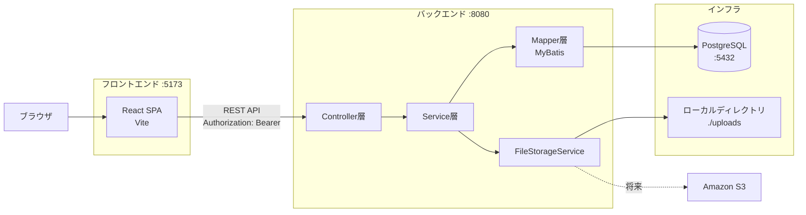
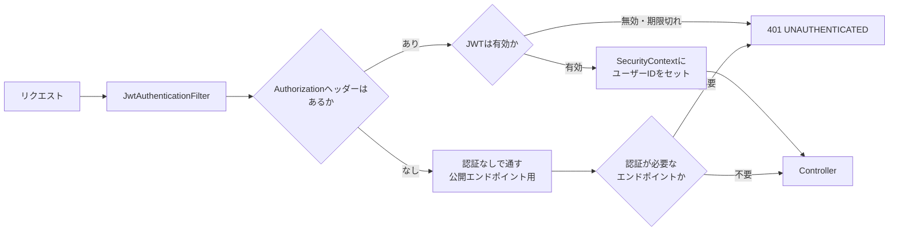

# アーキテクチャ

本書は、[05_api_design.md](05_api_design.md) のAPIを実現するためのシステム構成と、実装上の主要な設計を定義する。

---

## 1. システム構成



| コンポーネント | 技術 | ポート | 役割 |
|---|---|---|---|
| フロントエンド | React + Vite | 5173 | 画面の描画とユーザー操作。APIを呼ぶだけでDBには触れない |
| バックエンド | Spring Boot | 8080 | REST APIの提供。**HTMLは返さない** |
| データベース | PostgreSQL | 5432 | データの永続化 |
| ファイルストレージ | ローカルディレクトリ | — | 画像の実体。将来S3に差し替え可能 |

**別オリジン構成のため、CORSの設定が必須**（[05_api_design.md](05_api_design.md) 7章）。

---

## 2. バックエンドのレイヤー構成

```
Controller  … HTTPの入出力のみ。DTOへの変換とバリデーション起動
    ↓
Service     … 業務ロジック。トランザクション境界はここ
    ↓
Mapper      … DBアクセス。SQLの実行とオブジェクトへのマッピング（MyBatis）
    ↓
ドメインモデル … DBのテーブルに対応するJavaオブジェクト（record）
```

> **MyBatis 採用（[09_decision_log.md](09_decision_log.md) D-25）に伴う名称**: DBアクセス層は `@Mapper` インターフェース＋Mapper XML で実装する。SQLは `src/main/resources/mapper/*.xml` に集約する。層としての責務は「Repository層」と呼んでいたものと変わらない。

### 2.1 各層の責務

| 層 | やること | やらないこと |
|---|---|---|
| **Controller** | リクエストの受け取り、`@Valid` によるバリデーション起動、認証ユーザーの取得、DTOへの変換、HTTPステータスの決定 | 業務ロジック、DBアクセス、トランザクション管理 |
| **Service** | 業務ロジック、**トランザクション境界（`@Transactional`）**、認可（他人のリソースか判定）、複数リポジトリの協調 | HTTPの知識（`HttpServletRequest` を受け取らない）、DTOの直接返却 |
| **Mapper** | クエリの発行、オブジェクトへのマッピング | 業務ロジック、トランザクション制御 |

> **トランザクション境界を Service に置く理由**: いいねの登録とカウンタ更新のように、**複数のDB操作をひとまとまりにする**必要があるため（[04_data_model.md](04_data_model.md) 3.1 実装ルール①）。Mapperに置くと個々の操作が別トランザクションになり、整合性が保てない。

### 2.2 パッケージ構成案

```
com.example.snstimeline
├─ config
│   ├─ SecurityConfig.java         Spring Security と JWT フィルタ
│   ├─ CorsConfig.java             CORS設定
│   └─ StorageConfig.java          FileStorageService の Bean 定義
├─ auth
│   ├─ AuthController.java         #1〜#4, #27, #28
│   ├─ AuthService.java
│   ├─ JwtTokenProvider.java       アクセストークン（JWT）の生成と検証
│   ├─ RefreshTokenService.java    リフレッシュトークンの発行・ローテーション・失効
│   ├─ RefreshTokenRevoker.java    盗用検知時の失効を別トランザクションで確定させる
│   ├─ RefreshTokenMapper.java     MyBatis の @Mapper
│   ├─ RefreshToken.java           ドメインモデル（record）
│   ├─ JwtAuthenticationFilter.java
│   └─ dto/
├─ user
│   ├─ UserController.java         #17〜#20
│   ├─ UserService.java
│   ├─ UserMapper.java             MyBatis の @Mapper（SQLは resources/mapper/*.xml）
│   ├─ User.java                   ドメインモデル（record）
│   └─ dto/
├─ post
│   ├─ PostController.java         #6〜#9
│   ├─ TimelineController.java     #5
│   ├─ PostService.java
│   ├─ PostMapper.java
│   ├─ Post.java
│   ├─ PostImage.java
│   └─ dto/
├─ comment
├─ like
├─ follow
├─ file
│   ├─ FileController.java         #25, #26
│   ├─ FileService.java
│   ├─ StoredFile.java
│   ├─ storage/
│   │   ├─ FileStorageService.java       ← インターフェース
│   │   ├─ LocalFileStorageService.java  ← MVPの実装
│   │   └─ S3FileStorageService.java     ← 将来
│   └─ dto/
└─ common
    ├─ GlobalExceptionHandler.java  エラーレスポンスの統一
    ├─ ErrorCode.java               エラーコードのenum
    ├─ CursorPage.java              ページネーションの共通ラッパー
    └─ CursorCodec.java             カーソルのエンコード/デコード
```

**機能ごとにパッケージを切る（パッケージ・バイ・フィーチャー）。** `controller` / `service` / `repository` で切る（レイヤー別）と、1つの機能を変更するたびに複数のパッケージを行き来することになる。

---

## 3. 画像ストレージの抽象化

**本アプリで最も重要な拡張性の設計。** [04_data_model.md](04_data_model.md) 設計判断⑤と対になる。

### 3.1 インターフェース

```java
public interface FileStorageService {

    /**
     * ファイルを保存し、保存先を特定するキーを返す。
     * キーの形式は実装ごとに異なるが、呼び出し側は中身を解釈しない。
     */
    String store(MultipartFile file);

    /** ファイルの内容を読み出す。 */
    Resource load(String storageKey);

    /** ファイルを削除する。 */
    void delete(String storageKey);

    /** 表示用のURLを組み立てる。 */
    String generateUrl(Long fileId);

    /** この実装が扱うストレージ種別。stored_files.storage_type に保存する。 */
    StorageType getStorageType();
}
```

### 3.2 ローカル実装（MVP）

```java
@Service
@ConditionalOnProperty(name = "app.storage.type", havingValue = "LOCAL", matchIfMissing = true)
public class LocalFileStorageService implements FileStorageService {

    // 例: 2026/08/17/3f2a1b8c-....jpg
    // 日付でディレクトリを分けることで、1ディレクトリのファイル数が増えすぎるのを防ぐ
    public String store(MultipartFile file) { ... }

    public StorageType getStorageType() { return StorageType.LOCAL; }
}
```

### 3.3 なぜこの設計だとS3に差し替えられるのか

| 保存する内容 | ローカル→S3移行時 |
|---|---|
| ✕ 絶対URL | 全レコードの書き換えが必要。ドメイン変更でも壊れる |
| ✕ 物理パス | OS依存。サーバー移設で全滅 |
| ○ **`storage_type` + `storage_key`** | **`S3FileStorageService` を追加し、設定値を変えるだけ** |

移行手順:

1. `S3FileStorageService implements FileStorageService` を新規作成する
2. 既存ファイルをS3にコピーする（`storage_key` はそのまま流用できる）
3. `UPDATE stored_files SET storage_type = 'S3'` を実行する
4. 設定を `app.storage.type=S3` に変更する

**`FileService` や `PostService` のコードは1行も変わらない。** これが抽象化の効果である。

### 3.4 storage_key の設計

```
2026/08/17/3f2a1b8c-9d4e-4f7a-b2c1-8e5d6a3f9b0c.jpg
└──日付──┘ └──────────UUID──────────┘└拡張子┘
```

| 要素 | 理由 |
|---|---|
| 日付ディレクトリ | 1ディレクトリあたりのファイル数を抑える。OSによっては数万ファイルで性能が落ちる |
| UUID | 衝突しない。**元のファイル名を使わない**ことでパストラバーサル攻撃（`../../etc/passwd`）を根本的に防ぐ |
| 拡張子 | 配信時の `Content-Type` 判定には使わない（DBの `content_type` を使う）が、ファイルの識別性のため残す |

> **元のファイル名は `stored_files.original_filename` に保存するだけで、パスには使わない。** ユーザー入力をファイルパスに含めるのは危険。

### 3.5 URL生成の責務

```
DB              : storage_type='LOCAL', storage_key='2026/08/17/uuid.jpg'
                        ↓
FileStorageService#generateUrl(fileId)
                        ↓
LOCAL の場合    : http://localhost:8080/api/v1/files/20
S3 の場合（将来）: https://bucket.s3.amazonaws.com/... （または署名付きURL）
```

**URLはDBに保存せず、レスポンスを組み立てるたびに生成する。** ドメインが変わってもDBを触らずに済む。

---

## 4. 認証の仕組み

### 4.1 JWTによるステートレス認証



| 項目 | 内容 |
|---|---|
| ライブラリ | **jjwt 0.12.7**（GSON版。[09_decision_log.md](09_decision_log.md) D-26） |
| 署名アルゴリズム | HS256（共通鍵）。**`alg: none` と HS256 以外を拒否する** |
| 秘密鍵 | 環境変数 `JWT_SECRET` から読む。**ソースコードにハードコードしない**。32バイト未満なら**起動を失敗させる** |
| ペイロード | `sub`（ユーザーID）、`iat`、`exp`。**メールアドレスは入れない** |
| 有効期限 | **アクセストークン15分 / リフレッシュトークン14日**（[09_decision_log.md](09_decision_log.md) D-29） |
| リフレッシュ | **行う。** 不透明トークンをDBに（SHA-256ハッシュで）保存し、1回で使い捨てる（ローテーション）。使用済みの再提示は盗用とみなしファミリー全体を失効させる |
| 失効管理 | アクセストークンは**不可**（ステートレス）。リフレッシュトークンは**可能**（ログアウト・盗用検知） |
| 保管場所（クライアント） | `localStorage`（[06_non_functional.md](06_non_functional.md) で比較、[09_decision_log.md](09_decision_log.md) D-07に記録） |

**セッションを持たない。** `SessionCreationPolicy.STATELESS` を設定する。

> **401 / 403 は `@RestControllerAdvice` では捕捉できない。** 認証エラーはフィルタチェーン内で発生し、DispatcherServlet まで到達しないため。統一エラー形式（F-CO-01）を守るには `AuthenticationEntryPoint` と `AccessDeniedHandler` を実装してJSONを書き出す必要がある。**実装しないとボディが空の401になる。**

> **CORSフィルタは認証フィルタより前に置く。** `http.cors(...)` が挿入する `CorsFilter` は `UsernamePasswordAuthenticationFilter` より前に入るため、JWTフィルタを `addFilterBefore(..., UsernamePasswordAuthenticationFilter.class)` で差せば自動的にCORSの後になる（[05_api_design.md](05_api_design.md) 7章のハマりどころ）。

### 4.2 認可（他人のリソースの保護）

**管理者ロールは設けない**（[01_requirements.md](01_requirements.md) 4章）。認可は「自分のリソースか」の1点のみ。

```java
// Service層で行う。findById のSQLには deleted_at IS NULL が入っている（D-25）
Post post = postMapper.findById(postId)
    .orElseThrow(NotFoundException::new);          // ① 存在しない → 404

if (!post.userId().equals(currentUserId)) {
    throw new ForbiddenException();                // ② 他人のもの → 403
}
```

| 順序 | 理由 |
|---|---|
| ① 存在チェック → 404 | 存在しないリソースは404 |
| ② 所有者チェック → 403 | 存在するが他人のもの |

> **この順序が重要。** 先に所有者チェックをすると、存在しないIDに対して403を返してしまい、リソースの存在有無が漏れる。

---

## 5. 環境変数・設定値

| 変数名 | 例 | 説明 |
|---|---|---|
| `DB_URL` | `jdbc:postgresql://localhost:5432/snstimeline` | 接続先 |
| `DB_USERNAME` | `snsapp` | |
| `DB_PASSWORD` | — | **リポジトリにコミットしない** |
| `JWT_SECRET` | — | 32バイト以上のランダム文字列。**コミットしない** |
| `JWT_ACCESS_EXPIRATION_MINUTES` | `15` | アクセストークン有効期限（分） |
| `JWT_REFRESH_EXPIRATION_DAYS` | `14` | リフレッシュトークン有効期限（日） |
| `APP_STORAGE_TYPE` | `LOCAL` | `LOCAL` / `S3` |
| `APP_STORAGE_LOCAL_PATH` | `./uploads` | ローカル保存先 |
| `APP_UPLOAD_MAX_SIZE_MB` | `5` | 1ファイルの上限 |
| `APP_UPLOAD_MAX_COUNT` | `1` | 1投稿あたりの画像枚数（MVP=1、Phase2=4） |
| `CORS_ALLOWED_ORIGINS` | `http://localhost:5173` | 許可オリジン |

**秘密情報は `.env` に置き、`.gitignore` に含める。** `application.yml` にはデフォルト値のみ書く。

> **補足（実装時に判明）**: **Spring Boot は `.env` を自動では読み込まない。** `.env` / `.env.example` は「IDEの実行構成やシェルに設定する値の転記元」として運用する。`application.yml` の既定値が `.env.example` と一致しているため、**実際に設定が必要なのは `JWT_SECRET` だけ**（既定値を置いておらず、未設定だと起動に失敗する）。

---

## 6. ローカル開発環境

### 6.1 起動構成

```
docker-compose up -d      # PostgreSQL を起動
./mvnw spring-boot:run    # バックエンド :8080
npm run dev               # フロントエンド :5173
```

### 6.2 docker-compose.yml（PostgreSQLのみ）

```yaml
services:
  db:
    image: postgres:16
    environment:
      POSTGRES_DB: snstimeline
      POSTGRES_USER: snsapp
      POSTGRES_PASSWORD: password
    ports:
      - "5432:5432"
    volumes:
      - pgdata:/var/lib/postgresql/data
    # 起動完了を判定できるようにする（dev-environment スキルが healthy を確認手順にしているため）
    healthcheck:
      test: ["CMD-SHELL", "pg_isready -U snsapp -d snstimeline"]
      interval: 5s
      timeout: 3s
      retries: 10
volumes:
  pgdata:
```

アプリ本体はDockerに入れない。IDEからの起動とデバッグを優先する。

### 6.3 ディレクトリ構成

```
SnsTimeLineApp/
├─ docs/                  要件定義ドキュメント（本ドキュメント群）
├─ mockup/                画面モックアップ（静的HTML）
├─ backend/               Spring Boot
│   ├─ pom.xml
│   ├─ mvnw / mvnw.cmd    Maven Wrapper
│   ├─ src/main/java/
│   ├─ src/main/resources/
│   │   ├─ application.yml
│   │   ├─ db/migration/  Flyway
│   │   └─ mapper/        MyBatis の SQL（*.xml）
│   └─ uploads/           画像の保存先（.gitignore に追加）
├─ frontend/              React + Vite + TypeScript
│   ├─ src/
│   │   ├─ api/           APIクライアント（JWT付与・401時の再発行を集約）
│   │   ├─ auth/          認証Contextとルートガード
│   │   ├─ components/    ヘッダー・トースト・フォーム部品
│   │   ├─ pages/         画面（ファイル名は画面IDに対応）
│   │   └─ styles/        mockup/common.css から移植
│   ├─ .env.development   VITE_API_BASE_URL（機密を含まないのでコミットする）
│   ├─ .oxlintrc.json     リンタ設定
│   └─ package.json
├─ docker-compose.yml
├─ .env                   秘密情報（.gitignore に追加）
├─ .env.example           .env のテンプレート（こちらはコミットする）
└─ README.md
```

> **`uploads/` と `.env` は必ず `.gitignore` に入れる。**
> **SQLはMapper XMLに集約する。** `@Select` などのアノテーションにSQLを書くと、論理削除の除外条件を共通化できないため（[09_decision_log.md](09_decision_log.md) D-25）。

---

## 7. フロントエンドの構成方針

| 項目 | 方針 |
|---|---|
| ルーティング | React Router。[03_screen_design.md](03_screen_design.md) の画面一覧のパスに対応させる |
| 認証状態 | Context APIで保持。起動時に `GET /auth/me`（#3）で復元 |
| APIクライアント | 共通ラッパーを1つ作り、**JWTの自動付与と401時の共通処理を集約**する（F-CO-02） |
| サーバー状態 | 一覧のキャッシュ・楽観的更新を扱うため、TanStack Query などの利用を推奨（必須ではない） |
| 画面の状態 | ローディング / 空 / エラー / 正常の4状態を必ず実装（[03_screen_design.md](03_screen_design.md) 8章） |

### 7.1 実装済みの範囲

| 画面ID | パス | ファイル | 状態 |
|---|---|---|---|
| SC-01 | `/login` | `pages/LoginPage.tsx` | 実装済み |
| SC-02 | `/signup` | `pages/SignupPage.tsx` | 実装済み |
| SC-03 | `/` | `pages/timeline/TimelinePage.tsx` | 実装済み（無限スクロール・タブ・新着通知バナー） |
| SC-04 | `/posts/:postId` | `pages/PostDetailPage.tsx` | 実装済み（コメント欄・いいねボタン含む） |
| SC-05 | `/users/:userId` | `pages/profile/ProfilePage.tsx` | 実装済み |
| SC-06 | `/settings/profile` | `pages/profile/ProfileEditPage.tsx` | 実装済み（プロフィール画像欄はPhase2のプレースホルダ） |
| SC-08 | `/users/:userId/following` | `pages/follow/FollowListPage.tsx`（`mode="following"`） | 実装済み（D-39によりPhase2から前倒し） |
| SC-09 | `/users/:userId/followers` | `pages/follow/FollowListPage.tsx`（`mode="followers"`） | 実装済み（D-39によりPhase2から前倒し） |
| SC-12 | `*` | `pages/NotFoundPage.tsx` | 実装済み |

**採用したライブラリ**: React 19 / Vite 8 / TypeScript 6 / React Router 7 / oxlint 1。
**TanStack Query は未導入**（上表は「推奨」であり必須ではない）。データ取得は `useTimeline` フックに
一元化し、`useState` + `useEffect` で手書きしている。

**現時点で今回のスコープに含めなかったもの**:

| 項目 | 状態 |
|---|---|
| コメント編集（F-CM-03, #12） | Phase2のため未実装。投稿・表示・削除（F-CM-01, 02, 04）は実装済み |
| ユーザー検索（F-US-05, SC-07, #20） | Phase2のため未実装。フォロー相手はタイムラインの投稿者から辿る |
| いいねしたユーザー一覧（F-LK-04, SC-10, #16） | Phase2のため未実装 |

### 7.2 401時の共通処理（F-CO-02）

**リフレッシュトークン導入により、401は「即ログアウト」ではなく「まず再発行を試みる」に変わった**（[09_decision_log.md](09_decision_log.md) D-29）。

```
APIラッパーで全レスポンスを監視
  ↓ 401を受信
localStorage のリフレッシュトークンで POST /auth/refresh
  ├─ 成功 → 新しい2つのトークンを保存し直し、元のリクエストを1回だけ再試行
  │          （ユーザーには何も見えない）
  └─ 失敗（401） → 両方のトークンを削除
                     ↓
                   認証Contextをクリア
                     ↓
                   SC-01 ログイン画面へ遷移
                     + トースト「セッションの有効期限が切れました」
```

**実装上の注意**

| # | 内容 |
|---|---|
| 1 | **再試行は1回だけ。** 再試行したリクエストがまた401を返しても、再度リフレッシュしない（無限ループ防止） |
| 2 | **同時に複数のAPIが401になったとき、リフレッシュは1回にまとめる。** 各リクエストが個別にリフレッシュすると、ローテーションにより2回目以降が「使用済みトークンの再提示」＝**盗用と誤検知され、強制ログアウトになる**。進行中のリフレッシュを共有し、完了を待たせる（Promiseを1つ保持する等） |
| 3 | `POST /auth/refresh` 自体が401を返した場合は、この処理を再帰的に適用しない |
| 4 | **返ってきた `refreshToken` を必ず保存し直す**（ローテーションのため、古い値は使用済みになっている） |

> **#2 は実装漏れしやすく、症状が「たまに勝手にログアウトする」という分かりにくい形で出る。** 画面表示直後に複数のAPIを並行で呼ぶ設計だと踏みやすい。

**各画面で個別に401を処理しない。** 1箇所に集約する。

> **実装済み**: 上記4点はすべて `frontend/src/api/client.ts` に実装している。
> #2 の集約はモジュールスコープの `refreshing` Promise（`refreshOnce()`）で実現しており、
> **無効なトークンで `/auth/me` が2本同時に401になっても `/auth/refresh` は1回しか飛ばない**ことを
> ブラウザのNetworkタブで確認済み（2026-08-23）。

---

## 8. 実装の推奨順序

要件定義が完了した後、以下の順で実装すると詰まりにくい。

| # | 内容 | 完了の目安 | 状態 |
|---|---|---|---|
| 1 | DB構築（Flywayマイグレーション） | 全テーブルと制約・インデックスが作られる | **`V1`(users) / `V2`(refresh_tokens) / `V3`(posts, likes) / `V4`(follows) / `V5`(comments) 完了** |
| 2 | 認証（#1〜#3, #27, #28） | curlでJWTが取得でき、`/auth/me` が通る | **完了** |
| 3 | 投稿作成・全体TL（#5 `tab=all`, #6, #7） | テキスト投稿がタイムラインに並ぶ | **完了。加えて編集(#8)・削除(#9)・新着件数(#29)・フォロー中タブのSQL(`tab=following`)も実装済み** |
| 4 | フロント: ログイン + タイムライン表示 | ブラウザで一連の流れが見える | **完了**（SC-01 / SC-02 / SC-03 / SC-04 / SC-12） |
| 5 | いいね（#14, #15） | **カウンタの整合性をここで作り込む。二重いいねのテストを必ず書く** | **完了**。二重いいねはDBのUNIQUE制約と事前SELECTで冪等化している（D-34。`DuplicateKeyException`捕捉は実装・動作確認の結果、PostgreSQLがトランザクションを中断状態にするため不採用と判明した） |
| 6 | コメント（#10, #11, #13） | カウンタの非対称ルールを実装 | **完了**。コメント編集（#12）はPhase2のため未実装 |
| 7 | 画像アップロード（#25, #26） | `FileStorageService` の抽象化を最初から入れる | **完了**（LOCAL / S3 の2実装、[09_decision_log.md](09_decision_log.md) D-40）。投稿への添付（F-PO-02）とプロフィール画像（F-US-04）は次のPR |
| 8 | フォロー + フォロー中TL（#21, #22, #5 `tab=following`） | MVPの一周が完成 | **完了**。フォロー登録API（#21, #22）の実装により、フォロー中タブが実際にフォロー中ユーザーの投稿を表示するようになった。冪等性はいいねと同じ事前SELECT方式（D-37） |
| 9 | プロフィール（#17〜#19） | | **完了**（#18のユーザー投稿一覧、#23/#24のフォロー一覧も合わせて実装。D-39） |
| 10 | 削除（#9, #13）と論理削除の徹底 | 削除済みがどこにも出ないことを確認 | **完了**（投稿削除・コメント削除ともに論理削除） |
| 11 | 無限スクロール（カーソルページネーション） | **シードデータで25件以上の投稿を用意して確認** | **完了。カーソルの時刻精度を秒からマイクロ秒に変更した（D-33）** |

> **自動テストは今回のスコープ外**（別タイミングで実装予定）。二重いいね・コメントカウンタのテストもそのときに書く。

---

## 関連ドキュメント

- [04_data_model.md](04_data_model.md) — データモデル（`stored_files` の定義）
- [05_api_design.md](05_api_design.md) — API設計
- [06_non_functional.md](06_non_functional.md) — 非機能要件
- [09_decision_log.md](09_decision_log.md) — 設計判断ログ
