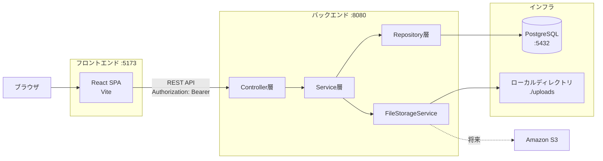
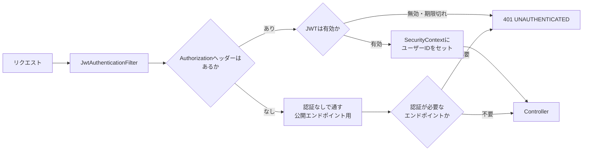

# アーキテクチャ

本書は、[05_api_design.md](05_api_design.md) のAPIを実現するためのシステム構成と、実装上の主要な設計を定義する。

---

## 1. システム構成



| コンポーネント | 技術 | ポート | 役割 |
|---|---|---|---|
| フロントエンド | React + Vite | 5173 | 画面の描画とユーザー操作。APIを呼ぶだけでDBには触れない |
| バックエンド | Spring Boot | 8080 | REST APIの提供。**HTMLは返さない** |
| データベース | PostgreSQL | 5432 | データの永続化 |
| ファイルストレージ | ローカルディレクトリ | — | 画像の実体。将来S3に差し替え可能 |

**別オリジン構成のため、CORSの設定が必須**（[05_api_design.md](05_api_design.md) 7章）。

---

## 2. バックエンドのレイヤー構成

```
Controller  … HTTPの入出力のみ。DTOへの変換とバリデーション起動
    ↓
Service     … 業務ロジック。トランザクション境界はここ
    ↓
Repository  … DBアクセス。SQLとエンティティのマッピング
    ↓
Entity      … DBのテーブルに対応するJavaオブジェクト
```

### 2.1 各層の責務

| 層 | やること | やらないこと |
|---|---|---|
| **Controller** | リクエストの受け取り、`@Valid` によるバリデーション起動、認証ユーザーの取得、DTOへの変換、HTTPステータスの決定 | 業務ロジック、DBアクセス、トランザクション管理 |
| **Service** | 業務ロジック、**トランザクション境界（`@Transactional`）**、認可（他人のリソースか判定）、複数リポジトリの協調 | HTTPの知識（`HttpServletRequest` を受け取らない）、DTOの直接返却 |
| **Repository** | クエリの発行、エンティティのマッピング | 業務ロジック、トランザクション制御 |

> **トランザクション境界を Service に置く理由**: いいねの登録とカウンタ更新のように、**複数のDB操作をひとまとまりにする**必要があるため（[04_data_model.md](04_data_model.md) 3.1 実装ルール①）。Repositoryに置くと個々の操作が別トランザクションになり、整合性が保てない。

### 2.2 パッケージ構成案

```
com.example.snstimeline
├─ config
│   ├─ SecurityConfig.java         Spring Security と JWT フィルタ
│   ├─ CorsConfig.java             CORS設定
│   └─ StorageConfig.java          FileStorageService の Bean 定義
├─ auth
│   ├─ AuthController.java         #1〜#4
│   ├─ AuthService.java
│   ├─ JwtTokenProvider.java       JWTの生成と検証
│   ├─ JwtAuthenticationFilter.java
│   └─ dto/
├─ user
│   ├─ UserController.java         #17〜#20
│   ├─ UserService.java
│   ├─ UserRepository.java
│   ├─ User.java                   Entity
│   └─ dto/
├─ post
│   ├─ PostController.java         #6〜#9
│   ├─ TimelineController.java     #5
│   ├─ PostService.java
│   ├─ PostRepository.java
│   ├─ Post.java
│   ├─ PostImage.java
│   └─ dto/
├─ comment
├─ like
├─ follow
├─ file
│   ├─ FileController.java         #25, #26
│   ├─ FileService.java
│   ├─ StoredFile.java
│   ├─ storage/
│   │   ├─ FileStorageService.java       ← インターフェース
│   │   ├─ LocalFileStorageService.java  ← MVPの実装
│   │   └─ S3FileStorageService.java     ← 将来
│   └─ dto/
└─ common
    ├─ GlobalExceptionHandler.java  エラーレスポンスの統一
    ├─ ErrorCode.java               エラーコードのenum
    ├─ CursorPage.java              ページネーションの共通ラッパー
    └─ CursorCodec.java             カーソルのエンコード/デコード
```

**機能ごとにパッケージを切る（パッケージ・バイ・フィーチャー）。** `controller` / `service` / `repository` で切る（レイヤー別）と、1つの機能を変更するたびに複数のパッケージを行き来することになる。

---

## 3. 画像ストレージの抽象化

**本アプリで最も重要な拡張性の設計。** [04_data_model.md](04_data_model.md) 設計判断⑤と対になる。

### 3.1 インターフェース

```java
public interface FileStorageService {

    /**
     * ファイルを保存し、保存先を特定するキーを返す。
     * キーの形式は実装ごとに異なるが、呼び出し側は中身を解釈しない。
     */
    String store(MultipartFile file);

    /** ファイルの内容を読み出す。 */
    Resource load(String storageKey);

    /** ファイルを削除する。 */
    void delete(String storageKey);

    /** 表示用のURLを組み立てる。 */
    String generateUrl(Long fileId);

    /** この実装が扱うストレージ種別。stored_files.storage_type に保存する。 */
    StorageType getStorageType();
}
```

### 3.2 ローカル実装（MVP）

```java
@Service
@ConditionalOnProperty(name = "app.storage.type", havingValue = "LOCAL", matchIfMissing = true)
public class LocalFileStorageService implements FileStorageService {

    // 例: 2026/08/17/3f2a1b8c-....jpg
    // 日付でディレクトリを分けることで、1ディレクトリのファイル数が増えすぎるのを防ぐ
    public String store(MultipartFile file) { ... }

    public StorageType getStorageType() { return StorageType.LOCAL; }
}
```

### 3.3 なぜこの設計だとS3に差し替えられるのか

| 保存する内容 | ローカル→S3移行時 |
|---|---|
| ✕ 絶対URL | 全レコードの書き換えが必要。ドメイン変更でも壊れる |
| ✕ 物理パス | OS依存。サーバー移設で全滅 |
| ○ **`storage_type` + `storage_key`** | **`S3FileStorageService` を追加し、設定値を変えるだけ** |

移行手順:

1. `S3FileStorageService implements FileStorageService` を新規作成する
2. 既存ファイルをS3にコピーする（`storage_key` はそのまま流用できる）
3. `UPDATE stored_files SET storage_type = 'S3'` を実行する
4. 設定を `app.storage.type=S3` に変更する

**`FileService` や `PostService` のコードは1行も変わらない。** これが抽象化の効果である。

### 3.4 storage_key の設計

```
2026/08/17/3f2a1b8c-9d4e-4f7a-b2c1-8e5d6a3f9b0c.jpg
└──日付──┘ └──────────UUID──────────┘└拡張子┘
```

| 要素 | 理由 |
|---|---|
| 日付ディレクトリ | 1ディレクトリあたりのファイル数を抑える。OSによっては数万ファイルで性能が落ちる |
| UUID | 衝突しない。**元のファイル名を使わない**ことでパストラバーサル攻撃（`../../etc/passwd`）を根本的に防ぐ |
| 拡張子 | 配信時の `Content-Type` 判定には使わない（DBの `content_type` を使う）が、ファイルの識別性のため残す |

> **元のファイル名は `stored_files.original_filename` に保存するだけで、パスには使わない。** ユーザー入力をファイルパスに含めるのは危険。

### 3.5 URL生成の責務

```
DB              : storage_type='LOCAL', storage_key='2026/08/17/uuid.jpg'
                        ↓
FileStorageService#generateUrl(fileId)
                        ↓
LOCAL の場合    : http://localhost:8080/api/v1/files/20
S3 の場合（将来）: https://bucket.s3.amazonaws.com/... （または署名付きURL）
```

**URLはDBに保存せず、レスポンスを組み立てるたびに生成する。** ドメインが変わってもDBを触らずに済む。

---

## 4. 認証の仕組み

### 4.1 JWTによるステートレス認証



| 項目 | 内容 |
|---|---|
| 署名アルゴリズム | HS256（共通鍵） |
| 秘密鍵 | 環境変数 `JWT_SECRET` から読む。**ソースコードにハードコードしない** |
| ペイロード | `sub`（ユーザーID）、`iat`、`exp` |
| 有効期限 | 24時間 |
| 保管場所（クライアント） | `localStorage`（[06_non_functional.md](06_non_functional.md) で比較、[09_decision_log.md](09_decision_log.md) D-07に記録） |

**セッションを持たない。** `SessionCreationPolicy.STATELESS` を設定する。

### 4.2 認可（他人のリソースの保護）

**管理者ロールは設けない**（[01_requirements.md](01_requirements.md) 4章）。認可は「自分のリソースか」の1点のみ。

```java
// Service層で行う
Post post = postRepository.findActiveById(postId)
    .orElseThrow(() -> new NotFoundException(ErrorCode.NOT_FOUND));

if (!post.getUserId().equals(currentUserId)) {
    throw new ForbiddenException(ErrorCode.FORBIDDEN);  // 403
}
```

| 順序 | 理由 |
|---|---|
| ① 存在チェック → 404 | 存在しないリソースは404 |
| ② 所有者チェック → 403 | 存在するが他人のもの |

> **この順序が重要。** 先に所有者チェックをすると、存在しないIDに対して403を返してしまい、リソースの存在有無が漏れる。

---

## 5. 環境変数・設定値

| 変数名 | 例 | 説明 |
|---|---|---|
| `DB_URL` | `jdbc:postgresql://localhost:5432/snstimeline` | 接続先 |
| `DB_USERNAME` | `snsapp` | |
| `DB_PASSWORD` | — | **リポジトリにコミットしない** |
| `JWT_SECRET` | — | 32バイト以上のランダム文字列。**コミットしない** |
| `JWT_EXPIRATION_HOURS` | `24` | トークン有効期限 |
| `APP_STORAGE_TYPE` | `LOCAL` | `LOCAL` / `S3` |
| `APP_STORAGE_LOCAL_PATH` | `./uploads` | ローカル保存先 |
| `APP_UPLOAD_MAX_SIZE_MB` | `5` | 1ファイルの上限 |
| `APP_UPLOAD_MAX_COUNT` | `1` | 1投稿あたりの画像枚数（MVP=1、Phase2=4） |
| `CORS_ALLOWED_ORIGINS` | `http://localhost:5173` | 許可オリジン |

**秘密情報は `.env` に置き、`.gitignore` に含める。** `application.yml` にはデフォルト値のみ書く。

---

## 6. ローカル開発環境

### 6.1 起動構成

```
docker-compose up -d      # PostgreSQL を起動
./mvnw spring-boot:run    # バックエンド :8080
npm run dev               # フロントエンド :5173
```

### 6.2 docker-compose.yml（PostgreSQLのみ）

```yaml
services:
  db:
    image: postgres:16
    environment:
      POSTGRES_DB: snstimeline
      POSTGRES_USER: snsapp
      POSTGRES_PASSWORD: password
    ports:
      - "5432:5432"
    volumes:
      - pgdata:/var/lib/postgresql/data
volumes:
  pgdata:
```

アプリ本体はDockerに入れない。IDEからの起動とデバッグを優先する。

### 6.3 ディレクトリ構成

```
SnsTimeLineApp/
├─ docs/                  要件定義ドキュメント（本ドキュメント群）
├─ backend/               Spring Boot
│   ├─ src/main/java/
│   ├─ src/main/resources/
│   │   ├─ application.yml
│   │   └─ db/migration/  Flyway
│   └─ uploads/           画像の保存先（.gitignore に追加）
├─ frontend/              React + Vite
│   ├─ src/
│   └─ package.json
├─ docker-compose.yml
├─ .env                   秘密情報（.gitignore に追加）
└─ README.md
```

> **`uploads/` と `.env` は必ず `.gitignore` に入れる。**

---

## 7. フロントエンドの構成方針

| 項目 | 方針 |
|---|---|
| ルーティング | React Router。[03_screen_design.md](03_screen_design.md) の画面一覧のパスに対応させる |
| 認証状態 | Context APIで保持。起動時に `GET /auth/me`（#3）で復元 |
| APIクライアント | 共通ラッパーを1つ作り、**JWTの自動付与と401時の共通処理を集約**する（F-CO-02） |
| サーバー状態 | 一覧のキャッシュ・楽観的更新を扱うため、TanStack Query などの利用を推奨（必須ではない） |
| 画面の状態 | ローディング / 空 / エラー / 正常の4状態を必ず実装（[03_screen_design.md](03_screen_design.md) 8章） |

### 401時の共通処理（F-CO-02）

```
APIラッパーで全レスポンスを監視
  ↓ 401を受信
localStorage からJWTを削除
  ↓
認証Contextをクリア
  ↓
SC-01 ログイン画面へ遷移 + トースト「セッションの有効期限が切れました」
```

**各画面で個別に401を処理しない。** 1箇所に集約する。

---

## 8. 実装の推奨順序

要件定義が完了した後、以下の順で実装すると詰まりにくい。

| # | 内容 | 完了の目安 |
|---|---|---|
| 1 | DB構築（Flywayマイグレーション） | 全テーブルと制約・インデックスが作られる |
| 2 | 認証（#1〜#3） | curlでJWTが取得でき、`/auth/me` が通る |
| 3 | 投稿作成・全体TL（#5 `tab=all`, #6, #7） | テキスト投稿がタイムラインに並ぶ |
| 4 | フロント: ログイン + タイムライン表示 | ブラウザで一連の流れが見える |
| 5 | いいね（#14, #15） | **カウンタの整合性をここで作り込む。二重いいねのテストを必ず書く** |
| 6 | コメント（#10, #11, #13） | カウンタの非対称ルールを実装 |
| 7 | 画像アップロード（#25, #26） | `FileStorageService` の抽象化を最初から入れる |
| 8 | フォロー + フォロー中TL（#21, #22, #5 `tab=following`） | MVPの一周が完成 |
| 9 | プロフィール（#17〜#19） | |
| 10 | 削除（#9, #13）と論理削除の徹底 | 削除済みがどこにも出ないことを確認 |
| 11 | 無限スクロール（カーソルページネーション） | **シードデータで25件以上の投稿を用意して確認** |

> **ステップ5で手を抜かないこと。** カウンタの整合性は後から直すのが難しい。トランザクション境界とSQL側の相対更新を最初から正しく実装する。

---

## 関連ドキュメント

- [04_data_model.md](04_data_model.md) — データモデル（`stored_files` の定義）
- [05_api_design.md](05_api_design.md) — API設計
- [06_non_functional.md](06_non_functional.md) — 非機能要件
- [09_decision_log.md](09_decision_log.md) — 設計判断ログ
