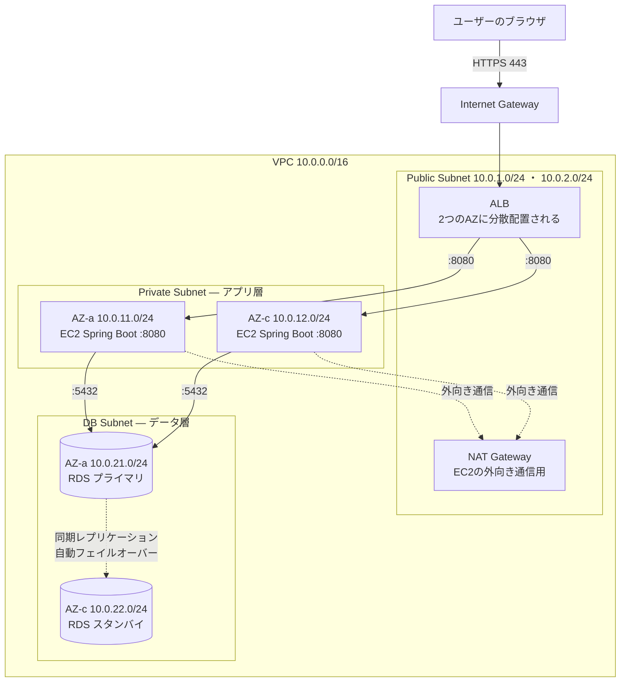
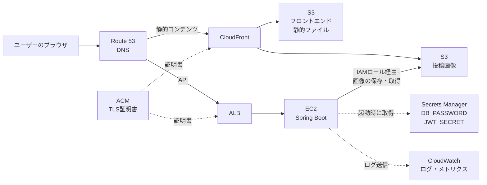
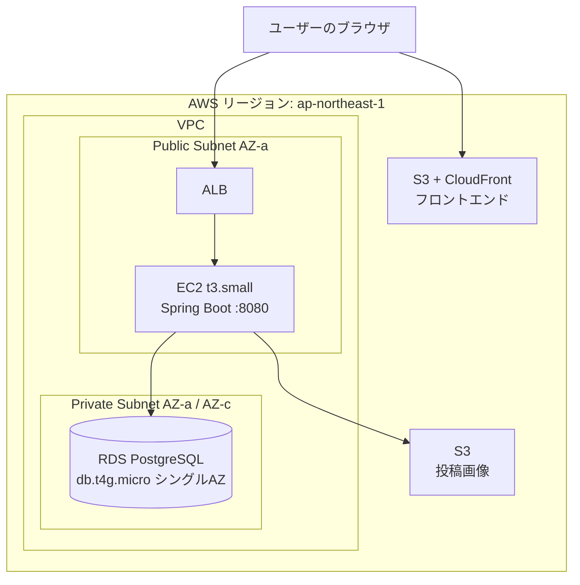

# インフラ構成（AWS想定）

本書は、本アプリを**AWS上で動かす場合**の構成を定義する。

---

## 0. 本書の位置づけ — 何が決定済みで、何が未決か

> **重要**: 本書は「AWSで動かすと決めた場合の設計」であり、**AWSでサーバーを構築すること自体はまだ決定していない**。

| 項目 | 状態 | 備考 |
|---|---|---|
| **画像ストレージにS3を使う** | **決定済み** | [04_data_model.md](04_data_model.md) 設計判断⑤ / [07_architecture.md](07_architecture.md) 3章の抽象化がこれを前提にしている |
| AWSでサーバー（アプリ・DB）を構築するか | **未決** | ローカル / 他PaaS / オンプレも選択肢として残る |
| 構築する場合の構成（EC2 + RDS + ALB） | **前提として確定** | 上記の未決が「YES」になった場合の構成として本書で確定させる |

**なぜ未決のまま構成図を作るのか**: 構成が決まっていないと、アプリ側の設計（セッションを持たないこと・ファイルをローカルに置かないこと・接続先を環境変数にすること）が正しいかを検証できない。**構成図は「アプリ側の設計に対する制約の洗い出し」として先に描く価値がある。** 実際に構築するかどうかは後から決めてよい。

構成が確定した時点で、[09_decision_log.md](09_decision_log.md) の `D-21` を「決定済み」に更新する。

---

## 1. 本番想定構成（Multi-AZ）

セオリー通りの構成。**可用性を確保することを目的とする。**

**図1: ネットワーク構成**（VPC内のリクエスト経路）



**図2: マネージドサービスとの連携**（VPC外のサービス）



> **図を2枚に分ける理由**: VPC内のネットワーク経路（サブネット・AZ・ポート）と、マネージドサービスとの連携（S3・Secrets Manager等）は関心事が違う。1枚に詰め込むと線が交差して読めなくなる。

> **図1の配置について**: Mermaidの自動レイアウトは `subgraph` の記述順を保証しないため、レンダリング環境によって各層の上下・左右の配置が変わることがある。**読み取るべきは配置ではなく接続関係**（ALB → EC2 → RDS、EC2 → NAT）である。厳密な配置が必要になった場合は、Mermaidではなく作図ツール（draw.io等）でAWS公式アイコンを使って描き直すこと。

### 1.1 各コンポーネントの役割

| コンポーネント | サービス | 配置 | 役割 |
|---|---|---|---|
| DNS | Route 53 | — | ドメイン名の解決 |
| TLS証明書 | ACM | — | HTTPS化。**ALBとCloudFrontで終端**する |
| CDN + フロント配信 | CloudFront + S3 | — | React SPAのビルド成果物を配信 |
| ロードバランサ | **ALB** | Public Subnet × 2AZ | HTTPSを終端し、EC2にHTTPで転送。ヘルスチェックで異常なEC2を切り離す |
| アプリケーション | **EC2** | Private Subnet × 2AZ | Spring Boot。**インターネットから直接到達できない** |
| データベース | **RDS PostgreSQL** | DB Subnet × 2AZ | Multi-AZ配置。プライマリ障害時に自動フェイルオーバー |
| 画像ストレージ | **S3** | — | 投稿画像・プロフィール画像の実体。**決定済み事項** |
| 外向き通信 | NAT Gateway | Public Subnet | Private SubnetのEC2がyum/Maven等を取りに行くため |
| 秘密情報 | Secrets Manager | — | `DB_PASSWORD` / `JWT_SECRET`。[07_architecture.md](07_architecture.md) 5章の環境変数の置き場所 |
| ログ・監視 | CloudWatch | — | アプリログとメトリクス |

### 1.2 サブネットを3層に分ける理由

| 層 | インターネットからの到達 | 置くもの |
|---|---|---|
| **Public** | 到達できる | ALB、NAT Gateway |
| **Private (App)** | 到達できない | EC2 |
| **DB** | 到達できない。**NAT経由の外向き通信もしない** | RDS |

**DBサブネットをアプリサブネットからさらに分ける理由**: EC2が乗っ取られた場合でも、DBサブネットに独立したセキュリティグループとネットワークACLを敷いておけば被害を限定できる。「アプリが動く場所」と「データが眠る場所」を分離するのは多層防御の基本である。

### 1.3 セキュリティグループの設計

**セキュリティグループの参照は、IPアドレスではなく「セキュリティグループID」で行う。** EC2を増減させてもルールを書き換えずに済む。

| SG名 | インバウンド | アウトバウンド |
|---|---|---|
| `sg-alb` | `0.0.0.0/0` から `443`（と `80` → 443へリダイレクト） | `sg-app` の `8080` |
| `sg-app` | **`sg-alb` から `8080` のみ** | `sg-db` の `5432`、`443`（S3・Secrets Manager） |
| `sg-db` | **`sg-app` から `5432` のみ** | なし |

> **`sg-app` のインバウンドに `0.0.0.0/0` を絶対に入れない。** ALB経由でしかアプリに到達できない状態を保つことが、この構成の要点である。

### 1.4 SSH接続をどうするか

| 選択肢 | 評価 |
|---|---|
| 踏み台（Bastion）EC2をPublicに置く | 従来型。踏み台自体の管理コストと攻撃面が増える |
| **AWS Systems Manager Session Manager** | **推奨。** SSHポートを開けずにシェルに入れる。鍵の管理も不要 |

Session Managerを使う場合、EC2に `AmazonSSMManagedInstanceCore` のIAMロールを付与し、Private SubnetからSSMエンドポイントに到達できるようにする（NAT経由またはVPCエンドポイント）。

---

## 2. 学習用の最小構成（コスト重視）

「動かして学ぶ」ことが目的なら、1.の構成は明らかに過剰である。**個人で立てる場合の現実的な最小構成**を併記する。



### 2.1 本番想定構成から削ったもの

| 削るもの | 影響 | 判断 |
|---|---|---|
| EC2の2台目 | 冗長性なし。EC2が落ちたらサービス停止 | 学習用途では許容 |
| RDS Multi-AZ | フェイルオーバーなし。**料金がほぼ半額になる** | 許容。バックアップ（自動スナップショット）だけは有効にする |
| NAT Gateway | EC2をPublic Subnetに置いて直接IGWへ抜ける | **NAT Gatewayは月額約5,000円と高額**。最小構成では最も削る価値が大きい |
| Route 53 + ACM独自ドメイン | ALBのデフォルトDNS名で接続。HTTPSは張れない | 学習用なら許容。ただしJWTを平文で流すことになる点は認識しておく |

### 2.2 ALBが冗長化の意味を持たない点について

**最小構成ではEC2が1台なので、ALBは「振り分け先が1つしかないロードバランサ」になる。** 可用性の観点では意味がない。

それでもALBを入れる価値は以下にある。

| 価値 | 内容 |
|---|---|
| **HTTPSの終端** | ACM証明書を無料で使える。EC2上でNginx等を設定するより圧倒的に楽 |
| **EC2を隠せる** | EC2のIPを直接公開しない |
| **入れ替えが無停止になる** | EC2を2台目に切り替えるとき、ターゲットグループの付け替えだけで済む |
| **学習項目そのもの** | ターゲットグループ・ヘルスチェック・リスナールールはALBを触らないと学べない |

> **ALBは可用性のためだけの部品ではない。** 「1台構成でもALBを置く意味がある」ことを理解しておくと、構成の判断がぶれない。

### 2.3 コスト概算（東京リージョン / 2026年8月時点の目安）

| 項目 | 最小構成 | 本番想定構成 |
|---|---|---|
| EC2 | t3.small × 1 ≒ $15 | t3.small × 2 ≒ $30 |
| RDS | db.t4g.micro シングル ≒ $13 | db.t4g.small Multi-AZ ≒ $50 |
| ALB | ≒ $18 | ≒ $18 |
| NAT Gateway | **なし** | ≒ $35 |
| S3 + CloudFront | 1GB程度なら ≒ $1 | ≒ $1 |
| **月額合計の目安** | **$45〜50 程度** | **$130〜140 程度** |

> **これは概算であり、正確な料金は必ずAWS Pricing Calculatorで確認すること。** 為替と料金改定で変動する。

**コスト面で最も効くのは NAT Gateway と RDS Multi-AZ の2つ。** この2つを外すかどうかで月額が倍近く変わる。

---

## 3. アプリ側の設計がこの構成を前提にできているか

**構成図を先に描く最大の目的がこれである。** 既存の設計がAWS構成に耐えるかを検証する。

| 構成上の制約 | アプリ側の対応状況 | 根拠 |
|---|---|---|
| **EC2が複数台になるとセッションを共有できない** | ✅ **対応済み。** JWTによるステートレス認証で、サーバーにセッションを持たない | [07_architecture.md](07_architecture.md) 4.1 |
| **EC2が複数台だとローカルディスクの画像が共有されない** | ✅ **対応済み。** `FileStorageService` の抽象化により、S3実装に差し替えられる | [07_architecture.md](07_architecture.md) 3章 |
| **DBの接続先がlocalhostではなくなる** | ✅ **対応済み。** `DB_URL` を環境変数で外出ししている | [07_architecture.md](07_architecture.md) 5章 |
| **秘密情報をサーバー上のファイルに置きたくない** | ✅ **対応済み。** `JWT_SECRET` / `DB_PASSWORD` は環境変数から読む設計。Secrets Managerに差し替えられる | [07_architecture.md](07_architecture.md) 5章 |
| **フロントとバックのオリジンが本番では変わる** | ✅ **対応済み。** `CORS_ALLOWED_ORIGINS` を環境変数化している | [07_architecture.md](07_architecture.md) 5章 |
| **ALBのヘルスチェックに応答する必要がある** | ⚠️ **未対応。** ヘルスチェック用エンドポイントが未定義 | 4.1で定義する |
| **ALB配下ではクライアントIPが `X-Forwarded-For` になる** | ⚠️ **未対応。** ログにIPを出す場合に影響 | 4.2で対応方針を示す |
| **画像配信を `GET /files/{id}` でアプリ経由にしている** | ⚠️ **要検討。** S3移行後もEC2を経由させるか、CloudFrontから直接返すか | 4.3で論点を整理する |

**上位5項目が既に対応済みであること自体が、[07_architecture.md](07_architecture.md) の抽象化設計が正しかったことの証明になっている。**

---

## 4. AWS構成に向けて追加で必要になる設計

### 4.1 ヘルスチェックエンドポイント（追加が必要）

ALBのターゲットグループは、定期的にHTTPリクエストを投げて応答が正常かを確認する。**応答しないEC2は自動的に切り離される。**

| 項目 | 値 |
|---|---|
| パス | `/actuator/health`（Spring Boot Actuator）または `GET /api/v1/health` |
| 認証 | **不要**（ALBはJWTを持てない） |
| 成功条件 | ステータス `200` |
| 間隔 / 閾値 | 30秒間隔 / 連続2回失敗で異常、連続2回成功で復帰 |

> **注意点が2つある。**
> 1. **認証不要にする必要がある。** [05_api_design.md](05_api_design.md) の認証必須ポリシーの例外になるため、`SecurityConfig` で明示的に許可する。認証必須のままだと全EC2が「異常」と判定され、**サービス全体が停止する。**
> 2. **DBの状態をヘルスチェックに含めるか慎重に決める。** Actuatorのデフォルトはデータソースの死活も見る。DBが一時的に落ちた場合に全EC2が切り離されて復旧不能になるため、**ALB用のヘルスチェックはアプリの生存確認だけに留める**のが無難。

構成が確定したら、[02_feature_list.md](02_feature_list.md) と [05_api_design.md](05_api_design.md) にエンドポイントを追加する。

### 4.2 ALB配下でのクライアントIPの扱い

ALBを経由すると、アプリから見た接続元IPは**ALBのIP**になる。実際のクライアントIPは `X-Forwarded-For` ヘッダーに入る。

```properties
# application.yml — ALB配下で動かす場合に必要
server.forward-headers-strategy=NATIVE
```

これを設定しないと、以下が壊れる。

| 壊れるもの | 症状 |
|---|---|
| ログのクライアントIP | 全リクエストがALBのIPとして記録される |
| 生成される絶対URL | `http://` になる（ALBでHTTPSを終端しているため、アプリはHTTPで受け取る） |
| 将来のレート制限（D-17） | 全ユーザーが同一IPとみなされ、**制限が全員に一斉にかかる** |

> **2番目が特に厄介。** [07_architecture.md](07_architecture.md) 3.5 の `generateUrl()` が `http://` を返してしまい、HTTPSページから読むとMixed Contentでブロックされる。

### 4.3 S3移行後の画像配信経路（論点）

現在は `GET /files/{fileId}`（API #26）でアプリ経由の配信としている。S3に移行した後、この経路をどうするか。

| 案 | 経路 | メリット | デメリット |
|---|---|---|---|
| **A. アプリ経由のまま** | ブラウザ → ALB → EC2 → S3 → EC2 → ブラウザ | **API仕様が一切変わらない。** 既存の設計をそのまま使える | 画像1枚ごとにEC2の帯域とスレッドを消費する。**最も重い通信をアプリに通すのは非効率** |
| **B. リダイレクト** | `GET /files/{id}` が `302` でS3/CloudFrontのURLを返す | エンドポイントは残しつつ、実体の転送はEC2を通らない | リダイレクト1往復ぶん遅延する |
| **C. CloudFrontから直接** | レスポンスJSONにCloudFrontのURLを入れる | **最速。** EC2を完全に迂回する | `generateUrl()` の実装変更が必要。公開URLになる |

**現時点では決定しない。** ただし [07_architecture.md](07_architecture.md) 3.5 の「**URLはDBに保存せず、レスポンスを組み立てるたびに生成する**」という設計により、**どの案を選んでもDBの変更は不要**である。この判断を先送りできること自体が、抽象化の効果である。

> D-15（画像配信を認証不要にする）で「本アプリの画像は全ログインユーザーに公開」と決めているため、C案の「公開URLになる」というデメリットは実質的に問題にならない。

### 4.4 S3バケットの設計

| 項目 | 投稿画像バケット | フロントエンド配信バケット |
|---|---|---|
| パブリックアクセス | **ブロック**（CloudFront経由でのみ公開） | **ブロック**（同左） |
| バケットポリシー | CloudFront OAC からの `s3:GetObject` のみ許可 | 同左 |
| キー設計 | `2026/08/17/uuid.jpg` — **`storage_key` をそのまま使う** | — |
| バージョニング | 有効（誤削除対策） | 有効 |
| 暗号化 | SSE-S3（デフォルト） | SSE-S3 |

> **キー設計を変えずに済む点が重要。** [04_data_model.md](04_data_model.md) の `storage_key` は「保存先内での相対パス」と定義されており、ローカルの `./uploads/2026/08/17/uuid.jpg` とS3の `s3://bucket/2026/08/17/uuid.jpg` で同じ値が使える。**移行時に `UPDATE stored_files SET storage_type = 'S3'` を実行するだけで済む。**

### 4.5 EC2からS3へのアクセス方法

**アクセスキーをEC2に置かない。** IAMロールをEC2インスタンスにアタッチする。

```
EC2インスタンスプロファイル
  └─ IAMロール
       ├─ S3: 投稿画像バケットへの GetObject / PutObject / DeleteObject
       ├─ Secrets Manager: 該当シークレットの GetSecretValue
       ├─ CloudWatch Logs: ログ送信
       └─ SSM: Session Manager接続用（AmazonSSMManagedInstanceCore）
```

| やり方 | 評価 |
|---|---|
| ✕ アクセスキーを `.env` に書く | **絶対にやらない。** 漏洩時の被害が大きく、ローテーションも手動になる |
| ✕ アクセスキーを環境変数で渡す | 同上 |
| ○ **IAMロール** | 一時的な認証情報がSDKに自動で渡る。**コード上は何も書かなくてよい** |

> AWS SDK for Java は認証情報を「環境変数 → システムプロパティ → ... → インスタンスプロファイル」の順で探す。**IAMロールを付けておけば、`S3FileStorageService` に認証情報のコードは一切不要**になる。

---

## 5. デプロイ方式（未決 / 選択肢の整理）

| 案 | 内容 | 評価 |
|---|---|---|
| **A. 手動デプロイ** | jarをEC2にscpして `systemctl restart` | 最も単純。**まずはこれで動かすのが学習効率が良い** |
| B. GitHub Actions + S3 + CodeDeploy | ビルド成果物をS3に置き、CodeDeployで配布 | 現実的な自動化。学習価値も高い |
| C. コンテナ化（ECS / Fargate） | EC2の管理自体をなくす | **EC2を使うという前提と矛盾する。** 今回は対象外 |

**A → B の順で段階的に進めるのが妥当。** いきなりCI/CDを組むより、まず手で1回デプロイして手順を把握する方が理解が早い。

フロントエンド（React）は `npm run build` の成果物をS3に同期し、CloudFrontのキャッシュを無効化する。

```bash
aws s3 sync ./dist s3://<frontend-bucket>/ --delete
aws cloudfront create-invalidation --distribution-id <ID> --paths "/*"
```

---

## 6. ローカル開発環境との対応関係

**ローカルとAWSで「同じアプリが設定だけで動く」ことを保つ。**

| 項目 | ローカル | AWS |
|---|---|---|
| フロント配信 | Vite dev server `:5173` | S3 + CloudFront |
| アプリ | `./mvnw spring-boot:run` `:8080` | EC2上でjarを起動 |
| DB | Docker の PostgreSQL `:5432` | RDS PostgreSQL |
| 画像 | ローカルディレクトリ `./uploads` | S3 |
| 秘密情報 | `.env` ファイル | Secrets Manager |
| `APP_STORAGE_TYPE` | `LOCAL` | `S3` |
| HTTPS | なし（HTTP） | ALB / CloudFront で終端 |

> **`APP_STORAGE_TYPE` の1行で挙動が切り替わる**のが、[07_architecture.md](07_architecture.md) 3章の抽象化の成果である。**ローカル開発をS3依存にしない**こと（AWSアカウントがなくても開発できる状態を保つこと）を方針とする。

---

## 7. この構成で対象外とするもの

学習スコープを超えるため、本書では扱わない。

| 項目 | 理由 |
|---|---|
| Auto Scaling Group | 想定ユーザー数100人（[06_non_functional.md](06_non_functional.md) 1.1）でスケールアウトは不要 |
| ElastiCache / Redis | キャッシュ層は現在の設計に存在しない |
| WAF | 攻撃対象になる規模ではない |
| マルチリージョン / DR | 過剰 |
| IaC（Terraform / CDK） | **価値は高いが、まずマネジメントコンソールで手を動かして構成を理解する方が先** |
| コンテナ化（ECS / EKS） | EC2前提という与件と矛盾する |

---

## 8. 未決事項

| ID | 論点 | 状態 |
|---|---|---|
| D-21 | **そもそもAWSでサーバーを構築するか** | **未決**（本書 0章） |
| D-22 | 本番想定構成 / 最小構成のどちらを採るか | 未決。構築するなら**まず最小構成**を推奨 |
| D-23 | S3移行後の画像配信経路（A / B / C案） | 未決（本書 4.3）。**どれを選んでもDB変更は不要** |
| D-24 | デプロイ方式（手動 / CodeDeploy） | 未決（本書 5章）。**まず手動**を推奨 |

構築を決定した時点で、[09_decision_log.md](09_decision_log.md) に正式なエントリ（`D-25` 以降）として記録する。

---

## 関連ドキュメント

- [04_data_model.md](04_data_model.md) — `stored_files` の `storage_type` / `storage_key`（S3移行の要）
- [06_non_functional.md](06_non_functional.md) — 想定データ量・セキュリティ要求
- [07_architecture.md](07_architecture.md) — アプリ内部構成・ストレージ抽象化・環境変数
- [09_decision_log.md](09_decision_log.md) — 設計判断ログ
