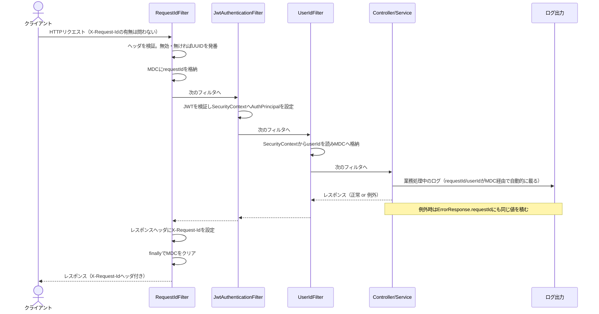
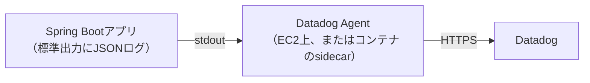

# ログ運用・監視・障害対応

本書は「ログをどう出すか」だけでなく、「出したログをどう使うか」までを1冊にまとめる。
[06_non_functional.md](06_non_functional.md) 5.2 のログレベル表を前提とし、そこに書ききれない
構造化・相関ID・Datadog連携・監視設計・障害対応手順を扱う。

> **本書の範囲。** 実装（構造化ログ・リクエストID・観測点）は完了しているが、**Datadogへの実接続や
> AWS上での稼働は行っていない**（AWSでサーバーを構築するかどうか自体が [09_decision_log.md](09_decision_log.md)
> のD-21で未決のため）。本書は「構築が決まったときにすぐ動ける設計」を示すものであり、
> Datadog Agentの実際の設置手順は [10_infrastructure.md](10_infrastructure.md) 側の未対応項目として扱う。

---

## 1. 何のためにログを出すか

障害対応・不正調査で聞かれる問いは、突き詰めると3つしかない。

| 問い | 答えるための情報 |
|---|---|
| **何が起きたか** | エラーコード・スタックトレース・観測点のメッセージ |
| **誰に起きたか** | ユーザーID（`userId`） |
| **いつから、どこまで進んだか** | タイムスタンプ・リクエストID（同じリクエストの複数行を束ねる） |

このどれか1つでも欠けると、調査は「ログを全部読んで推測する」作業になる。本PR導入前の状態
（成功したリクエストのログが1行も出ない、リクエストIDが無い）は、3つとも欠けていた。

**ログ・メトリクス・トレースの違い**（Datadogを含む一般的な観測可能性の3本柱）:

| | 何を記録するか | 本アプリでの状態 |
|---|---|---|
| **ログ**（本書の対象） | 個々の出来事（1行=1イベント） | 本PRで整備 |
| **メトリクス** | 数値の時系列（5xx率、レイテンシ等） | 7章で設計のみ。actuator/micrometer未導入のため実装なし |
| **トレース** | サービスをまたぐ処理の連鎖 | 未対応（9章） |

---

## 2. ログレベルの使い分け

[06_non_functional.md](06_non_functional.md) 5.2 の表がベース。ここでは**判断に迷う例**を補う。

| レベル | 判断基準 |
|---|---|
| `ERROR` | **人が今すぐ対応すべきか。** 500エラー、S3操作の失敗など「アプリの外側」の異常 |
| `WARN` | **想定内だが、記録しておきたい失敗。** 401/403、バリデーションエラー、退会済みユーザーのアクセス試行 |
| `INFO` | **正常な業務イベント。** ログイン成功、新規登録、画像アップロード成功、アクセスログ |
| `DEBUG` | 開発中のSQLログ。本番相当では無効化 |

**迷いやすい境界**

- **「認証エラー」はWARNで、「S3の書き込み失敗」はERROR。** 前者はクライアントの入力ミスや
  トークン期限切れという想定内の事象。後者はアプリの外側（インフラ）の異常で、人が気づいて
  対応する必要がある。「クライアント起因か、サーバー・インフラ起因か」が境目。
- **業務例外（`ApiException`）は4xxならWARN、5xxならERROR。** 4xxはクライアントの誤り、
  5xxは`INTERNAL_ERROR`のようにサーバー側の想定外を表すため、無条件でWARNにすると
  見逃しが起きる（実装時にこの穴を発見し、[GlobalExceptionHandler](../backend/src/main/java/com/example/snstimeline/common/GlobalExceptionHandler.java)を修正した）。
- **ログイン失敗はWARNだが、メールアドレスは出さない。** 「誰の」を犠牲にしても、
  「出してはいけないもの」を優先する（5章）。

---

## 3. 構造化ログの形式

### 3.1 なぜプレーンテキストでは駄目か

導入前のログはBoot既定のプレーンテキストだった。

```
2026-09-09T18:59:59.000+09:00  WARN 12948 --- [snstimeline] [main] c.e.s.common.GlobalExceptionHandler : 業務エラー code=NOT_FOUND path=/api/v1/posts/24
```

人が読む分には困らないが、機械には読めない。Datadogで「`status:500` かつ `userId:42`」のような
検索をするには、`status` や `userId` が**フィールドとして**構造化されている必要がある。
プレーンテキストのままDatadogに送っても、全文検索はできても構造化フィルタはできない。

### 3.2 ECS形式を選んだ理由（D-62）

Spring Boot 4（Spring Framework 7）は追加依存なしで構造化ログを出せる
（`logging.structured.format.console`）。選べる形式はECS / GELF / Logstashの3つで、
本アプリは **ECS（Elastic Common Schema）** を選んだ。

- `@timestamp` / `log.level` / `service.name` / `message` などのフィールド名が規格として
  定義済みで、Datadogがそのまま解釈できる（DatadogはECSベースのログパイプラインを持つ）。
- MDCの中身（`requestId` / `userId`）は自動的にトップレベルのフィールドとして出力される。
  追加のマッピング設定が要らない。

### 3.3 出力例

環境変数 `LOG_STRUCTURED_FORMAT=ecs` を指定したときの実際の出力（1行。動作確認で採取したものを
そのまま掲載）:

```json
{
  "@timestamp": "2026-09-09T10:21:23.852132700Z",
  "log": { "level": "WARN", "logger": "com.example.snstimeline.common.GlobalExceptionHandler" },
  "process": { "pid": 27880, "thread": { "name": "http-nio-8080-exec-6" } },
  "service": { "name": "snstimeline", "environment": "verification", "node": {} },
  "message": "業務エラー code=NOT_FOUND path=/api/v1/posts/999999",
  "userId": "50182",
  "requestId": "8cce8924-5864-4b33-9e69-1dc4de02b1d5",
  "ecs": { "version": "8.11" }
}
```

`requestId` / `userId` はMDCに入っているときだけ出る（未認証のリクエストなら `userId` は
フィールドごと存在しない）。`service.environment` は環境変数 `APP_ENV` から決まる
（[application.yml](../backend/src/main/resources/application.yml) の `logging.structured.ecs.service.environment`）。

> **`logging.structured.json.add` で `service.env` を足そうとすると起動時に例外になる。**
> ECS形式は `service.*`（`service.name` / `service.environment` 等）を自前で書き込むため、
> 同じキーへ二重に書き込もうとして `IllegalStateException: The name 'service' has already
> been written` になる。環境名はECS専用の `logging.structured.ecs.service.environment`
> プロパティで設定する（動作確認で実際に踏んだ罠）。

### 3.4 既定はプレーンテキスト

`application.yml` の既定値は空文字で、通常はプレーンテキストのまま動く
（[application.yml](../backend/src/main/resources/application.yml)）。開発中にJSONが流れると
人には読みにくいため、JSON化は環境変数を明示したときだけ有効になる。

```yaml
logging:
  structured:
    format:
      console: ${LOG_STRUCTURED_FORMAT:}
    ecs:
      service:
        environment: ${APP_ENV:local}
```

---

## 4. リクエストIDの流れ



**フィルタの順序が重要な理由**

| 順序 | 理由 |
|---|---|
| `RequestIdFilter` が最初 | CORSや認証エラーのログにもリクエストIDを載せるため |
| `UserIdFilter` は `JwtAuthenticationFilter` の後 | `SecurityContextHolder` に `AuthPrincipal` が入るのはJWTフィルタの中であり、それより前では常に未認証扱いになる |
| `AccessLogFilter` は `RequestIdFilter` の内側 | 1行ログを出す時点でMDCにまだ`requestId`が残っている必要がある。外側に置くと、ログを出す前に`RequestIdFilter`の`finally`でMDCが消えてしまう |

実装は [SecurityConfig.java](../backend/src/main/java/com/example/snstimeline/config/SecurityConfig.java)
の `.addFilterBefore` / `.addFilterAfter` の並びに対応する。

**なぜサーバーが発番するのか。** クライアントが送った `X-Request-Id` をそのまま信用すると、
改行文字を仕込んだ値でログ行を偽造される（ログインジェクション）。英数字とハイフン・64文字以内
に限定して検証し、外れる値は自前で発番し直す（[RequestIdFilter.java](../backend/src/main/java/com/example/snstimeline/common/logging/RequestIdFilter.java)、D-63）。

---

## 5. 出してはいけないもの

| 対象 | なぜ出さないか |
|---|---|
| **パスワード** | 平文がログに残ると、ログの閲覧権限を持つ全員に漏洩する（CLAUDE.md 6章） |
| **JWT** | トークンそのものが認証情報。漏れると即座になりすましが可能（06 5.2） |
| **メールアドレス** | 個人情報。ログイン失敗のログにも書かない。アカウント存在の推測を許さない設計（06 3.1）と同じ理由 |
| **検索クエリ文字列** | `GET /users?q=...` の検索語は入力者の意図（誰を探しているか）を含みうる。アクセスログはパスのみを記録し、クエリは出さない（04 6.5のアカウント列挙対策と同じ発想） |
| **アップロードファイル名** | 利用者が実名を含むファイル名を付ける場合がある。アップロード拒否のログは理由コードのみ記録する |
| **`Authorization` ヘッダ** | アクセスログはヘッダを一切出さない。「出さない」を徹底する最も確実な方法は、そもそもヘッダを読まないこと |

これらはCLAUDE.md 6章とD-63で明文化した禁止事項だが、**レビューだけでは担保しきれない**。
そのため [docs/11_test_design.md](11_test_design.md) 25章に、ログ全文から機密情報の文字列を
検索して「1行も含まれない」ことを機械的に確認するテストを追加した（#474）。

---

## 6. Datadogへの転送

### 6.1 転送経路（D-64）



**アプリからDatadogへ直接送信しない。** アプリは標準出力にJSONを出すだけで、Datadogの存在を
知らない。ログの回収はDatadog Agentが担う。

理由:

- **アプリにDatadogの依存・APIキーを持たせずに済む。** ローカル開発でも本番相当の構成でも、
  アプリのコードは同一のまま動く。
- **送信失敗時のバッファリング・リトライをAgentに任せられる。** アプリ自身が送信責任を持つと、
  Datadog側の障害時にアプリの処理速度やメモリに影響しうる。
- **CloudWatch経由（10_infrastructure.md記載の既存案）との二者択一にしない。** 標準出力に
  出す設計はCloudWatch Logs Agentでも回収できるため、どちらの監視サービスを選んでも
  アプリ側の変更は不要。

### 6.2 タグ付け

`service.name`（`snstimeline`固定）と `service.environment`（`APP_ENV`環境変数、既定`local`）を
ログに埋め込む。Datadog側でこの2つのタグを使い、環境別・サービス別に絞り込む。

---

## 7. 監視設計

[06_non_functional.md](06_non_functional.md) 2章の「監視: 行わない」は、本PRを機に
「Datadogを前提に設計する」へ更新した（D-64）。ただし**実際の監視が稼働するのは、
AWS構築（D-21）が決まった後**であることに変わりはない。ここでは「構築されたら何を見るか」を
設計として残す。

| 指標 | 何が分かるか | 閾値の考え方 |
|---|---|---|
| **5xx率** | アプリが壊れているか | 「0件が普通」の指標。1件でもERRORログが出たら気づけることが目標であり、率の閾値より**発生そのもの**を検知したい |
| **p95レイテンシ** | 遅延しているユーザーがどれだけいるか | [06_non_functional.md](06_non_functional.md) 1.2 の応答時間目標と対応させる |
| **ログイン失敗率** | ブルートフォース攻撃の兆候 | 同一IPからの短時間の失敗集中を見る（本アプリはIPをログに残していないため、実装するならアクセスログにIPを追加する判断が別途要る） |
| **S3/ストレージのERROR件数** | ストレージ障害 | 0件が正常。1件でも即座に気づきたい |
| **起動失敗** | デプロイ事故 | `INFO`の起動ログが一定時間出なければ異常 |

**何を監視しないか。** ユーザーの行動分析（DAU、投稿頻度等）はログの目的ではなく、
プロダクト分析の領域として意図的に対象外にする。ログは「壊れていないか」を見るためのもので、
「使われているか」を見るためのものではない。

---

## 8. 障害対応の手順

### 8.1 ユーザー報告からの追跡

1. ユーザーから、画面に表示された **リクエストID**（またはエラー発生時刻）を聞く
2. Datadogで `requestId:<値>` で絞り込む。**1リクエストに関わる全ログ行が1つの検索で揃う**
   （アクセスログ・観測点・エラーログがすべて同じ `requestId` を持つため）
3. そのログ行の `userId` で、同じユーザーの前後の操作を確認する（同じ問題が繰り返しているか）
4. `@timestamp` の前後を見て、直前に何が起きていたかを確認する

**リクエストIDが無い場合**（ユーザーがメモしていない等）は、報告された時刻・操作内容・
（分かれば）ユーザー名から絞り込む。ユーザー名からuserIdを特定できれば3.以降と同じ手順が使える。

### 8.2 よくある事象と一次対応

| 事象 | ログでの見分け方 | 一次対応 |
|---|---|---|
| クライアントの入力ミス（400） | `code=VALIDATION_ERROR`のWARN | 対応不要。頻発するなら入力フォームの改善を検討 |
| セッション切れ（401） | `AuthEntryPoint`のWARN | 対応不要（正常な仕様） |
| 他人のリソースへのアクセス試行（403） | `RestAccessDeniedHandler`または`業務エラー code=FORBIDDEN`のWARN | 同一ユーザーからの頻発は不正利用の兆候として注視 |
| S3障害 | `S3操作に失敗`のERROR | Datadog/AWSコンソールでS3の状態を確認。頻発時はストレージ種別を一時的にLOCALへ切り替える選択肢もある（D-40） |
| 予期しない500 | `予期しないエラー`のERROR（スタックトレース付き） | スタックトレースから原因箇所を特定。再現手順が分かればIssue化する |

---

## 9. 未対応・今後

| 項目 | 状態 | 補足 |
|---|---|---|
| **actuatorによるログレベルの動的変更** | 未導入 | `/actuator/loggers` でレベルを動的に変えられる機能は無い。ログレベルを変えるには環境変数を変更して再起動する必要がある |
| **分散トレーシング** | 未対応 | 本アプリはモノリスのため現時点で必要性は低いが、将来サービスを分割する場合は検討する |
| **ログ保持期間** | 未定 | AWS構築（D-21）が決まった時点で、CloudWatch LogsまたはDatadogの保持設定として決定する |
| **`/actuator/health` ヘルスチェック** | 未実装 | [10_infrastructure.md](10_infrastructure.md) 4.1 に記載済みの既知の未対応項目。ALBのヘルスチェックに必須 |
| **Datadog Agentの実接続** | 未対応 | 本書は設計のみ。実際のAgent設置手順はAWS構築が決定してから [10_infrastructure.md](10_infrastructure.md) 側に追記する |
| **監視の閾値・アラート設定** | 未対応 | 7章は「何を見るか」の設計であり、実際のアラートルールは未設定 |

---

## 関連ドキュメント

- [06_non_functional.md](06_non_functional.md) — 非機能要件（ログレベルの基本方針、5.2）
- [05_api_design.md](05_api_design.md) — API設計（エラーレスポンスの`requestId`、1.3）
- [07_architecture.md](07_architecture.md) — アーキテクチャ（`common/logging/`パッケージ構成、5章の環境変数）
- [09_decision_log.md](09_decision_log.md) — 設計判断ログ（D-62・D-63・D-64）
- [10_infrastructure.md](10_infrastructure.md) — インフラ構成（Datadog/CloudWatchの配置、未対応項目）
- [11_test_design.md](11_test_design.md) — テスト設計（25章、#460〜）
